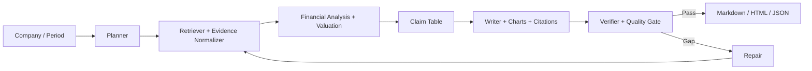

# FinSight：多智能体金融研报生成与质量评估系统

FinSight 是一个面向公司与个股研报生成的证据驱动 Multi-Agent 系统。系统将资料检索、证据规范化、财务分析、估值建模、报告写作、引用校验和缺口修复拆成可观测阶段，输出 Markdown / HTML / JSON 报告，并保留 evidence、claim、citation、valuation、verification 与 trace 产物。

*A reproducible Multi-Agent RAG system for financial research report generation, citation verification, valuation consistency, and benchmark-driven quality gates.*

## Highlights

- Multi-Agent 研报生成链路：Planner、Retriever、Analyzer、Writer、Verifier 与 Repair 协同工作。
- Evidence / Claim / Citation 可追溯中间产物，关键数值保留来源与审计路径。
- Formal-18 冻结评测 Harness，固定输入上比较三种生成方案。
- 9 个金融工具的 MCP-style tools boundary，支持本地发现与调用。
- Skill Registry 与 Planner / Router 集成，能力提示和实际工具执行分离。
- 默认关闭的 Durable Memory，上下文与事实证据严格隔离。

## Formal-18 Frozen Benchmark

Formal-18 使用 `formal18_fy2024_v1` 冻结证据快照，覆盖 US、HK、CN-A 各 6 个 FY2024 case。`18/18` case 就绪并通过 SHA-256 校验，三种方案共 `54/54` 个评测单元完成。

| Variant | Delivery Pass Rate | Objective Quality Score | Traceable Claim Rate v1 |
| --- | ---: | ---: | ---: |
| Direct LLM | 16.67% | 51.21 | 29.66% |
| Single-Agent RAG | 27.78% | 52.52 | 34.89% |
| Multi-Agent RAG | 72.22% | 86.27 | 70.01% |

该结果证明 Multi-Agent RAG 在这一离线冻结协议下的报告交付与关键结论可追溯性更好，不代表实时生产稳定性、投资建议准确率或线上数据覆盖能力。正式协议、快照和结果见 [formal_benchmark_protocol.md](docs/formal_benchmark_protocol.md)、[snapshot_manifest.json](data/benchmarks/frozen_fy2024_v1/snapshot_manifest.json) 与 [formal_benchmark_report.md](eval_outputs/benchmark_formal18_fy2024_v1/formal_benchmark_report.md)。

## Architecture



系统首先生成结构化 evidence 与 claims，再组装报告并执行数值、引用、图表与交付门禁校验。更多实现说明见 [architecture.md](docs/architecture.md) 与 [evidence_claim_citation_schema.md](docs/evidence_claim_citation_schema.md)。

## Quick Start

```powershell
python -m venv .venv
pip install -e .
python scripts/run_multi_agent_demo.py --symbol AAPL --period 2025Q4 --execution-mode dynamic --fast
```

启动网页工作台：

```powershell
python scripts/run_financial_agent_ui.py --host 127.0.0.1 --port 8787
```

运行核心回归测试：

```powershell
python -m pytest -q
```

运行冻结快照上的 Formal-18 协议需要配置可用生成后端；runner 只消费落盘快照，不在评测时联网补证：

```powershell
python scripts/run_formal_benchmark.py --config configs/benchmark_formal18_fy2024.yaml
```

## Key Artifacts

| Artifact | Purpose |
| --- | --- |
| `evidence.json` | 规范化来源与证据记录 |
| `claims.json` / `citations.json` | 可验证结论与引用绑定 |
| `valuation_model.json` / `financial_metrics.json` | 估值和财务数值链路 |
| `charts.json` / `chart_consistency.json` | 图表生成与一致性核验 |
| `verification_report.json` / `task_trace.jsonl` | 质量门禁和 Agent 执行轨迹 |
| `eval_outputs/benchmark_formal18_fy2024_v1/` | 正式冻结评测汇总证据 |

## Limits And Boundaries

- Formal-18 是离线冻结快照评测，不等同于线上数据源稳定性或实时覆盖证明。
- 港股在当前正式结果中的关键结论可追溯率仍较弱，A 股仍有交付失败案例。
- Memory 默认关闭；启用时只提供规划上下文，不作为事实来源或引用替代。
- MCP-style 接口提供工具边界，不声称为完整生产级 MCP 平台。
- 系统用于可复核研究报告生成与质量评估，不构成投资建议。

历史 Quick-9 与 Phase 2R 诊断结果仅用于内部修复追踪，见 [ablation_and_diagnostics.md](docs/ablation_and_diagnostics.md)。

## Documentation

| Document | Topic |
| --- | --- |
| [architecture.md](docs/architecture.md) | 多智能体链路与产物流 |
| [evidence_claim_citation_schema.md](docs/evidence_claim_citation_schema.md) | Evidence / Claim / Citation 契约 |
| [formal_benchmark_protocol.md](docs/formal_benchmark_protocol.md) | Formal-18 冻结评测协议 |
| [mcp_style_tools.md](docs/mcp_style_tools.md) | 工具边界与 HTTP JSON-RPC 表面 |
| [skill_registry_design.md](docs/skill_registry_design.md) | Skill 提示与编排集成 |
| [memory_boundary.md](docs/memory_boundary.md) | Durable memory 证据边界 |
| [limitations.md](docs/limitations.md) | 可声明结果与限制 |

## Acknowledgement

本项目早期工程组织曾参考 `DeepReport` 的模块划分思路，但金融研报任务链路、证据契约、质量门禁、评测协议和 MCP-style 工具边界均围绕本项目重新实现。
