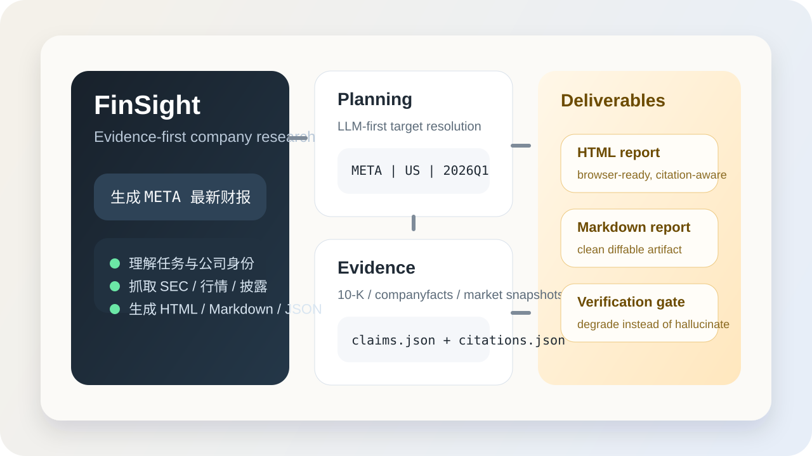
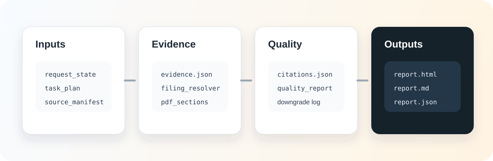
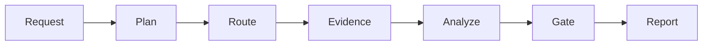

<div align="center">

# Open DeepReport++

**Evidence-first multi-agent research reports for public companies**

[](https://www.python.org/)
[](https://fastapi.tiangolo.com/)
[](https://www.docker.com/)
[](#boundaries)

Generate Markdown / HTML / JSON company research reports with traceable claims,
official-source evidence, charts, and quality gates.

</div>



## Highlights

- **Claim-first writing**: every important statement is tied to `evidence_id`.
- **Official-source routing**: SEC filings/companyfacts for US, CNINFO/SSE/SZSE
  for A-share, and HKEX-oriented disclosure paths for HK coverage.
- **10-K annual report parsing**: US FY reports resolve SEC 10-K filings and
  extract Item 1, Item 1A, Item 7, and related sections before writing.
- **Quality gates**: delivery checks flag missing evidence, raw companyfacts
  dumps, weak sections, broken citations, and chart/report mismatch.
- **User web app**: FastAPI financial research workbench on port `7860`.
- **Docker-first deployment**: one command starts the user-facing service.

## Public Repo Scope

- **Published entrypoint**: `main.py` starts the user-facing service on `7860`.
- **Local-only developer entrypoint**: `main_dev.py` stays ignored and is not part
  of the public branch.
- **Tracked fixtures**: frozen benchmark snapshots and curated samples remain for
  reproducibility and tests.
- **Ignored runtime state**: generated reports, memory, evidence archives, and
  temporary runs stay local.

## Visual Overview



## Product Flow



## Quick Start

### Docker

```bash
git clone https://github.com/wara886/DeepReport-.git
cd DeepReport-
cp .env.example .env
docker compose up --build -d
```

Open:

```text
http://localhost:7860
```

Generated user reports are persisted under:

```text
data/outputs_user/
data/reports_user/
data/evidence_archive/
memory/
```

Run the published image:

```bash
docker run --env-file .env -p 7860:7860 \
  -v ./data/outputs_user:/app/data/outputs_user \
  -v ./data/reports_user:/app/data/reports_user \
  -v ./data/evidence_archive:/app/data/evidence_archive \
  -v ./memory:/app/memory \
  ghcr.io/wara886/deepreport-plus:latest
```

### Local Python

```bash
python -m venv .venv
python -m pip install -e ".[pdf]"
python main.py
```

Then open `http://localhost:7860`.

### What Ships in Docker

- `main.py`
- `src/`
- `configs/`
- `scripts/`
- `.env.example`

The image intentionally excludes local reports, benchmark outputs, developer
notes, and private scratch entrypoints.

### Smoke Test

```bash
python scripts/run_multi_agent_demo.py --symbol AAPL --period FY2024 --execution-mode dynamic --fast
python -m pytest -q tests/test_sec_annual_report_flow.py
```

## Repository Layout

```text
.
├── configs/                  # model, source, report, and gate policies
├── docs/                     # architecture and benchmark documentation
├── scripts/                  # reproducible smoke/evaluation commands
├── src/
│   ├── agents/               # planning, research, analysis, writing, verifier
│   ├── app/                  # FastAPI service and current workbench frontend
│   ├── data/                 # source adapters and SEC filing resolver
│   ├── evaluation/           # quality gates and benchmark scoring
│   ├── report/               # charts, citations, HTML rendering
│   └── schemas/              # report/evidence/claim data contracts
├── tests/                    # regression tests
├── main.py                   # user-facing service entrypoint
├── Dockerfile
└── docker-compose.yml
```

`main_dev.py` is intentionally local-only and ignored by Git. Public runs should
use `main.py` or Docker Compose.

## Core Artifacts

| Artifact | Why it exists |
| --- | --- |
| `evidence.json` | normalized source records |
| `claims.json` | claim-first intermediate report facts |
| `sec_filing_resolver.json` | SEC 10-K target filing resolution |
| `annual_report_sections.json` | parsed Item 1 / Item 1A / Item 7 evidence |
| `section_dossiers.json` | per-section writing brief and deterministic tables |
| `citations.json` | citation map used by final report |
| `verification_report.json` | delivery gate and evidence-gap diagnostics |
| `report.md`, `report.html`, `report.json` | final user deliverables |

## API Surface

| Route | Purpose |
| --- | --- |
| `GET /` | current financial research workbench |
| `GET /workbench` | explicit workbench alias |
| `GET /health`, `GET /api/health` | container and deployment health checks |
| `POST /api/report-tasks` | create a report task |
| `POST /api/report-tasks/{task_id}/start` | start a queued report task |
| `GET /api/report-tasks/{task_id}` | task state, readiness, and artifacts |
| `GET /artifacts/*` | generated report artifacts |

## Release Hygiene

- `main_dev.py`, status notes, scratch scripts, and local planning documents are
  kept out of Git.
- GitHub Linguist is configured to treat benchmark/data snapshots as generated so
  the repo surface stays focused on product code.
- Docker build context excludes runtime artifacts and internal notes to keep the
  image smaller and safer to publish.

## Benchmarks

The repository includes frozen benchmark summaries for reproducibility. They are
not a promise of live-source availability or investment performance.

| Variant | Delivery Pass Rate | Objective Quality Score | Traceable Claim Rate |
| --- | ---: | ---: | ---: |
| Direct LLM | 16.67% | 51.21 | 29.66% |
| Single-Agent RAG | 27.78% | 52.52 | 34.89% |
| Multi-Agent RAG | 72.22% | 86.27 | 70.01% |

See [formal benchmark protocol](docs/formal_benchmark_protocol.md),
[architecture](docs/architecture.md), and [limitations](docs/limitations.md).

## Configuration

Secrets live in `.env`; non-secret runtime settings live in `configs/*.yaml`.

Common environment variables:

```text
DEEPSEEK_API_KEY=
TAVILY_API_KEY=
SEC_USER_AGENT=Your Name contact@example.com
HOST=0.0.0.0
PORT=7860
```

For SEC access, set a descriptive `SEC_USER_AGENT` before running live annual
report workflows.

## Boundaries

- This is a research and auditability tool, not investment advice.
- Reports are only as strong as the available public evidence.
- Missing official evidence should produce a degraded report or explicit data
  gap, not invented analysis.
- Durable memory is context only and never replaces cited evidence.
