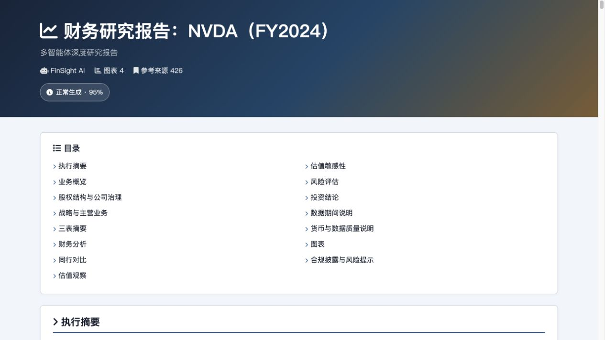
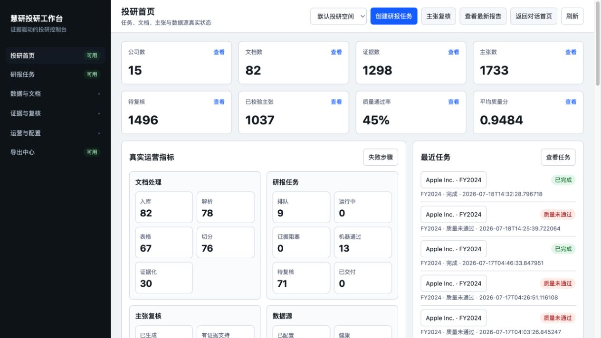
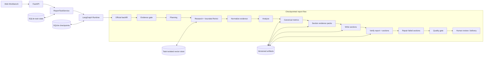

<div align="center">

# FinSight DeepReport++

**证据驱动、过程可观测、结果可复核的多智能体金融研报工作台**

[](https://www.python.org/)
[](https://fastapi.tiangolo.com/)
[](https://langchain-ai.github.io/langgraph/)
[](https://www.sqlite.org/)
[](https://www.docker.com/)
[](https://github.com/wara886/DeepReport-/actions/workflows/docker-publish.yml)

从官方披露、结构化行情和本地文档中建立证据链，经过指标仲裁、章节写作、自动返工和交付门禁，输出可追溯的 Markdown / HTML / PDF / DOCX / JSON / CSV 研报包。

[快速开始](#快速开始) · [核心架构](#核心架构) · [数据覆盖](#数据覆盖) · [验收状态](#验收状态) · [使用边界](#使用边界)

</div>



## 当前产品

FinSight 不是一次性调用大模型的报告脚本。它将一次研报任务拆成可检查、可重试、可恢复的 LangGraph 节点，并让写作节点只能消费已经治理过的指标和章节证据包。

| 能力 | 当前实现 |
| --- | --- |
| 任务工作台 | 创建、启动、追踪、复核、导出与失败诊断 |
| Agent Runtime | LangGraph 节点级 checkpoint、失败恢复和人工复核中断 |
| ReAct 工具调用 | 有界循环、参数约束、超时、错误分类和完整调用轨迹 |
| RAG | BM25 / Vector / Hybrid / Reranker，按任务、公司和期间隔离 |
| 数据治理 | Evidence → Metric Candidate → Canonical / Derived Metric |
| 报告生成 | 章节合同、must-use evidence、章节级校验与定向返工 |
| 质量控制 | 数字、引用、证据、章节、图表、LLM Review 和交付门禁 |
| 交付产物 | Markdown、HTML、PDF、DOCX、JSON、CSV、图表、引用、验证报告与运行清单 |

### 工作台界面



首页指标直接读取任务、文档、证据、主张和数据源状态，不再使用固定示意漏斗。完整工作台位于 `/workbench`，根路径 `/` 也可进入当前产品入口。

## 核心架构



每个运行节点记录状态、耗时、错误、重试和产物版本。上游证据或指标改变时，下游报告、主张和引用会被明确标记失效，避免正文与证据版本错位。

### Agent 与工具

核心 Tool Registry 当前注册 9 个工具：

| 类别 | Tool |
| --- | --- |
| 检索 | `retrieve_local_evidence` |
| 市场快照 | `fetch_yahoo_market_snapshot` |
| 财务计算 | `calculate_financial_ratios`, `build_three_statement_view` |
| 分析 | `build_trend_features`, `build_peer_comparison`, `perform_company_valuation` |
| 图表与组装 | `render_all_charts`, `attach_charts_to_report` |

Research Agent 只开放与当前任务相关的工具；运行时注入公司、期间和数据目录等受控参数。工具失败会被归类为数据降级、参数错误、超时或运行故障，不会直接伪装成研究结论。

BM25 与哈希向量回退可在核心安装中运行；Chroma、BGE Embedding 与 Reranker 属于 `local_rag` 可选依赖。系统会在语义模型不可用时明确记录降级后端，不把哈希回退标记为真实 BGE 检索。

## 数据覆盖

| 市场 | 官方 / 主要来源 | 结构化补充来源 | 说明 |
| --- | --- | --- | --- |
| 美股 | SEC EDGAR、Companyfacts | Yahoo Finance、FRED、BEA、Tavily | 年报章节、三表、行情、宏观和检索补充 |
| A 股 | CNINFO、SSE、SZSE | Tushare Pro、BaoStock、Yahoo Finance | 公告与财务数据按股票和期间归一化 |
| 港股 | HKEX 披露 | Yahoo Finance、搜索补充 | 官方披露优先；可用性取决于目标年度覆盖 |
| 本地材料 | PDF、表格、文本手动导入 | BGE Embedding / Reranker | 解析、切分、证据化、向量化后进入任务证据库 |

外部来源的“已配置、已启用、健康”是三个独立状态。需要密钥或网络不可用的来源不会被误报为健康来源。

## 验收状态

当前最新已记录的真实隔离回归（2026-07-18）：

| 样本 | 质量分 | Canonical Metrics | 章节合同 | 结果 |
| --- | ---: | ---: | ---: | --- |
| AAPL FY2024 | 0.975 | 32 | 13 / 13 | `delivery_pass=true` |

- Verifier、Objective Quality 与 LLM Review 全部通过。
- 5 张财务、现金流、估值、同行和敏感性图表通过一致性与 lineage 校验。
- 聚焦回归测试：`206 passed, 2 skipped`。
- 当前源码全量回归（2026-07-29）：`1007 collected, 1005 passed, 2 optional-fixture skips, 0 failed`。
- 冻结多市场样本与基准结果用于回归，不代表实时数据源永远可用或投资表现承诺。

这里的 `delivery_pass=true` 表示机器证据、引用、质量与产物门禁通过；工作台中的正式导出还要求人工复核完成。两种状态独立展示，机器通过不等于人工已批准。

历史多策略对照基准：

| Variant | Delivery Pass Rate | Objective Quality Score | Traceable Claim Rate |
| --- | ---: | ---: | ---: |
| Direct LLM | 16.67% | 51.21 | 29.66% |
| Single-Agent RAG | 27.78% | 52.52 | 34.89% |
| Multi-Agent RAG | 72.22% | 86.27 | 70.01% |

详见 [formal benchmark protocol](docs/formal_benchmark_protocol.md)、[architecture](docs/architecture.md)、[latest repository audit](docs/repository_audit_20260729.md) 和 [limitations](docs/limitations.md)。

## 快速开始

### Docker

```bash
git clone https://github.com/wara886/DeepReport-.git
cd DeepReport-
cp .env.example .env
docker compose up --build -d
```

打开 `http://localhost:7860/workbench`。

### 本地 Python

```bash
python -m venv .venv
source .venv/bin/activate
python -m pip install -e ".[pdf]"
cp .env.example .env
python main.py
```

可使用 `python main.py --port 7863` 指定其他端口。

如需本地 Chroma/BGE 检索和完整 DOCX 后端，安装全部可选能力：

```bash
python -m pip install -e ".[pdf,docx,local_rag]"
python scripts/setup_local_rag_models.py
```

### 最小配置

密钥只写入本地 `.env`，不要提交到 Git：

```text
DEEPSEEK_API_KEY=
MIMO_API_KEY=
TAVILY_API_KEY=
SERPER_API_KEY=
TUSHARE_TOKEN=
FRED_API_KEY=
BLS_API_KEY=
BEA_API_KEY=
SEC_USER_AGENT=Your Name contact@example.com
```

未配置可选来源时，系统会显示准确的降级状态。BLS 公共接口可不带 Key 使用；SEC 实时访问应提供可联系的 `SEC_USER_AGENT`。数据源的可用性还受网络、额度、账号权限和目标期间披露状态影响。

## API 与产物

| Route | Purpose |
| --- | --- |
| `GET /`, `GET /workbench` | 当前投研工作台 |
| `GET /health`, `GET /api/health` | 服务与部署健康检查 |
| `POST /api/report-tasks` | 创建研报任务 |
| `POST /api/report-tasks/{task_id}/start` | 启动待执行任务 |
| `GET /api/report-tasks/{task_id}` | 节点、质量、复核和产物状态 |
| `GET /api/claims`, `POST /api/claims/{claim_id}/*` | 查询、通过、驳回或编辑主张 |
| `GET /api/exports/{task_id}`, `POST /api/exports/{task_id}/package/files` | 检查导出门禁并生成所选格式 |
| `GET /artifacts/*` | 访问生成的报告与图表 |

| Artifact | Purpose |
| --- | --- |
| `evidence.json` | 归一化证据与业务级身份 |
| `canonical_metrics.json` | 正式指标、单位、期间与来源 lineage |
| `section_evidence_packs.json` | 每个章节必须消费的证据包 |
| `claims.json`, `citations.json` | 主张与引用绑定 |
| `verification_report.json` | 数字、引用、章节和质量诊断 |
| `run_manifest.json` | 上下游产物版本与失效关系 |
| `report.md`, `report.html`, `report.json` | 最终交付物 |

运行数据默认保存在 `data/outputs_user/`、`data/reports_user/`、`data/evidence_archive/` 和 `memory/`，这些目录中的本地用户数据不会随源码提交。

## 项目结构

```text
configs/       model, source, report and quality policies
docs/          architecture, protocol and acceptance notes
scripts/       smoke, baseline and runtime hygiene commands
src/agents/    planning, research, analysis, writer and verifier
src/app/       FastAPI routes and workbench frontend
src/data/      source adapters and canonical metric pipeline
src/runtime/   LangGraph state, checkpoints and run manifests
src/report/    contracts, enrichment, charts and rendering
src/evaluation quality gates, review and section repair
src/retrieval/ chunking, hybrid retrieval and vector isolation
tests/         focused and production regression tests
```

检查本地配置与运行状态但不输出密钥值：

```bash
python scripts/runtime_hygiene.py status --output tmp/runtime_baseline.json
```

提交前运行完整回归：

```bash
pytest -q
```

GitHub Actions 会在 Pull Request 和 `main` 推送时运行全量测试；Docker 镜像仅在测试通过后发布。

## 使用边界

- 本项目用于公开信息研究与可审计报告生成，不构成投资建议。
- 实时行情与历史财务数据必须明确区分 `market_as_of_date` 和 `financial_period`。
- 缺少官方证据、核心指标或章节合同未通过时，任务应降级为草稿，而不是生成虚构结论。
- 长期记忆只提供上下文，不能替代报告中的正式证据和引用。
- 估值结果取决于可用输入；相对估值与机械敏感性分析不等同于完整 DCF 目标价。
- current-TTM 同行快照与 FY 报告期数据必须分开展示，不能伪装成同期间比较。
- 正式导出要求完成主张人工复核；机器交付通过只代表报告具备进入复核的条件。

更完整的已知限制、降级策略与证据边界见 [limitations](docs/limitations.md) 和 [production path boundary](docs/production_path_boundary.md)。
