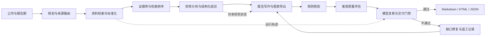

# Open DeepReport++：证据驱动的公司研报多智能体系统

> 本项目受开源项目 `DeepReport` 的工程组织方式启发，复用的是模块职责拆分、配置方式与运行入口思路，不直接复制其业务逻辑。

Open DeepReport++ 面向公司与个股研究报告生成场景。它解决的核心问题不是“让大模型写一篇看起来像研报的文章”，而是让报告中的关键事实、财务数字、估值输入和图表结论都能够追溯来源，并在证据不足或质量不达标时拒绝交付。

```text
公司 / 报告期输入
  -> 资料搜集与标准化
  -> 检索筛选与来源管理
  -> 结构化结论与财务分析
  -> 中文研报写作与图表导出
  -> 事实 / 数值 / 估值 / 图表核验
  -> 客观质量评分 + 模型复核
  -> 交付判定、返工记录与运行追踪
```

当前最成熟的范围是公司/个股研报主链，输出 Markdown、HTML 与结构化报告产物；行业与宏观研究、训练增强能力仍属于扩展方向。

## 项目亮点

### 1. 证据优先，而不是自由生成

研报场景容易出现无来源结论、财务期间混用、数字口径错误和估值不可复算等问题。本项目先将资料转成标准化证据，再生成可引用的结构化结论，最后组织成报告正文。这样一来，报告错误可以定位到资料、检索、分析、写作或校验环节，而不是只能重新提示模型“写得更可靠一点”。

### 2. 受控多智能体协作，而不是角色名称堆叠

系统包含规划、研究、资料整理、财务分析、写作、校验、写前质疑与缺口修复等职责。不同角色通过共享研究状态传递公司主体、报告期、三表覆盖、同行比较、估值可用性和风险缺口，并保留协作与工具调用轨迹。

默认流程优先保证稳定与可复核；需要诊断时，再展开更细的身份、三表、同行、估值和风险视角。

### 3. 可切换检索与本地降级

检索层支持关键词检索、向量检索、融合排序与重排等模式，并保留命中来源、报告期和数值来源关系。向量组件、网页读取或外部模型不可用时，系统会回退到本地可运行路径，并在产物中记录降级原因，而不是静默降低报告质量。

### 4. 三层质量门禁与失败可定位

报告交付需要同时经过：

1. **规则核验**：事实引用、数值支撑、报告期、图表来源和估值输入检查。
2. **客观质量评估**：结构、证据、财务深度、多模态一致性、专业表达与合规披露评分。
3. **模型复核**：识别规则较难覆盖的空洞章节、逻辑断裂与表达质量问题。

质量不达标时，系统输出问题清单、修复约束和返工记录，便于复盘究竟是资料不够、分析不完整，还是写作没有正确消费已有证据。

## 架构概览



## 给代码审阅者与 ChatGPT 的阅读路径

如果你想在较短时间理解这个项目，建议按下面顺序阅读：

| 优先级 | 阅读目标 | 入口文件 |
| --- | --- | --- |
| 1 | 理解多角色如何编排、如何输出协作轨迹 | [`src/agents/multi_agent_orchestrator.py`](src/agents/multi_agent_orchestrator.py) |
| 2 | 理解共享研究状态、写前质疑和角色责任边界 | [`src/agents/research_blackboard.py`](src/agents/research_blackboard.py) |
| 3 | 理解最终交付为什么通过或失败 | [`src/evaluation/delivery_gate.py`](src/evaluation/delivery_gate.py) |
| 4 | 理解客观质量评分覆盖哪些维度 | [`src/evaluation/report_quality.py`](src/evaluation/report_quality.py) |
| 5 | 理解证据如何转成结构化财务结论 | [`src/agents/deep_analyze_agent.py`](src/agents/deep_analyze_agent.py) |
| 6 | 理解事实与数值核验逻辑 | [`src/agents/verifier_agent.py`](src/agents/verifier_agent.py) |
| 7 | 理解关键词、向量、融合和重排切换路径 | [`src/retrieval/retrieve.py`](src/retrieval/retrieve.py) |
| 8 | 理解数值来源追踪与可复算关系 | [`src/features/financial_metric_lineage.py`](src/features/financial_metric_lineage.py) |
| 9 | 理解自然语言入口与网页工作台 | [`src/app/agent_chat.py`](src/app/agent_chat.py)、[`src/app/web_ui.py`](src/app/web_ui.py) |

进一步阅读：

- [`docs/financial_multi_agent_detailed_guide.md`](docs/financial_multi_agent_detailed_guide.md)：系统能力与实现说明。
- [`docs/multi_agent_competition_alignment.md`](docs/multi_agent_competition_alignment.md)：多智能体证据、差距与边界。
- [`docs/cloud_training.md`](docs/cloud_training.md)：离线训练与本地回退约束。

## 核心模块

```text
configs/        模型、数据源、报告、校验与训练配置
scripts/        本地演示、评估、回归和服务启动脚本
src/agents/     规划、研究、分析、写作、校验、缺口修复与协作状态
src/app/        命令行流水线、自然语言入口与网页工作台
src/data/       数据获取、标准化、来源策略与财务质量处理
src/features/   三表、指标来源、同行、估值和风险特征
src/retrieval/  证据存储、分块、关键词/向量/融合/重排检索
src/evaluation/ 规则核验、质量评分、交付门禁和回归评估
src/report/     引用、图表、合规说明与报告导出
src/schemas/    证据、结论、报告、图表和任务数据契约
tests/          核心流程与质量规则测试
```

## 可运行能力

| 能力 | 当前状态 |
| --- | --- |
| 公司/个股研报生成，输出 Markdown / HTML / JSON | 可运行 |
| 证据记录、结构化结论、引用表、图表与验证报告导出 | 可运行 |
| 关键词、向量、融合排序与重排检索切换 | 可运行，部分能力为可选依赖 |
| 规划、研究、分析、写作、校验与缺口修复协作链路 | 可运行 |
| 共享研究状态、工具调用、协作与返工轨迹 | 可运行 |
| 规则核验、客观质量评分、模型复核和最终交付判定 | 可运行 |
| 本地网页工作台与自然语言任务入口 | 可运行 |
| 训练增强模块 | 仅面向离线训练与回退接入，不是本地主链依赖 |
| 任意公司稳定高质量交付 | 尚未完成，仍受数据覆盖与泛化质量影响 |

## 质量证据与诚实边界

本项目刻意保留“能证明什么”和“仍不能证明什么”的边界。

| 验证类型 | 当前结果 | 结论 |
| --- | --- | --- |
| 三公司运行记忆消融 | AAPL、GOOGL、MSFT 各进行开启/关闭对照；检查表均值 `86.77% -> 89.51%`，平均耗时 `123.80s -> 118.79s`，规则核验通过率两侧均为 `66.67%` | 记忆在小样本中改善检查表表现与耗时，不能据此声称事实准确率或最终通过率提高 |
| AMD 单样本修复验收 | 修复后的样本通过三层交付门禁，客观质量评分 `0.9667` | 可证明该样本满足当前交付条件，仍有正文深度和权威来源覆盖警告 |
| 跨市场泛化回归 | 一轮 8 个跨行业/跨市场案例中，最终交付通过数为 `0/8` | 已建立泛化检查，但系统尚不具备稳定跨市场交付能力 |

## 快速开始

### 1. 安装

```bash
python -m venv .venv
pip install -e .
```

可选能力：

```bash
pip install -e ".[browser,local_rag,pdf,docx]"
python -m playwright install chromium
```

### 2. 配置

复制环境变量示例文件，在本地填写需要使用的模型或搜索服务密钥：

```bash
copy .env.example .env
```

密钥文件不会被提交到仓库。没有远程密钥时，仍可使用本地样例与降级链路完成基础调试。

### 3. 运行多智能体报告演示

```bash
python scripts/run_multi_agent_demo.py --symbol AAPL --period 2025Q4 --execution-mode dynamic --fast
```

### 4. 启动网页工作台

```bash
python scripts/run_financial_agent_ui.py --host 127.0.0.1 --port 8787
```

网页端可输入类似任务：

```text
生成 AMD 最新财报研报，并检查数值来源、估值依据和风险结论。
```

网页工作台支持选择协作模式与完整诊断模式，用于查看共享研究状态、角色协作、工具调用和返工轨迹。

### 5. 运行核心测试

```bash
pytest -q tests/test_multi_agent_workflow.py tests/test_delivery_gate.py tests/test_report_quality.py tests/test_web_ui.py
```

## 输出产物

一次完整公司报告运行会生成以下类型的产物：

| 产物类型 | 用途 |
| --- | --- |
| 报告正文与网页版本 | 阅读与展示最终研报 |
| 标准化证据与结构化结论 | 追踪事实依据与分析来源 |
| 财务指标、估值和图表元数据 | 复核数值、图表与估值链路 |
| 引用表与验证报告 | 检查结论是否得到来源支持 |
| 质量报告与交付判定 | 判断报告是否允许交付 |
| 协作、工具调用和返工轨迹 | 诊断失败环节与修复过程 |

本地输出目录与运行产物默认不作为源码提交内容，避免仓库被临时结果和敏感运行上下文污染。

## 当前限制

- 公司研报主链成熟度高于行业与宏观报告链路。
- 外部公开数据源存在可用性、时效性和市场覆盖差异。
- 向量检索与远程模型均为可选增强能力，本地闭环优先保证可运行与可复核。
- 质量门禁能阻止一批不合格报告，但不能替代正式投研中的持牌审核、合规审批和人工判断。
- 当前仍需要扩大固定评测集，补充检索策略对照和跨市场数据覆盖。

## 设计原则

1. 先证据，后结论，再写作。
2. 先规则核验，后模型增强。
3. 事实来源与历史记忆严格分离。
4. 数据不足时披露缺口，不生成虚假确定性。
5. 任何质量提升必须通过固定样本和对照评估说明边界。

## 致谢

项目在工程骨架审计阶段参考了开源项目 `DeepReport` 的组织思路，并基于公司研报场景重新设计了数据契约、分析逻辑、质量门禁与评测闭环。
