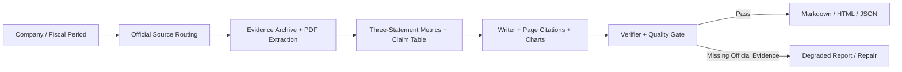

<div align="center">

# FinSight / DeepReport++

**Evidence-driven multi-agent company research reports**

[](https://www.python.org/)
[](https://fastapi.tiangolo.com/)
[](https://www.docker.com/)

</div>

FinSight generates auditable company and stock research reports in Markdown, HTML, and JSON. The project adopts the concise deployable layout of [DeepReport](https://github.com/wisdom-pan/DeepReport), while its official-source evidence contracts, financial quality gates, and benchmark workflow are independently implemented.

## Features

- Claim-first report generation with traceable `evidence.json`, `claims.json`, and `citations.json`.
- Market-aware official-source routing for SEC, CNINFO/SSE/SZSE, and HKEX disclosure research.
- Three-statement normalization and PDF page-anchored citations for document-backed financial claims.
- Objective quality evaluation, LLM review, delivery gate, and chat-based quality review.
- Formal-18 frozen benchmark covering US, HK, and CN-A FY2024 cases.
- FastAPI service and Docker deployment without replacing the existing local workbench logic.

## Quick Start

### Docker

Create `.env` from `.env.example` and configure the model/search credentials required by the report mode you intend to run. Secrets stay local and are not included in images.

```bash
git clone https://github.com/wara886/DeepReport-.git
cd DeepReport-
cp .env.example .env
./start.sh
```

Open `http://localhost:7860`. Generated reports and evidence archives are persisted in `data/reports/`, `data/outputs/`, and `data/evidence_archive/`.

To run the published image after the GitHub workflow has produced it:

```bash
docker run --env-file .env -p 7860:7860 \
  -v ./data/outputs:/app/data/outputs \
  -v ./data/reports:/app/data/reports \
  -v ./data/evidence_archive:/app/data/evidence_archive \
  ghcr.io/wara886/deepreport-plus:latest
```

Windows PowerShell can use `.\start.ps1` and `.\stop.ps1`; direct Compose remains available through `docker compose up --build -d`.

### Local

```powershell
python -m venv .venv
pip install -e ".[pdf]"
python main.py
```

The existing development workbench remains available on its original entrypoint:

```powershell
python scripts/run_financial_agent_ui.py --host 127.0.0.1 --port 8787
```

Generate a local report or run tests:

```powershell
python scripts/run_multi_agent_demo.py --symbol AAPL --period FY2024 --execution-mode dynamic --fast
python -m pytest -q
```

## Report Quality Flow



For A-share and Hong Kong reports, formal delivery now records official evidence coverage, statement completeness, and PDF page anchors. If period-matched official evidence is missing, the system marks the report for degradation instead of silently substituting newer data.

## Key Artifacts

| Artifact | Purpose |
| --- | --- |
| `evidence.json`, `claims.json`, `citations.json` | Source-to-conclusion audit chain |
| `official_evidence_manifest.json`, `evidence_coverage.json` | Official-source inventory and sufficiency policy |
| `financial_metrics.json`, `tables.json` | Three-statement normalization and metric lineage |
| `pdf_manifest.json`, `pdf_sections.json` | Download/extraction status and page-located PDF evidence |
| `verification_report.json`, `quality_report.json`, `delivery_gate.json` | Delivery readiness and blockers |
| `report.md`, `report.html`, `report.json` | Final deliverables |

## Benchmark

Formal-18 uses the frozen `formal18_fy2024_v1` evidence snapshot: 18 FY2024 cases across US, HK, and CN-A markets, with 54 evaluated generation units.

| Variant | Delivery Pass Rate | Objective Quality Score | Traceable Claim Rate v1 |
| --- | ---: | ---: | ---: |
| Direct LLM | 16.67% | 51.21 | 29.66% |
| Single-Agent RAG | 27.78% | 52.52 | 34.89% |
| Multi-Agent RAG | 72.22% | 86.27 | 70.01% |

These are results under an offline frozen-input protocol, not proof of live-source stability, universal company coverage, or investment recommendation accuracy. Published summaries are in [`bench/formal18_fy24`](bench/formal18_fy24), with protocol details in [formal_benchmark_protocol.md](docs/formal_benchmark_protocol.md), [reference mapping](docs/deepreport_skeleton_mapping.md), and [limitations.md](docs/limitations.md).

## Project Structure

```text
FinSight/
|-- bench/                   # Published benchmark summaries
|-- configs/                 # Models, sources, report, and gate policies
|-- data/                    # Evidence inputs and runtime persistence
|-- docs/                    # Architecture, audit, and protocol notes
|-- scripts/                 # Evaluation and maintenance commands
|-- src/                     # Agents, evidence, reports, and API service
|-- tests/                   # Regression coverage
|-- main.py                  # Deployable FastAPI entrypoint
|-- Dockerfile
|-- docker-compose.yml
|-- start.sh / stop.sh
`-- .github/workflows/      # GHCR image publishing
```

## Service Surface

- `GET /`: report workbench.
- `GET /health`: deployment health check.
- `GET /api/latest`: latest completed report and quality artifacts.
- `POST /api/chat`: chat, confirmation, report execution, and `quality_review`.
- `POST /api/run`: direct report execution.
- `GET /artifacts/*`: generated reports and audit artifacts.

## Boundaries

- The current product focuses on company/stock reports; industry and macro strategy reports are not yet equivalent full workflows.
- A/H report quality depends on availability and parsability of official announcements and PDFs; failures are surfaced as evidence gaps.
- Durable memory is context only and never replaces cited evidence.
- The system supports research production and auditability; it does not constitute investment advice.
