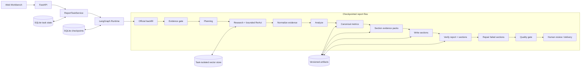
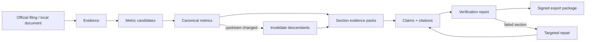

<div align="center">

# FinSight DeepReport++

**面向公开公司研究的证据驱动多智能体研报工作台**<br/>
把官方披露、结构化财务数据与本地材料组织为可追溯证据链，经过指标仲裁、章节写作、自动返工和人工复核，交付可审计研报包。

[](https://www.python.org/)
[](https://fastapi.tiangolo.com/)
[](https://langchain-ai.github.io/langgraph/)
[](#检索与工具)
[](https://github.com/wara886/Financial-Platform-Agent/pkgs/container/deepreport-plus)
[](https://github.com/wara886/Financial-Platform-Agent/actions/workflows/docker-publish.yml)

[项目亮点](#项目亮点) · [当前能力](#当前能力) · [架构概览](#架构概览) · [快速开始](#快速开始) · [使用边界](#使用边界)

</div>


## 简介

FinSight DeepReport++ 是一个面向美股、A 股和港股公开公司研究的多智能体系统。它解决的核心问题不是“让模型写一篇看起来完整的报告”，而是让每个数字、主张、图表和章节都能回答三个问题：**证据来自哪里、指标如何得到、失败后从哪里继续**。

系统使用 LangGraph 将研报任务拆为可检查、可重试、可恢复的节点。Writer 不能直接读取未经治理的原始材料，只能消费经过来源分级、期间/币种/单位归一化和冲突仲裁后的 Canonical Metrics 与 Section Evidence Packs；Verifier 会检查数字、引用、章节合同和图表 lineage，失败章节进入定向返工，机器门禁通过后仍需完成人工主张复核才能正式导出。

> 当前定位是个人开源研究项目与工程演示，不是线上投资顾问服务。实时数据源的可用性取决于网络、凭证、额度和目标期间披露状态。

## 项目亮点

| 能力 | 实现方式 | 解决的问题 |
| --- | --- | --- |
| Evidence-first 写作 | Evidence → Metric Candidate → Canonical Metric → Section Pack → Claim / Citation | 阻止模型绕过证据直接编造财务结论 |
| 可恢复 Agent Runtime | LangGraph 节点级 checkpoint、SQLite 状态、幂等重试、人工复核中断 | 长链路失败后无需整条任务重跑 |
| 有界 ReAct | Tool Registry、参数白名单、循环上限、超时与错误分类 | 保留工具调用能力，同时控制失控循环和脏参数 |
| 混合检索 | BM25 / Vector / Hybrid / Reranker，按任务、公司和期间隔离 | 同时覆盖精确财务术语与语义改写，避免跨任务串库 |
| 财务指标治理 | 单位、币种、期间、来源权威性与 lineage 仲裁 | 避免 TTM / FY、元 / 百万元等口径混写 |
| 章节级返工 | 13 类章节合同、must-use evidence、失败原因路由 | 只重写不合格章节，不破坏已通过内容 |
| 可审计交付 | MD / HTML / PDF / DOCX / JSON / CSV、SHA-256 manifest | 让报告、引用、图表和验证结果作为同一版本交付 |

## 当前能力

### 1. 多智能体研报主链

- **Planner**：解析公司、市场和报告期间，生成研究计划与章节任务。
- **Research Agent**：优先回填官方披露，通过有界 ReAct 调用检索、行情、财务和估值工具，并保留完整调用轨迹。
- **Evidence Normalizer**：统一来源身份、期间、币种、单位和业务主键，隔离不满足正式报告要求的证据。
- **Analysis Agent**：构建三表视图、趋势、同行、相对估值和敏感性分析，输出结构化指标候选。
- **Metric Adjudicator**：按来源权威性和口径冲突选出 Canonical Metrics，保留衍生公式与上游 lineage。
- **Writer**：按章节合同消费指定证据包，生成带主张与引用绑定的报告正文。
- **Verifier / Repair**：检查数字、引用、章节、图表和质量门禁，将失败原因路由到对应章节进行有限次返工。
- **Human Review**：逐条通过、驳回或编辑关键主张；机器通过与人工批准分别记录。

### 2. 三市场证据接入

| 市场 | 官方 / 主要来源 | 结构化补充来源 | 当前用途 |
| --- | --- | --- | --- |
| 美股 | SEC EDGAR、Companyfacts | Yahoo Finance、FRED、BEA、Tavily | 年报、三表、行情、宏观与检索补充 |
| A 股 | CNINFO、SSE、SZSE | Tushare Pro、BaoStock、Yahoo Finance | 公告、财务数据与行情归一化 |
| 港股 | HKEX 披露 | Yahoo Finance、搜索补充 | 年报披露优先，缺失时显式降级 |
| 本地材料 | PDF、表格、纯文本 | BGE Embedding / Reranker | 解析、切分、证据化后进入任务知识库 |

数据源的“已配置、已启用、健康”是三种独立状态。需要密钥、额度或网络但当前不可用的来源不会被标记为健康，也不会伪装成已取得的官方证据。

### 3. 工作台与交付


工作台支持创建任务、查看节点进度、诊断失败、复核关键主张和生成正式导出包。首页统计直接读取任务、文档、证据、主张与数据源状态；运行产物按任务和版本隔离保存。


## 架构概览



每个节点记录状态、耗时、错误、重试和产物版本。上游证据或指标变化时，下游报告、主张和引用会被明确标记失效，防止正文继续引用旧版本结果。

### 证据与产物生命周期




## 检索与工具

核心 Tool Registry 注册 9 个工具。Research Agent 只获得当前任务允许调用的子集，公司、期间和数据目录等关键参数由运行时注入，不能由模型任意改写。

| 类别 | Tool |
| --- | --- |
| 证据检索 | `retrieve_local_evidence` |
| 市场快照 | `fetch_yahoo_market_snapshot` |
| 财务计算 | `calculate_financial_ratios`, `build_three_statement_view` |
| 趋势与估值 | `build_trend_features`, `build_peer_comparison`, `perform_company_valuation` |
| 图表与组装 | `render_all_charts`, `attach_charts_to_report` |

核心安装可使用 BM25 与哈希向量回退；Chroma、BGE Embedding 与 Reranker 属于 `local_rag` 可选依赖。语义模型不可用时，运行轨迹会明确记录实际降级后端，不把哈希回退标记成 BGE 检索。

## 快速开始

### 1. 使用 Docker 启动

```bash
git clone https://github.com/wara886/Financial-Platform-Agent.git
cd Financial-Platform-Agent
cp .env.example .env
docker compose up --build -d
```

打开 `http://localhost:7860/workbench`，健康检查位于 `http://localhost:7860/health`。

也可以直接拉取已发布的多架构镜像：

```bash
docker pull ghcr.io/wara886/deepreport-plus:latest
```

### 2. 使用本地 Python 启动

```bash
git clone https://github.com/wara886/Financial-Platform-Agent.git
cd Financial-Platform-Agent
python -m venv .venv
source .venv/bin/activate
python -m pip install -e ".[pdf]"
cp .env.example .env
python main.py
```

默认监听 `7860` 端口；可使用 `python main.py --port 7863` 指定其他端口。

### 3. 启用完整本地 RAG 与 DOCX

```bash
python -m pip install -e ".[pdf,docx,local_rag]"
python scripts/setup_local_rag_models.py
```

### 4. 配置可选数据源

密钥只写入本地 `.env`，不要提交到 Git：

```text
DEEPSEEK_API_KEY=
MIMO_API_KEY=
TAVILY_API_KEY=
SERPER_API_KEY=
TUSHARE_TOKEN=
FRED_API_KEY=
BLS_API_KEY=
BEA_API_KEY=
SEC_USER_AGENT=Your Name contact@example.com
```

未配置可选来源时，系统会显示准确的降级状态。BLS 公共接口可不带 Key 使用；SEC 实时访问应提供可联系的 `SEC_USER_AGENT`。实际可用性仍受网络、额度、账号权限和目标期间披露状态影响。

## 使用流程

1. 在 `/workbench` 创建任务，填写公司、市场、财务期间和报告模板。
2. 按需要导入本地文本、PDF 或表格，并确认数据源健康状态。
3. 启动任务，查看 LangGraph 节点、Tool Call、降级事件和失败原因。
4. 在质量页检查 Evidence、Canonical Metrics、章节合同、图表与引用。
5. 对关键 Claim 执行通过、驳回或编辑；阻塞项修复后重新进入门禁。
6. 生成 Markdown、HTML、PDF、DOCX、JSON 或 CSV，并下载带校验清单的交付包。

手动粘贴的正文会进入解析和证据化流程；只填写 URL 或本地 PDF 路径但未提供可读取内容时，会保留为待处理记录，不会被当作已完成导入。

## API 概览

| Route | Purpose |
| --- | --- |
| `GET /`, `GET /workbench` | 投研工作台 |
| `GET /health`, `GET /api/health` | 服务与部署健康检查 |
| `POST /api/report-tasks` | 创建研报任务 |
| `POST /api/report-tasks/{task_id}/start` | 启动待执行任务 |
| `GET /api/report-tasks/{task_id}` | 查询节点、质量、复核和产物状态 |
| `GET /api/claims`, `POST /api/claims/{claim_id}/*` | 查询、通过、驳回或编辑主张 |
| `GET /api/exports/{task_id}` | 检查正式导出门禁 |
| `POST /api/exports/{task_id}/package/files` | 生成所选格式的导出包 |
| `GET /artifacts/*` | 访问生成的报告与图表 |

## 交付产物

| Artifact | Purpose |
| --- | --- |
| `evidence.json` | 归一化证据、来源与业务级身份 |
| `canonical_metrics.json` | 正式指标、单位、期间、公式与来源 lineage |
| `section_evidence_packs.json` | 每个章节允许和必须消费的证据包 |
| `claims.json`, `citations.json` | 主张、引用与人工复核状态 |
| `verification_report.json` | 数字、引用、章节和质量诊断 |
| `run_manifest.json` | 上下游产物版本与失效关系 |
| `report.md`, `report.html`, `report.json` | 结构化与可阅读报告 |
| `export_manifest.json` | `formal_export_manifest.v1` 文件 SHA-256、包摘要与 trace context |

运行数据默认保存在 `data/outputs_user/`、`data/reports_user/`、`data/evidence_archive/` 和 `memory/`。这些目录中的本地用户数据、checkpoint、向量库和密钥不会随源码提交。

## 项目结构

```text
configs/          模型、来源、报告和质量策略
docs/             架构、协议、验收和限制说明
scripts/          数据准备、来源回填、健康检查与运行治理命令
src/agents/       planning、research、analysis、writer、verifier
src/app/          FastAPI 路由与工作台前端
src/data/         数据源适配器与 Canonical Metric 管线
src/runtime/      LangGraph 状态、checkpoint 与 run manifest
src/report/       章节合同、指标增强、图表和导出渲染
src/evaluation/   质量门禁、人工复核与章节返工
src/retrieval/    chunking、混合检索与任务级向量隔离
```

## 验证与部署

检查本地配置和运行目录状态，但不输出密钥值：

```bash
python scripts/runtime_hygiene.py status --output tmp/runtime_baseline.json
```

运行发布前自检：

```bash
python -m pip install -e ".[pdf,docx]"
python -m compileall -q src scripts main.py
python -c "from src.app.api_fastapi import create_fastapi_app; create_fastapi_app(mode='user'); print('app import ok')"
```

GitHub Actions 会在 Pull Request 和 `main` 推送时执行安装、编译和应用创建检查。Docker 镜像只在这些检查通过后发布到 `ghcr.io/wara886/deepreport-plus`，目标平台为 `linux/amd64` 与 `linux/arm64`。

## 常见问题

<details>
<summary><strong>没有配置所有 API Key，项目还能运行吗？</strong></summary>

可以。核心工作台、BM25、哈希向量回退和本地材料不要求全部外部密钥；相关数据源会显示未配置或降级，不会被误报为健康。

</details>

<details>
<summary><strong>质量分很高，为什么仍然不能正式导出？</strong></summary>

内容质量分与交付门禁是不同概念。缺少官方证据、Canonical Metrics、章节合同、引用绑定或人工主张复核中的任一项，都可能阻止正式导出。

</details>

<details>
<summary><strong>为什么报告不能直接用最新行情替代 FY2024 数据？</strong></summary>

实时行情使用 `market_as_of_date`，年报指标使用 `financial_period`。current-TTM 同行快照与 FY 报告期指标会分开展示，避免把不同期间伪装成可直接比较的数据。

</details>

## 使用边界

- 本项目用于公开信息研究、Agent 工程验证与可审计报告生成，不构成投资建议。
- 缺少官方证据、核心指标或章节合同未通过时，任务应降级为草稿，而不是生成虚构结论。
- 长期记忆只提供上下文，不能替代报告中的正式证据和引用。
- 估值结果取决于可用输入；相对估值与机械敏感性分析不等同于完整 DCF 目标价。
- 外部数据源健康取决于网络、凭证、额度、权限与披露覆盖，仓库不承诺持续在线可用。
- 当前仓库未声明开源许可证；除非另有书面许可，源码默认保留作者权利。

更完整的已知限制、降级策略和证据边界见 [limitations](docs/limitations.md) 与 [production path boundary](docs/production_path_boundary.md)。
