# DeepReport-v2 本地客户端从 0 重构计划

> 本文档供你本人和 Codex 使用。它不是让 Codex 一次性重构完整项目，而是规定：**先在本地新建独立 v2 文件夹，从 0 搭建像参考视频一样的投研客户端；每个阶段只做一个闭环，完成后先检查、测试、提交 GitHub，再进入下一阶段。**

---

## 0. 先复述你的要求

你的最新要求整理如下：

1. **文档形式**
   - 需要一份本地可看的 Markdown 文档。
   - 文档要先复述需求，再给出完整重构方案。
   - 文档要能直接给 Codex 读，让 Codex 按阶段执行。

2. **重构方式**
   - 不要直接在旧工程上大改。
   - 在本地路径下重新建立一个新文件夹：
     ```bash
     /Users/yuan_dian/AI_project/DeepReport-wara886
     ```
   - 在这个路径中建立新的 v2 工程，一切从 0 开始重构。
   - 旧项目中能复用的代码、模块、思路可以复用，但必须一步一步迁移，避免幻觉和失控。

3. **最终产品形态**
   - 最终要做成类似参考视频中的客户端/后台工作台。
   - 不是只做“输入股票代码生成研报”的页面。
   - 要有左侧菜单、首页 Dashboard、数据处理漏斗、任务中心、证据库、Claim 复核、PromptOps、实体库、评测中心等产品化页面。

4. **开发节奏**
   - 必须一步一步来。
   - 每一步完成后必须检查。
   - 每个阶段要有对应单元测试/集成测试。
   - 每个阶段完成并通过测试后，要提交一次 GitHub。

5. **GitHub 仓库要求**
   - 目标仓库：
     ```text
     https://github.com/wara886/DeepReport-
     ```
   - 需要另起一个分支进行重构开发。
   - 每完成一个阶段提交一次 GitHub。
   - 最终主分支 `main` 应该放新的版本。
   - 旧项目中不用的代码可以删除，或者更稳妥地集中放到类似 `legacy/`、`old/`、`archive/DeepReport-v1/` 的文件夹。

6. **避免幻觉原则**
   - Codex 每次只能执行当前阶段任务。
   - 执行前必须先读代码、确认当前状态。
   - 执行后必须运行测试、给出变更摘要、列出下一步。
   - 不允许凭空假设已经存在的文件、接口、数据库表或前端页面。

---

## 1. 总体策略：新工程优先，旧工程逐步归档

### 1.1 推荐本地目录

在你的 Mac 上使用下面结构：

```text
/Users/yuan_dian/AI_project/DeepReport-wara886/
├── DeepReport-v1-legacy/              # 可选：旧项目备份/归档
├── DeepReport-v2-client/              # 新项目，从 0 开始做客户端和后端
└── notes/                             # 本地规划、截图、运行记录，可选
```

如果当前 `/Users/yuan_dian/AI_project/DeepReport-wara886` 已经是旧项目仓库，可以采用更稳妥的方式：

```text
/Users/yuan_dian/AI_project/DeepReport-wara886/
├── legacy/DeepReport-v1/              # 旧代码归档，后期再移动
├── apps/finsight-v2/                  # 新版本工程主体
├── docs/                              # 规划文档和阶段记录
└── README.md                          # 最终指向 v2
```

**默认不要直接删除旧项目。** 先集中归档到 `legacy/DeepReport-v1/`。只有在 v2 能完整跑通，并且你明确确认后，才可以删除旧代码。

### 1.2 Git 分支策略

建议使用两个阶段的分支：

```bash
# 规划文档分支
branch: docs/local-rebuild-client-plan

# 真正重构代码分支
branch: rebuild/finsight-v2-client
```

执行代码重构时，在本地仓库中：

```bash
cd /Users/yuan_dian/AI_project/DeepReport-wara886

git checkout main
git pull origin main
git checkout -b rebuild/finsight-v2-client
```

每完成一个阶段：

```bash
git status
git add .
git commit -m "stage: <阶段名>"
git push origin rebuild/finsight-v2-client
```

最终稳定后再合并到 main：

```bash
git checkout main
git merge rebuild/finsight-v2-client
git push origin main
```

如果最终要让 main 只保留新版本，建议先做一个明确阶段：

```text
P9：旧项目归档与 v2 提升为主版本
```

不要在 P0/P1 就删除旧代码。

---

## 2. 最终产品形态：参考视频式投研客户端

最终要做的不是一个简单 Web 表单，而是一个类似情报分析后台的 **FinSight Research Agent 客户端**。

### 2.1 客户端定义

P0/P1 阶段先做本地 Web 客户端：

```text
Frontend: http://localhost:3000
Backend:  http://localhost:8000
```

P3 之后如果需要，可以再包一层 Tauri/Electron 变成桌面客户端，但第一阶段不要做桌面壳，避免复杂度过高。

### 2.2 左侧菜单

```text
FinSight Research Agent
├── 投研首页 Dashboard
├── 投研空间 / 股票池
├── 数据源管理
├── 采集任务
├── 手动导入
├── 文档处理中心
├── 证据库
├── 财务事实中心
├── 投资线索
├── 研报任务
├── Claim 复核
├── PromptOps
├── 实体库
├── 关系图谱
├── 评测中心
└── 导出中心
```

P0 不要全部做完。P0 只做：

```text
投研首页 Dashboard
研报任务
证据库
Claim 复核
文档处理中心简版
```

### 2.3 参考视频可借鉴点

| 视频功能 | 金融项目对应设计 |
|---|---|
| 首页统计卡片 | 公司数、文档数、证据数、财务事实数、研报任务数、待复核 Claim、质量通过率、平均生成耗时 |
| 累计处理漏斗 | 原始资料入库 → 解析成功 → 表格抽取 → 向量化 → 事实抽取 → 线索生成 → Claim 生成 → Claim 校验 → 待复核 |
| 数据源管理 | SEC、CNINFO、HKEX、EastMoney、Yahoo、Tavily、本地 PDF、手动导入 |
| 采集任务 | batch_id、状态、成功/失败数量、重试、日志 |
| 清洗结果页 | 文档处理中心：入库、解析、OCR、表格抽取、去重、Chunk、Embedding、BM25、KG、事实抽取 |
| 风险线索 | 投资线索：财务异常、经营事件、估值风险、官方源缺口、币种风险 |
| 人工复核 | Claim 复核：证据覆盖、数字一致性、引用可用性、是否过度推断 |
| 黑话词典 | 金融词典：公司别名、指标别名、行业术语、财报科目 |
| PromptOps | 财务分析、估值、风险、Verifier、GapResolver、事实抽取 Prompt 版本管理 |
| 实体库 / 图谱 | 公司、行业、指标、公告、事件、供应链、同行关系 |
| 导出 | Markdown、HTML、PDF、DOCX、CSV、facts.json、claims.json |

---

## 3. 总体架构

```mermaid
flowchart TB
    subgraph Client[本地客户端 / Web Frontend]
        C1[Dashboard]
        C2[Report Tasks]
        C3[Evidence Center]
        C4[Claim Review]
        C5[Document Pipeline]
        C6[PromptOps]
        C7[Evaluation]
    end

    subgraph API[FastAPI Backend]
        A1[Dashboard API]
        A2[Report Task API]
        A3[Evidence API]
        A4[Claim Review API]
        A5[Document API]
        A6[PromptOps API]
        A7[Evaluation API]
    end

    subgraph Core[Core Services]
        S1[Task Service]
        S2[Artifact Importer]
        S3[Evidence Service]
        S4[Claim Service]
        S5[Report Runner]
        S6[LLM Harness]
        S7[Evaluation Harness]
    end

    subgraph Agents[可复用旧项目能力]
        G1[MultiAgentOrchestrator]
        G2[SearchManager]
        G3[ToolRegistry]
        G4[Verifier / GapResolver]
        G5[Quality Gates]
    end

    subgraph Data[Data Layer]
        D1[(SQLite P0 / PostgreSQL P1)]
        D2[(Local Files / Object Storage)]
        D3[(Vector DB: Chroma/Milvus P2)]
        D4[(BM25/ElasticSearch P2)]
        D5[(Neo4j P3)]
    end

    Client --> API
    API --> Core
    Core --> Agents
    Core --> Data
    Agents --> Data
```



---

## 4. 技术栈建议

### 4.1 前端

P0 推荐：

```text
Vite + React + TypeScript
Ant Design 或 shadcn/ui
ECharts / Recharts
TanStack Query
```

原因：

- 快速做出像视频一样的后台客户端。
- 表格、侧边栏、抽屉、状态卡片、漏斗图都容易实现。
- 与 FastAPI REST 接口配合简单。

### 4.2 后端

```text
FastAPI
Pydantic
SQLAlchemy
SQLite P0 / PostgreSQL P1
pytest
```

P0 先用 SQLite，保证本地一键跑起来。P1 再上 PostgreSQL。

### 4.3 Agent / LLM Harness

P0 先不接真实 LLM，使用 fake runner / mock artifact。

P1 接旧项目：

```text
MultiAgentOrchestrator
SearchManager
ToolRegistry
Verifier
GapResolver
Quality Gate
```

P2 再接 Harness：

```text
Prompt Registry
Model Router
JSON Schema Validator
Timeout / Retry / Fallback
ToolCall Trace
Token / Cost / Latency Metrics
Replay Evaluation
```

---

## 5. Harness 架构要放在哪里

Harness 不是单独页面，而是所有模型 API 和 Agent 调用的统一入口。

### 5.1 Harness 应用点

| 位置 | 作用 |
|---|---|
| 事实抽取 | 输入 evidence，输出 financial_facts JSON，必须过 Schema |
| 事件抽取 | 输入新闻/公告，输出 event_facts JSON |
| 投资线索生成 | 输入 facts，输出 signals JSON |
| 研报章节生成 | 输入 section dossier + evidence，输出 section draft |
| Claim 抽取 | 输入 report section，输出 claims JSON |
| Verifier | 输入 claim + evidence，输出 verdict JSON |
| GapResolver | 输入失败项，输出补检索任务 |
| PromptOps 测试运行 | 输入测试样例，输出校验结果、token、耗时 |
| Evaluation Replay | 固定输入，比较不同 prompt/model 的输出质量 |

### 5.2 Harness 必须记录

```text
llm_run_id
task_id
module
prompt_key
prompt_version
model_name
input_hash
output_hash
input_tokens
output_tokens
latency_ms
cost
schema_valid
retry_count
fallback_used
error_message
created_at
```

### 5.3 Harness 测试

```text
tests/test_llm_harness_schema_validation.py
tests/test_llm_harness_retry_fallback.py
tests/test_llm_harness_run_logging.py
tests/test_promptops_active_version.py
```

---

## 6. 数据库设计

P0 使用 SQLite，表结构尽量接近 PostgreSQL，方便后续迁移。

### 6.1 P0 必需表

```text
companies
- id
- ticker
- name
- market
- industry
- aliases_json
- created_at

report_tasks
- id
- task_id
- ticker
- company_name
- period
- report_type
- status
- current_phase
- quality_score
- output_dir
- report_dir
- error_message
- created_at
- started_at
- finished_at
- metadata_json

report_artifacts
- id
- task_id
- artifact_type
- path
- web_url
- created_at

documents
- id
- document_id
- ticker
- period
- title
- doc_type
- source_type
- source_url
- file_path
- parse_status
- content_hash
- created_at

document_processing_steps
- id
- document_id
- step_name
- status
- error_message
- started_at
- finished_at
- metadata_json

evidence_items
- id
- evidence_id
- task_id
- document_id
- ticker
- period
- source_type
- trust_level
- title
- content
- source_url
- page_no
- score
- metadata_json
- created_at

report_claims
- id
- claim_id
- task_id
- section_name
- claim_text
- claim_type
- is_critical
- critical_claim_type
- verification_status
- numeric_check_status
- citation_check_status
- confidence
- review_status
- metadata_json

claim_evidence
- claim_id
- evidence_id
- support_type

review_records
- id
- target_type
- target_id
- decision
- comment
- before_json
- after_json
- reviewer
- created_at
```

### 6.2 P1/P2 扩展表

```text
data_sources
ingestion_batches
ingestion_items
financial_facts
event_facts
investment_signals
signal_evidence
prompt_templates
prompt_versions
llm_runs
entities
entity_relations
evaluation_runs
evaluation_metrics
```

---

## 7. 当前旧项目可复用内容

从旧项目 `DeepReport-` 中可复用：

| 旧模块 | 是否复用 | 复用方式 |
|---|---|---|
| `MultiAgentOrchestrator` | 复用 | P1 作为 report runner 接入，不在 P0 接 |
| `SearchManager` | 复用 | P1 接数据源管理和证据检索 |
| `ToolRegistry` | 复用 | P1/P2 接入工具调用和 Harness |
| `VerifierAgent` | 复用 | P1 接 Claim 复核和质量门 |
| `GapResolverAgent` | 复用 | P2 接复核失败后的补检索 |
| `report_quality.py` | 复用 | P1/P2 接质量评分 |
| `multi_agent_harness.py` | 复用 | P2/P3 作为评测中心基础 |
| `evidence.json / claims.json / verification_report.json` | 复用 | P0 先做 artifact importer |
| SEC/CNINFO/HKEX/Yahoo/EastMoney 数据源 | 复用 | P1 接到数据源管理页面 |

不建议直接复用的部分：

```text
旧单页 Web UI
过度耦合的 legacy HTTP handler
散落在 Agent 中的 prompt 调用方式
只靠文件目录表达任务状态的逻辑
```

这些要在 v2 里重新设计为客户端页面 + REST API + DB 状态。

---

## 8. 阶段化开发计划

## P0：客户端壳 + Mock 数据闭环

目标：先做出像视频一样的客户端骨架，不接真实 Agent。

### P0.1 建立新工程目录

本地执行：

```bash
cd /Users/yuan_dian/AI_project/DeepReport-wara886
mkdir -p DeepReport-v2-client
cd DeepReport-v2-client
```

初始化结构：

```text
DeepReport-v2-client/
├── backend/
├── frontend/
├── docs/
├── tests/
├── data/mock/
├── README.md
└── .gitignore
```

检查：

```bash
find . -maxdepth 2 -type d
```

提交：

```bash
git add .
git commit -m "stage P0.1: initialize DeepReport v2 client workspace"
git push origin rebuild/finsight-v2-client
```

### P0.2 前端客户端骨架

功能：

- 左侧菜单。
- 顶部标题栏。
- Dashboard 页面。
- Report Tasks 页面。
- Evidence Center 页面。
- Claim Review 页面。
- Document Pipeline 页面。

先全部使用 mock 数据。

测试/检查：

```bash
cd frontend
npm install
npm run dev
npm run build
```

人工检查：

- 打开 `http://localhost:3000`。
- 左侧菜单能切换页面。
- Dashboard 能看到卡片、漏斗图、任务状态图。

提交：

```bash
git add .
git commit -m "stage P0.2: add v2 frontend client shell"
git push origin rebuild/finsight-v2-client
```

### P0.3 后端 FastAPI Mock API

接口：

```text
GET /health
GET /api/dashboard/summary
GET /api/dashboard/funnel
GET /api/report-tasks
GET /api/report-tasks/{task_id}
GET /api/evidence
GET /api/claims
POST /api/claims/{claim_id}/review
GET /api/documents
```

先返回 mock JSON。

测试：

```text
backend/tests/test_health.py
backend/tests/test_dashboard_api.py
backend/tests/test_report_tasks_api.py
backend/tests/test_claim_review_api.py
```

检查：

```bash
cd backend
pytest -q
uvicorn app.main:app --reload --port 8000
```

提交：

```bash
git add .
git commit -m "stage P0.3: add FastAPI mock backend"
git push origin rebuild/finsight-v2-client
```

### P0.4 前后端联调

任务：

- 前端从 `localhost:8000` 拉取数据。
- 删除前端内置 mock fallback 或保留为 dev fallback。
- Dashboard、任务列表、Claim 列表都来自 API。

检查：

```bash
# terminal 1
cd backend
uvicorn app.main:app --reload --port 8000

# terminal 2
cd frontend
npm run dev
```

打开页面确认：

```text
Dashboard 有数据
任务页有数据
证据库有数据
Claim 复核按钮能调用 API
```

提交：

```bash
git add .
git commit -m "stage P0.4: connect frontend to backend mock APIs"
git push origin rebuild/finsight-v2-client
```

---

## P1：接入数据库和 Artifact Importer

目标：让客户端不再只是 mock，而能导入旧项目生成的 artifacts。

### P1.1 后端数据库层

任务：

- SQLAlchemy。
- SQLite 默认库：`data/finsight_v2.sqlite3`。
- 建 P0 必需表。

测试：

```text
backend/tests/test_db_init.py
backend/tests/test_db_models.py
```

提交：

```bash
git add .
git commit -m "stage P1.1: add database layer"
git push origin rebuild/finsight-v2-client
```

### P1.2 Artifact Importer

任务：

- 从旧项目输出目录读取：
  ```text
  evidence.json
  claims.json
  verification_report.json
  report.md
  report.html
  report.json
  performance_trace.json
  delivery_gate.json
  ```
- 导入为：report_task、evidence_items、report_claims、report_artifacts、documents、document_processing_steps。

测试：

```text
backend/tests/test_artifact_importer_evidence.py
backend/tests/test_artifact_importer_claims.py
backend/tests/test_artifact_importer_report_task.py
```

提交：

```bash
git add .
git commit -m "stage P1.2: import legacy report artifacts"
git push origin rebuild/finsight-v2-client
```

### P1.3 API 改为查询数据库

任务：

- Dashboard 从 DB 聚合。
- Report Tasks 从 DB 查询。
- Evidence/Claims/Documents 从 DB 查询。

测试：

```text
backend/tests/test_dashboard_db_api.py
backend/tests/test_evidence_db_api.py
backend/tests/test_claims_db_api.py
```

提交：

```bash
git add .
git commit -m "stage P1.3: switch APIs from mock data to database"
git push origin rebuild/finsight-v2-client
```

---

## P2：接入旧项目 Multi-Agent 生成能力

目标：客户端可以创建真实研报任务，并显示任务状态和产物。

### P2.1 Report Runner Adapter

任务：

- 在 v2 新增 adapter，不直接把旧 orchestrator 代码硬塞进后端。
- adapter 调用旧项目 `MultiAgentOrchestrator`。
- 运行完成后自动调用 Artifact Importer。

接口：

```text
POST /api/report-tasks
GET /api/report-tasks/{task_id}
POST /api/report-tasks/{task_id}/retry
```

测试：

```text
backend/tests/test_report_runner_adapter_fake.py
backend/tests/test_report_task_lifecycle.py
backend/tests/test_report_artifact_import_after_run.py
```

提交：

```bash
git add .
git commit -m "stage P2.1: add report runner adapter"
git push origin rebuild/finsight-v2-client
```

### P2.2 任务状态与进度

任务：

- queued
- running
- retrieving
- analyzing
- writing
- verifying
- completed
- failed
- timeout

前端展示：

- 任务状态 badge。
- 当前阶段进度条。
- performance trace。
- report links。

测试：

```text
backend/tests/test_report_task_status_transitions.py
frontend build check
```

提交：

```bash
git add .
git commit -m "stage P2.2: add report task progress tracking"
git push origin rebuild/finsight-v2-client
```

---

## P3：PromptOps + LLM Harness

目标：让模型 API 能力真正工程化，而不是散落在 Agent 代码里。

### P3.1 Harness 基础层

任务：

- 新增 Harness 调用入口。
- fake model 测试。
- 记录 llm_runs。
- JSON Schema 校验。
- timeout/retry/fallback。

测试：

```text
backend/tests/test_llm_harness_schema_validation.py
backend/tests/test_llm_harness_retry_fallback.py
backend/tests/test_llm_harness_run_logging.py
```

提交：

```bash
git add .
git commit -m "stage P3.1: add LLM harness"
git push origin rebuild/finsight-v2-client
```

### P3.2 PromptOps 页面

任务：

- Prompt 模板列表。
- Prompt 版本详情。
- 测试运行。
- 输出 Schema 校验结果。
- token/耗时展示。

测试：

```text
backend/tests/test_promptops_api.py
frontend build check
```

提交：

```bash
git add .
git commit -m "stage P3.2: add PromptOps workbench"
git push origin rebuild/finsight-v2-client
```

---

## P4：数据源管理、文档处理中心、采集任务

目标：补齐像视频一样的数据流水线后台。

页面：

```text
数据源管理
采集任务
手动导入
文档处理中心
```

后端表：

```text
data_sources
ingestion_batches
ingestion_items
financial_facts
event_facts
```

测试：

```text
backend/tests/test_datasource_api.py
backend/tests/test_ingestion_batch_lifecycle.py
backend/tests/test_manual_import_text.py
backend/tests/test_document_processing_steps.py
```

每完成一个子模块单独提交。

---

## P5：RAG、KG、投资线索、评测中心

目标：从“可视化研报任务系统”升级为完整投研 Agent 工作台。

### P5.1 Hybrid RAG

参考 AGI-saber 思路：

```text
Dense Retrieval
BM25 Retrieval
Graph Recall
RRF Fusion
Reranker
Evidence-bound Context
```

先接本地 Chroma/BM25，后续接 Milvus/Elasticsearch/Neo4j。

### P5.2 实体库与关系图谱

实体：

```text
Company
Ticker
Industry
Product
Customer
Supplier
Executive
FinancialMetric
Document
RiskEvent
NewsEvent
PeerCompany
```

关系：

```text
BELONGS_TO
PUBLISHED
HAS_PRODUCT
HAS_METRIC
HAS_EVENT
PEER_OF
MENTIONED_IN
SUPPLIES_TO
```

### P5.3 投资线索

线索类型：

```text
revenue_growth
margin_decline
cashflow_gap
valuation_risk
official_source_missing
currency_mismatch
litigation_or_regulation
peer_underperformance
```

### P5.4 评测中心

指标：

```text
Delivery Pass Rate
Objective Quality Score
Traceable Claim Rate
Evidence Coverage
Citation Support Rate
Numeric Consistency
Tool-call Success Rate
Verifier Pass Rate
GapResolver Repair Rate
LLM Cost / Latency
```

---

## 9. 每一步的标准 Codex 执行协议

每次给 Codex 的任务必须使用下面格式：

```text
请先阅读 docs/DeepReport_v2_local_client_rebuild_plan.md。
本次只执行 <阶段编号>，不要提前做后续阶段。

执行前：
1. 检查当前目录结构。
2. 搜索是否已有相关文件，避免重复实现。
3. 列出本阶段将修改/新增的文件。

执行中：
1. 只实现本阶段功能。
2. 不接真实网络 API，除非本阶段明确要求。
3. 所有测试使用 mock/fake 数据。

执行后：
1. 运行指定测试。
2. 输出测试结果。
3. 输出 git diff 摘要。
4. 等我确认后再提交。
```

确认后提交：

```bash
git add .
git commit -m "stage <阶段编号>: <阶段名称>"
git push origin rebuild/finsight-v2-client
```

---

## 10. 禁止事项

1. 禁止一次性实现 P0-P5。
2. 禁止没读旧代码就声称可以复用。
3. 禁止默认真实网络 API 可用。
4. 禁止默认真实 LLM API 可用。
5. 禁止把旧 UI 直接改成新 UI。
6. 禁止在 P0 阶段删除旧项目。
7. 禁止报告里出现没有证据的确定性投资结论。
8. 禁止 Claim 没有 evidence_id 就进入正式报告。
9. 禁止测试依赖真实外部服务。
10. 禁止每步不测试就提交。

---

## 11. 最终主分支整理策略

当 v2 在 `rebuild/finsight-v2-client` 分支完成 P0-P5，并通过测试后，再执行主分支整理：

```text
P9.1 备份旧版本到 legacy/DeepReport-v1/
P9.2 将 DeepReport-v2-client 提升为仓库主应用
P9.3 更新 README，默认启动 v2
P9.4 保留旧版本迁移说明
P9.5 跑完整测试
P9.6 merge 到 main
```

最终主分支结构建议：

```text
DeepReport-/
├── backend/
├── frontend/
├── core/
├── docs/
├── tests/
├── data/
├── legacy/DeepReport-v1/
├── README.md
└── docker-compose.yml
```

也可以在你确认后删除 `legacy/DeepReport-v1/`，但默认先保留，避免误删可复用资产。

---

## 12. 第一条 Codex 指令建议

你可以直接对 Codex 说：

```text
请读取 docs/DeepReport_v2_local_client_rebuild_plan.md。
现在只执行 P0.1：在 /Users/yuan_dian/AI_project/DeepReport-wara886 下建立 DeepReport-v2-client 新工程目录，初始化 backend/frontend/docs/tests/data/mock 结构和 README，不要实现任何业务功能。完成后列出目录结构和 git diff，等待我确认后再提交。
```
