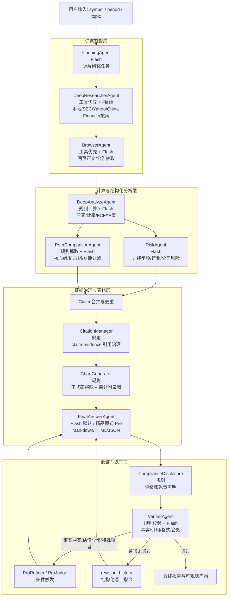

# Open DeepReport++ 金融多智能体项目 0-1 构建过程与赛题对标

更新时间：2026-05-14

## 1. 当前做到什么程度

项目已经从早期的“规则化研报流水线”推进到“可运行的金融多 Agent 研报系统原型”。当前主链可以围绕单个上市公司/个股自动完成：

- 任务规划：把研究主题拆成检索、浏览、分析、撰写、验证等子任务。
- 数据与证据获取：接入 SEC CompanyFacts、Yahoo Finance、本地样例数据、Tavily/Serper 搜索、本地 evidence store。
- 结构化财务分析：生成三表摘要、核心财务比率、趋势判断、估值、敏感性分析、风险提示、同业比较。
- 报告生成：输出 Markdown、HTML、JSON，HTML 中包含图表、引用和合规披露。
- 自检返工：Verifier 发现事实、引用、章节或合规缺口后，可触发 FinalAnswer 返工，并记录 revision history。
- 工具化能力：提供 ToolRegistry、MCP-style HTTP/JSON-RPC 服务和本地 Web UI。
- 中文市场第一层入口：已新增 A/H 股 source discovery，能识别 A 股、港股代码并返回巨潮、交易所、港交所披露易、东方财富/同花顺等分级来源候选。

最新一轮 Claude/上游工作已经做到这里：

- 新增/接入 `RiskAgent` 与 `PeerComparisonAgent`，补齐风险评估和同业横向比较。
- 强化 `DeepAnalyzeAgent`、`company_valuation.py`、`financial_ratios.py`，让估值、敏感性和财务口径更接近研报要求。
- 修补引用、合规披露、HTML 报告标题区、默认运行参数、公司 universe。
- 产出多轮 QA 报告，JPM/META/BAC 等样例已经进入“可演示但仍需事实精修”的阶段。

当前最重要的判断：

```text
已具备：公司/个股研报自动生成闭环 + 多 Agent 协作骨架 + 引用/图表/验证/合规披露 + A/H 股权威来源发现入口。
未完成：宏观研报、行业/子行业研报、A/H 股结构化财务抽取、正式开源模型替换、稳定的大规模泛化评测。
```

### 1.1 评分口径说明

文档中同时出现两类评分，含义不同，不能直接换算：

- 人工复核分（0-100）：基于实时性、真实性、金融专业性、完整性、展示质量的综合评审，用于判断报告是否接近可对外展示的研报成品。
- 系统验证分（0-1）：`Verifier` 内部质量指标，用于回归测试和版本间相对比较，重点衡量引用、结构、图表、事实一致性等机器可检查项，不直接等同于人工研报质量分。

因此，`0.82` 不应简单理解为 `82 分`；人工 90+ 与系统 0.75-0.85 可以同时成立，因为二者衡量的对象和粒度不同。

## 2. 与赛题目标的对标

赛题要求三类季度/年度跟踪型金融研报：

1. 公司/个股研报
2. 行业/子行业研报
3. 宏观经济/策略研报

本项目当前只完整落地了第一类：公司/个股研报。除此之外，对照赛题技术目标，进展如下：

| 赛题目标 | 当前状态 | 说明 |
| --- | --- | --- |
| 多 Agent 协同 | 基本达成 | Planning、Research、Browser、Analyze、Risk、Peer、FinalAnswer、Verifier 已形成主链。 |
| 多模态呈现 | 部分达成 | 已有 PNG/HTML 图表、财务表格、引用表；还没有 PDF 图表解析、OCR、复杂多模态输入理解。 |
| 专业性和深度 | 中高 | 已有三表、比率、估值、敏感性、风险、同业对比；特殊财务项目仍需更强口径识别。 |
| 数据融合与事实溯源 | 中高 | SEC、Yahoo、本地 RAG、网页搜索、CitationManager 已接入；A/H 股已补权威来源发现层，但中文结构化财务抽取仍需继续做。 |
| 格式与逻辑 | 中高 | HTML/Markdown/JSON、章节结构、参考来源、合规披露已具备；证券业协会格式还需进一步模板化。 |
| 任务泛化 | 中 | 美股公司已可跑多标的；A/H 股、行业、宏观泛化不足。 |
| 落地潜力 | 较强 | 有 UI、CLI、MCP 服务、配置化后端和可观测 trace。 |
| 创新性 | 较强 | RAG + 工具调用 + MCP-style 服务 + verifier 返工 + 引用治理已经形成组合拳。 |
| 开源模型/API限制 | 待修正 | 目前 DeepSeek/Tavily/Serper 可用性强，但若严格按赛题“开源模型及其 API、不能用闭源 AI 搜索接口”，需要切到开源模型和普通搜索/爬取。 |

结论：如果只看公司/个股研报，本项目已经接近一个可演示的复赛级原型；如果按赛题完整覆盖三类研报，则还差行业和宏观两条生产链。

## 3. 与二等奖 DeepReport 方案相比

公开 DeepReport 方案的强项是完整的赛题覆盖、工程部署形态和多 Agent 骨架。它定位为 AI 驱动金融研究和报告生成系统，使用规划智能体与子智能体协作，生成带可视化、引用和数据溯源的金融报告。

我们与其相比的劣势：

- 研报类别少：当前只主攻公司/个股研报，行业和宏观仍是空白。
- 赛题合规适配不足：当前部分搜索/API 在严格赛题限制下需要替换。
- 中文金融数据仍在起步：A/H 股已补第一层 source discovery 和来源权威分级，但东方财富/同花顺结构化行情、交易所公告正文、国家统计局和政策公告解析还没做成稳定数据层。
- 发布形态弱于成熟方案：还没有 Docker、生产部署、完整示例集、说明视频或正式评测榜单材料。

我们的优势：

- 公司/个股链条更“会计事实驱动”：SEC CompanyFacts、财务指标 lineage、估值模型、非经常项提示、同业比较和风险 Agent 都在往可核验财务口径收敛。
- 可验证性更强：每轮输出包含 `claims.json`、`evidence.json`、`citations.json`、`verification_report.json`、`task_trace.jsonl`，能追踪“结论从哪里来”。
- 自检返工更明确：Verifier -> FinalAnswer 的返工历史可落盘，适合展示 Agent 不是一次性生成，而是有质量闭环。
- 工具化落地更清晰：CLI、Web UI、MCP-style HTTP 服务同时存在，方便从 Demo 走向产品化。
- 架构演进记录完整：从 pipeline 到 multi-agent 的重构路径、踩坑、修复和评审报告都在仓库里，有利于答辩说明“我们怎么把系统做出来”。

一句话定位：

```text
二等奖方案更完整、更贴赛题；我们当前更像一个公司研报垂直深挖版，优势在事实核验、财务口径、可追踪输出和工具化闭环。
```

## 4. 从 0 到 1 的构建过程

### 4.1 第 0 步：先定问题边界

最开始不要直接写“万能金融 Agent”。赛题很大，包含宏观、行业、公司三类研报。如果一开始三条线同时做，会很快陷入数据源、模板、指标体系和评测口径都不稳定的问题。

因此第一版选择公司/个股研报作为主场景，原因是：

- 公司财报有相对明确的结构化数据。
- 三表、比率、估值、风险提示更容易设计验收标准。
- 单公司任务便于做端到端闭环：输入 ticker，输出报告。
- 先把“证据 -> claim -> 报告 -> 验证”的主链跑通，再扩展行业/宏观。

### 4.2 第 1 步：搭一个最小可运行流水线

初始架构不是多 Agent，而是一条规则 pipeline：

```text
src/app/main.py
  -> src/app/pipeline.py
  -> src/agents/orchestrator.py
  -> Planner
  -> Analyst
  -> Writer
  -> Verifier
```

这个阶段的目标是证明“项目能跑完”：

- `Planner` 用固定章节模板生成报告计划。
- `Analyst` 用 pandas 和规则生成核心 claim。
- `Writer` 用模板输出 Markdown。
- `Verifier` 做基础字段、数字和引用检查。

这个阶段的优点是稳定，缺点也很明显：它更像报告生成流水线，不是真正的多智能体。

### 4.3 第 2 步：抽出稳定数据契约

流水线能跑以后，最重要的是把中间数据结构固定下来。否则 Agent 越加越多，输入输出会互相污染。

核心契约放在：

```text
src/schemas/evidence.py
src/schemas/claim.py
src/schemas/chart.py
src/schemas/report.py
src/schemas/task.py
```

这些 schema 解决了几个问题：

- evidence 必须有来源、类型、时间、URL 或本地路径。
- claim 必须能指回 evidence_id。
- chart 必须有 chart_id、图片路径、数据摘要。
- task 必须能表达依赖关系、参数和状态。

这一步让后续多 Agent 协作有了“共同语言”。后续新增 A/H 股数据入口时，也没有让 Agent 直接拼网页，而是先把中文来源包装成 evidence-like record，继续沿用同一套证据契约。

### 4.4 第 3 步：建立数据层与特征层

为了让报告不是纯 LLM 编写，项目把数据获取和财务计算拆开。

数据层：

```text
src/data/sec_companyfacts.py
src/data/yahoo_finance.py
src/data/fetch_financials.py
src/data/fetch_market.py
src/data/fetch_news.py
src/data/source_authority.py
src/data/source_quality.py
```

特征层：

```text
src/features/financial_statements.py
src/features/financial_ratios.py
src/features/trend_analysis.py
src/features/company_valuation.py
src/features/peer_compare.py
src/features/risk_signals.py
src/features/financial_metric_lineage.py
```

这个阶段重点不是“让模型更会写”，而是把模型不擅长的精确计算交给代码：

- 营收、净利润、现金流、股东权益等从结构化数据取。
- ROE、净利率、FCF、同比增速等由代码计算。
- 估值和敏感性分析由规则模型生成。
- 来源可信度由 `source_authority.py` 和 `source_quality.py` 管理。

### 4.5 第 4 步：补检索与证据治理

报告质量最容易崩在“事实从哪里来”。因此项目加入本地 RAG 和搜索聚合：

```text
src/search/search_manager.py
src/retrieval/evidence_store.py
src/retrieval/bm25_index.py
src/retrieval/chroma_index.py
src/retrieval/retrieve.py
src/retrieval/chunking.py
```

当前支持：

- 本地样例数据：`local_real_data`
- 本地证据库：`local_evidence`
- Yahoo Finance：`yahoo_finance`
- A/H 股来源发现：`china_finance`
- Tavily/Serper：网页搜索适配
- BM25 + vector recall + hybrid rerank

踩坑：

- 只靠搜索 snippet，报告会浮。
- 只靠本地财务表，报告缺少实时新闻和管理层口径。
- 向量依赖不稳定时，环境容易跑不起来。

解决：

- 搜索结果统一转成 evidence。
- A/H 股先做官方入口发现和来源分级，不直接依赖不稳定 JS 页面抓取。
- BrowserAgent 尝试用 Jina Reader/Playwright 抽网页正文。
- Chroma/sentence-transformers 缺失时自动 fallback 到内存和启发式 rerank。

### 4.6 第 5 步：从流水线升级为多 Agent

多 Agent 主链入口：

```text
scripts/run_multi_agent_demo.py
src/agents/multi_agent_orchestrator.py
```

当前协作角色：

```text
PlanningAgent
  -> DeepResearcherAgent
  -> BrowserAgent
  -> DeepAnalyzeAgent
  -> RiskAgent
  -> PeerComparisonAgent
  -> FinalAnswerAgent
  -> VerifierAgent
```

这一步的关键思考是：不要为了“Agent 数量”而拆分，而是按失败模式拆分。

- 信息不够：交给 Research/Browser。
- 财务口径错：交给 Analyze/特征层。
- 风险提示薄：交给 RiskAgent。
- 缺少横向比较：交给 PeerComparisonAgent。
- 写作结构散：交给 FinalAnswerAgent。
- 引用、事实、格式不稳：交给 CitationManager + VerifierAgent。

### 4.7 第 6 步：加入引用、图表和合规披露

报告不是只要正文，还要能展示、能审计、能答辩。

关键文件：

```text
src/report/citation_manager.py
src/report/chart_generator.py
src/report/html_report_generator.py
src/report/compliance_disclosure.py
```

输出文件：

```text
data/outputs/multi_agent/citations.json
data/outputs/multi_agent/charts.json
data/outputs/multi_agent/verification_report.json
data/reports/multi_agent/report.md
data/reports/multi_agent/report.html
data/reports/multi_agent/report.json
```

这一步解决：

- 每个 claim 能不能找到 evidence。
- 报告末尾有没有参考来源。
- 投资建议有没有评级口径和免责声明。
- HTML 是否适合演示。

### 4.8 第 7 步：做 UI、MCP 和可观测输出

为了让项目不像脚本堆砌，补了三个产品化入口：

```text
scripts/run_financial_agent_ui.py
src/app/web_ui.py

scripts/run_mcp_server.py
src/utils/mcp_http_server.py
src/utils/mcp_manager.py
src/tools/registry.py
```

可观测输出：

```text
task_plan.json
task_trace.jsonl
run_summary.json
search_meta.json
revision_history.json
```

这让演示时可以回答：

- Agent 做了哪些任务？
- 每步耗时多久？
- 用了哪些搜索源？
- 哪些 claim 被哪些 evidence 支撑？
- Verifier 有没有触发返工？

## 5. 中间遇到的问题与解决

| 问题 | 表现 | 解决方案 |
| --- | --- | --- |
| 项目早期像规则流水线，不像多 Agent | Planner/Analyst/Writer/Verifier 固定执行 | 新增 `multi_agent_orchestrator.py`，按 task dependency 分发任务。 |
| LLM 容易写出无来源结论 | 报告可读但不可审计 | 引入 Evidence/Claim schema 和 `CitationManager`。 |
| 数字口径错误 | 如税收收益、ROE、FCF、P/E 基数混用 | 将财务计算下沉到 `financial_ratios.py`、`company_valuation.py`，并补 QA 评审。 |
| 特殊项目识别不足 | META 一次性税项容易写成净税收收益口径 | `RiskAgent` 增加非经常项提示，但还需继续做官方脚注解析。 |
| 报告缺少同业横向比较 | 个股分析显得孤立 | 新增 `PeerComparisonAgent`，用同业 SEC 数据补比较表。 |
| 搜索源质量不一 | 网页 snippet 信息碎片化 | `source_authority.py`、`source_quality.py` 给来源分级，BrowserAgent 抽正文。 |
| 本地依赖复杂 | Chroma、Playwright、sentence-transformers 可能缺失 | 可选依赖 + fallback 路径，保证主链不断。 |
| HTML 演示不够专业 | Markdown 可读但展示弱 | `html_report_generator.py` 增加专业封面、指标卡、图表和引用区。 |
| 返工不可追踪 | 不知道 Verifier 改了什么 | 输出 `revision_history.json` 和 `task_trace.jsonl`。 |
| 目录臃肿 | 历史评测、缓存、重复目录混杂 | 清理 `.DS_Store`、`__pycache__`、误复制的嵌套目录和中间产物。 |
| 中文 A/H 数据入口缺失 | 美股链路较强，但 A/H 股缺少稳定权威来源入口 | 新增 `src/data/china_finance.py`、`china_finance` 搜索引擎和 `discover_china_finance_sources` 工具，先完成代码识别、官方披露入口、行情候选源和来源分级。 |

## 6. 当前工作流程图



## 7. 关键代码入口与规范化命名索引

以后对外介绍时，建议统一使用下面这套名称，避免“stage 脚本”“demo 脚本”“QA 脚本”混在一起讲不清。

| 对外模块名 | 当前文件 | 作用 |
| --- | --- | --- |
| CLI 多 Agent 入口 | `scripts/run_multi_agent_demo.py` | 命令行运行完整多 Agent 研报生成。 |
| Web 工作台入口 | `scripts/run_financial_agent_ui.py`、`src/app/web_ui.py` | 本地可视化输入、运行和查看报告。 |
| MCP 工具服务入口 | `scripts/run_mcp_server.py`、`src/utils/mcp_http_server.py` | 暴露工具 manifest 和 JSON-RPC 调用。 |
| 多 Agent 调度器 | `src/agents/multi_agent_orchestrator.py` | 主流程编排、任务状态、返工循环、产物落盘。 |
| 任务规划 Agent | `src/agents/planning_agent.py` | 生成任务计划和依赖。 |
| 深度研究 Agent | `src/agents/deep_researcher_agent.py` | 调用搜索与本地证据源。 |
| 浏览 Agent | `src/agents/browser_agent.py` | 抽取网页正文、补充 evidence。 |
| 财务分析 Agent | `src/agents/deep_analyze_agent.py` | 生成财务 claim、估值和分析产物。 |
| 风险 Agent | `src/agents/risk_agent.py` | 生成风险评估 claim。 |
| 同业对比 Agent | `src/agents/peer_comparison_agent.py` | 拉取同业数据并生成横向比较。 |
| 终稿 Agent | `src/agents/final_answer_agent.py` | 组织最终报告正文。 |
| 验证 Agent | `src/agents/verifier_agent.py` | 检查事实、引用、结构和合规。 |
| 模型适配层 | `src/models/model_adapter.py` | DeepSeek/OpenAI-compatible 后端统一入口。 |
| 搜索聚合层 | `src/search/search_manager.py` | 多搜索源统一调度。 |
| 工具注册表 | `src/tools/registry.py` | 金融工具 schema 与调用入口。 |
| SEC 数据源 | `src/data/sec_companyfacts.py` | 拉取公司财务事实。 |
| Yahoo 数据源 | `src/data/yahoo_finance.py` | 拉取行情快照。 |
| A/H 股来源发现层 | `src/data/china_finance.py` | 识别 A/H 股代码，返回巨潮、交易所、港交所披露易、东方财富/同花顺等分级来源候选。 |
| 财务比率 | `src/features/financial_ratios.py` | ROE、净利率、FCF、增长率等。 |
| 估值模型 | `src/features/company_valuation.py` | P/E、P/S、DCF/DDM、敏感性分析。 |
| 引用治理 | `src/report/citation_manager.py` | evidence 到 citation 的映射。 |
| HTML 报告 | `src/report/html_report_generator.py` | 专业 HTML 报告生成。 |
| 合规披露 | `src/report/compliance_disclosure.py` | 评级说明与免责声明。 |

建议后续真正重命名的方向：

```text
scripts/run_multi_agent_demo.py      -> scripts/run_company_report_agent.py
scripts/run_financial_agent_ui.py    -> scripts/serve_company_report_ui.py
scripts/run_financial_qa_fixes_v1.py -> scripts/run_company_report_qa.py
docs/Open_DeepReport_financial_report_QA.md -> docs/company_report_agent_build_process.md
```

本次没有直接重命名这些入口，是为了避免破坏已有 README、测试和用户打开的文件路径；先在文档里统一称呼，后续可单独做一次低风险 rename。

## 8. 推荐运行方式

快速本地 Demo：

```bash
python scripts/run_multi_agent_demo.py --symbol NVDA --period latest --execution-mode dynamic --fast
```

带更多搜索源：

```bash
python scripts/run_multi_agent_demo.py \
  --symbol JPM \
  --period latest \
  --execution-mode dynamic \
  --engines local_real_data,yahoo_finance,tavily,local_evidence
```

启动 Web UI：

```bash
python scripts/run_financial_agent_ui.py --host 127.0.0.1 --port 8787
```

启动 MCP-style 工具服务：

```bash
python scripts/run_mcp_server.py --host 127.0.0.1 --port 8765
```

## 9. 下一步最该补什么

现在不建议平均铺开宏观、行业、A/H、部署所有方向，而应分两层推进。

短期目标：把公司研报从 90 分级推到 95 分级。

1. 补齐战略与主营业务、股权结构与治理等弱章节，增加 governance / strategy evidence extractor 和章节合成模板。
2. 风险分析更公司化，从 1-2 条关键风险扩展到业务、监管、资本开支、信用质量、利率、竞争格局等多维框架。
3. 估值从固定规则走向情景化，引入历史估值区间、一致预期、情景概率加权和关键假设解释。
4. Peer universe 更合理，从“能抓到同行数据”升级到基于行业 taxonomy、收入结构和商业模式的可比公司选择。
5. 来源精简与权威级别标注继续修复，避免 SEC peer evidence 被误标弱来源、未关联搜索结果进入正式参考来源。
6. 报告全文语言统一中文化，减少英文句子和模板痕迹混入中文正文。
7. 正式化图表再增加 1-2 张真正有研究价值的图，例如 CapEx 趋势、利润率桥、业务结构、同行估值区间。

中期目标：公司链条稳定后，再扩展赛题覆盖面。

1. 行业研报链路：行业数据抓取、集中度、产业链、情景模拟、敏感性分析。
2. 宏观策略链路：GDP/CPI/利率/汇率/政策文本、区域对比、传导路径、风险预警。
3. A/H 股结构化数据层：在本轮 source discovery 基础上继续做公告正文、财报表格、行情快照和中文新闻解析。
4. 赛题限制适配：替换闭源/AI 搜索接口，补开源模型和普通公开数据爬取路线。
5. 评测集：固定 10-20 个公司样例，保留报告、证据、评分、错误桶和回归测试。
6. 发布形态：Docker、样例视频、README 精简版、架构图、答辩 PPT。

## 10. 2026-05-13 成品化修复记录

根据 JPM、META、BAC 三份报告的人工复核，下一轮集中修复 5 件事，避免继续扩散新功能：

| 修复项 | 问题表现 | 本轮处理 |
| --- | --- | --- |
| 业务概览 | 旧输出会写“证据覆盖 X 条、横跨 Y 类来源”，像调试信息。 | `DeepAnalyzeAgent` 优先用 `company_profile` 生成公司业务画像，包含板块、行业、主营业务描述；只有缺少 profile 时才降级说明数据缺口。 |
| 三表摘要 | 有营收、净利润、OCF、权益等数据时仍可能只写“三表覆盖 X 项”。 | `financial_statements` claim 改为直接列出 3-5 个关键项：营收、净利润、经营现金流、自由现金流、股东权益/总资产。 |
| 同行对比 | JPM、BAC、META 只显示目标公司一行，说明同行抓取没有真正成功。 | `PeerComparisonAgent` 改为 SEC CompanyFacts 实时抓取同行指标，失败时再回退本地同业缓存；META、银行、科技股均有明确 peer set。 |
| META 税项 | 只写 XBRL 税收收益 5.02B，容易误解为官方披露的一次性税项金额。 | 税项表达统一为：“税费净额为 -5.02B，其中包含官方披露的 8.03B 一次性所得税收益。”估值、风险、执行摘要共享同一口径。 |
| 市场数据时间 | 市值与专用行情快照会因时点不同产生争议。 | Yahoo Finance evidence 增加 `snapshot_time_et` / `snapshot_time_utc`；估值市场对照改写为“市值 X B（Yahoo Finance snapshot, 时间 ET）”。 |

QA19 修复后，对 Agent 能力的历史判断曾更新为：

```text
JPM：89 / 100
META：87 / 100
BAC：90 / 100
Agent 总体评分：89 / 100
```

结合 QA22- QA24 速度、图表正式化、META 财务空节修复、peer 财期过滤和市场快照文案修复后，最新人工样例复核可更新为：

```text
JPM：92 / 100
BAC：91 / 100
META：94 / 100
Agent 总体可评估为：92 / 100 左右
```

结论：Agent 已经能工作，尤其 BAC 证明银行业估值模板不是 JPM 特判，行业化现金流解释不是硬编码，latest 财报抓取与市场数据对照能迁移到新银行标的。当前定位已经从“事实与框架基本可靠的自动研究报告生成器”推进到“公司研报方向 90 分级可演示系统”；距离“可稳定对外发布的高质量证券研报系统”，主要还差章节深度、风险框架、估值成熟度、peer universe 和来源治理的最后打磨。

新一轮验证报告建议目录：

```text
data/reports/qa19_jpm_final/
data/reports/qa19_meta_final/
data/reports/qa19_bac_final/
```

## 10.1 2026-05-13 速度与审查精修进展

在 QA22 轮次中，系统从“全链路偏重”回到 Flash 主链 + 条件 Pro 的轻量路径，并清理了 dynamic pipeline 中重复执行的 Risk/Peer/FinalAnswer 步骤。实测三家公司完整报告均压回 3 分钟内：

| 样例 | 目录 | 总耗时 | 验证 | 评分 |
| --- | --- | ---: | --- | ---: |
| META | `data/reports/qa22_meta_speed_v1/` | 113.951s | pass | 0.7812 |
| JPM | `data/reports/qa22_jpm_speed_v1/` | 131.765s | pass | 0.75 |
| BAC | `data/reports/qa22_bac_speed_v1/` | 133.096s | pass | 0.75 |

本轮又补了 4 个审查反馈项：

| 问题 | 最新处理 |
| --- | --- |
| Citi peer 财期落后 | `PeerComparisonAgent` 现在按目标财期过滤同行。若 SEC 当前只能取到 `C(FY2025 Q3)`，而目标为 `FY2026 Q1`，系统会把 C 标为财期不一致并剔除出同行均值，不再混入同一期比较；后续一旦 SEC 能取到 C 的 FY2026 Q1，就会自动纳入。 |
| 市场快照文案 | 估值市场对照从“按收盘价”改为“按快照价/最新价”，并继续保留 Yahoo Finance snapshot 时间，避免盘中快照被误读为正式收盘价。 |
| META 财务分析空置 | `FinalAnswerAgent` 的章节回填改为使用完整 claims，而不是只用 prompt pack 后的子集；即使 prompt 为了控长丢掉部分 financial_analysis claim，最终正文也会把 META 财务分析补回。 |
| JPM peer 文本与 evidence 对齐 | peer 正文只展示实际有 evidence 的同行。若正文写 GS、MS，`evidence_ids` 必须包含对应 SEC evidence；若某 peer 数据缺失或财期不一致，则从正文可比组中移除并在剔除说明中列出。 |

对应测试已补充并通过：`tests/test_agent_quality_fixes.py` 覆盖 financial_analysis 回填、Citi stale peer 剔除、GS/MS evidence 对齐；完整相关测试集当前为 `44 passed`。

## 10.2 2026-05-14 图表正式化调整

人工复核指出旧版图表仍偏 QA 面板：`关键指标` 混合不同量纲，`结论置信度` 和 `证据来源结构` 更像系统审计图，不适合作为正式研报正文图。本轮将图表层拆成两类：

| 图表层级 | 新图表 | 用途 |
| --- | --- | --- |
| 研报正文图 | 核心财务表现 | 展示营收、净利润、经营现金流、自由现金流、权益/资产等核心财务项。 |
| 研报正文图 | 盈利能力与资本回报 | 展示净利率、ROE、ROA 等百分比指标，避免与金额类指标混放。 |
| 研报正文图 | 估值对照：模型价值与市场市值 | 对比规则综合估值、DCF 估值和市场市值。 |
| 研报正文图 | 同行对比：核心指标 | 展示目标公司与同行的营收、增速、净利率、ROE、FCF。 |
| 审计附录图 | 附录：结论置信度 | 保留给系统可观测性和答辩解释，不作为投资正文图。 |
| 审计附录图 | 附录：证据来源结构 | 保留给证据覆盖和来源结构审计。 |

实现位置：

- `src/report/chart_generator.py`：默认图表从 QA 型 `key_metrics/confidence/source mix` 改为正式研报图 + 审计附录图。
- `src/report/report_enhancer.py`、`src/report/html_report_generator.py`：Markdown/HTML 中按“研报图表 / 审计附录图表”分组展示。
- `src/agents/verifier.py`：补充 `close_price`、`one_month_price_change_pct` 为市场数据字段，避免价格快照 claim 被误判为必须 SEC primary filing 支撑。

验证样例：

```text
data/reports/qa24_meta_report_charts_fix/
```

该样例耗时 71.093s，`verification_passed=true`，`chart_consistency=true`，`multimodal_consistency=true`，评分 0.8229。相关测试集当前为 `48 passed`。

## 10.3 当前公司研报仍存在的质量边界

最新报告已经稳定进入 90 分级别，但还不能把它描述成完整卖方级研报。当前边界更具体地体现在以下几类：

| 问题 | 当前表现 | 后续优化方向 |
| --- | --- | --- |
| 章节完整性不均衡 | 财务分析、估值、风险、同行对比较强；股权结构与公司治理、战略与主营业务、投资逻辑归纳仍可能偏弱或留空。 | 增加 governance / strategy evidence extractor，给弱章节配置专门的证据抓取和回填模板。 |
| 风险分析仍偏窄 | 现阶段多为 1-2 条关键风险；META 已能识别一次性税项，银行已能写利率、信用、资本充足率，但公司特异性风险覆盖仍不够厚。 | 加入公司特异性风险词典、财报 MD&A 风险解析和行业风险框架。 |
| 估值仍属规则框架 | 银行业 P/B + DDM + P/E、META P/E + P/S + DCF 已可解释，但 payout ratio、Ke、g、DCF 增速等仍是规则假设。 | 接入历史估值区间、一致预期、情景概率加权和参数来源说明。 |
| Peer 可比性仍需提升 | 已解决“有没有数据”和“财期是否一致”，也有核心组/扩展组；但 peer set 的商业模式可比性仍较粗。 | 按行业 taxonomy、收入结构、业务模型自动选择 peer universe。 |
| 来源治理仍需精修 | 已能区分主证据、peer evidence 和未关联来源；但仍需避免 peer SEC 官方证据被错误标弱、未关联搜索结果进入正式参考来源。 | 优化 `source_authority.py`、bibliography pruning 和引用分区。 |
| 输出语言一致性 | 业务画像、风险、估值段落偶尔仍有英文句子或模板痕迹嵌入中文正文。 | 增加统一中文化改写和金融术语规范层。 |
| 展示层进一步成品化 | 图表已从 QA 面板改成正式研报图，但治理、战略、CapEx、业务结构等研究型图表还不够。 | 增加 CapEx、利润率趋势、业务结构和同行估值区间图。 |

因此，更准确的表述是：项目已经能生成“事实、框架、引用和展示都基本可靠的公司研究报告”，但距离研究员级深度报告，还要补战略、治理、风险、估值假设和 peer universe 的专业深度。

## 10.4 模型路由策略

为兼顾生成质量与端到端耗时，系统采用“Flash 主链 + 条件 Pro”的分层模型路由，而不是全链路 Flash 或全链路 Pro。

| Agent / 节点 | 默认模型策略 | 触发升级条件 |
| --- | --- | --- |
| PlanningAgent | Flash | 很少升级。 |
| DeepResearcher / Browser | 工具优先，必要时 Flash | 搜索结果冲突或需要复杂摘要时升级。 |
| DeepAnalyzeAgent | 规则计算为主 + Flash | 特殊财务口径冲突、估值异常时升级 ProJudge。 |
| RiskAgent | Flash | 非经常项、监管风险、复杂风险归纳不稳定时升级。 |
| PeerComparisonAgent | 规则抓取 + Flash | peer 口径冲突、财期不一致或商业模式可比性存疑时升级。 |
| FinalAnswerAgent | Flash 默认，精品模式可切 Pro | claims/evidence 已稳定且需要最终润色时升级。 |
| VerifierAgent | 规则检查 + Flash | Verifier fail 且规则无法裁决时触发 ProRefiner / ProJudge。 |

这体现了项目的一个重要工程判断：大模型不是越大越好，而是要按 Agent 任务类型路由。事实抓取、财务计算和来源分级优先交给工具与规则；LLM 主要负责规划、归纳、解释和成文；Pro 模型只在事实冲突、估值异常、特殊财务项目、peer 口径冲突和最终精品化改写时条件触发。

## 10.5 A/H 股中文金融数据层第一步

本轮针对“中文金融数据覆盖不足”先补了第一层稳定入口，而不是直接写不稳定网页爬虫。

实现位置：

- `src/data/china_finance.py`：新增 A/H 股代码识别和来源发现层，支持 `600519`、`000001.SZ`、`00700.HK` 等格式。
- `src/search/search_manager.py`：新增 `china_finance` 搜索引擎，纳入 `SearchManager.with_local_sources()`。
- `src/tools/registry.py`：新增 `discover_china_finance_sources` 工具，后续 Agent 可通过 tool call 获取中文权威来源候选。
- `src/data/source_authority.py`：补充东方财富、同花顺等市场数据域名，并继续把巨潮、上交所、深交所、北交所、港交所披露易归为 primary official source。

当前能做到：

- A 股代码归一化：`600519` -> `600519.SH`，`000001.SZ` -> `000001.SZ`。
- 港股代码归一化：`00700.HK` -> `00700.HK`。
- 官方披露入口：巨潮资讯、上交所、深交所、北交所、港交所披露易。
- 市场行情候选：东方财富、同花顺。
- 来源分级：官方披露可支撑核心财务和事件结论；行情源只支撑价格、成交量、市值等 market claims，不能单独支撑营收、利润等核心财报结论。

当前还没做到：

- 自动下载并解析中文 PDF 年报、中报、季报。
- 从东方财富/同花顺稳定抽取结构化行情、估值和财务摘要。
- 接入交易所公告正文、国家统计局宏观数据、政策公告和 A/H 股公司画像。
- 对中文公司做完整三表、估值、同行和报告生成回归。

这一步的价值是把 A/H 股从“完全没有稳定入口”推进到“有权威来源发现、来源分级、搜索引擎和工具调用入口”。后续结构化抽取可以在这个 evidence contract 上继续扩展。

## 11. 最终判断

项目目前不是“完整赛题终局版”，但已经不是空壳或普通文本生成器。它已经完成了公司研报方向最关键的 0-1，并开始把能力外扩到 A/H 股中文数据入口：

```text
输入一个公司研究主题
  -> 自动拆任务
  -> 拉取公开证据
  -> 做财务计算和估值
  -> 生成图文报告
  -> 附引用和披露
  -> 自动验证并返工
```

如果接下来只剩较短时间，最稳的策略不是平均补三类研报，而是把公司/个股研报做成足够扎实的样板，再用同一套 Agent 框架扩展 A/H、行业和宏观。这样答辩时能讲清楚：项目不是凭空生成研报，而是围绕证据、计算、引用、验证、返工和数据源治理逐步构建出来的金融研究工作流。
