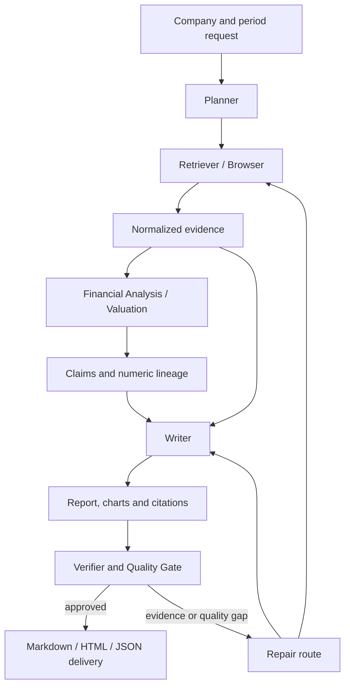

# FinSight Architecture

FinSight treats a financial report as an auditable chain of evidence-backed decisions rather than a single generation call.

## Runtime Flow

## Responsibilities

| Stage | Responsibility | Observable output |
| --- | --- | --- |
| Planner | Convert the research request into an executable task graph. | `task_plan.json`, trace events |
| Retriever / Browser | Select local or configured sources and normalize evidence. | `search_meta.json`, `evidence.json` |
| Financial Analysis / Valuation | Produce statement views, financial features, peer/valuation context and structured claims. | `claims.json`, `financial_metrics.json`, valuation artifacts |
| Writer | Assemble evidence-backed prose, tables, citations and charts. | `report.md`, `report.html`, `report.json` |
| Verifier | Validate evidence links, numeric support, sections, chart lineage and delivery constraints. | `verification_report.json`, scorecard |
| Repair | Route open gaps back to collection, analysis or rewriting. | revision history and gap trace |

## Quality Contract

Facts and numeric conclusions must connect to evidence IDs. Citations and chart metadata are exported separately from the narrative, allowing verification and benchmark scoring without relying on prose inspection alone. Formal-18 evaluates the same frozen evidence pool across all variants.

## Code Entrypoints

- `src/agents/multi_agent_orchestrator.py`: dynamic collaboration chain.
- `src/evaluation/formal_benchmark.py`: fixed-protocol comparison runner.
- `src/app/web_ui.py`: local chat-first workbench.
- `scripts/run_multi_agent_demo.py`: local visible demonstration.
