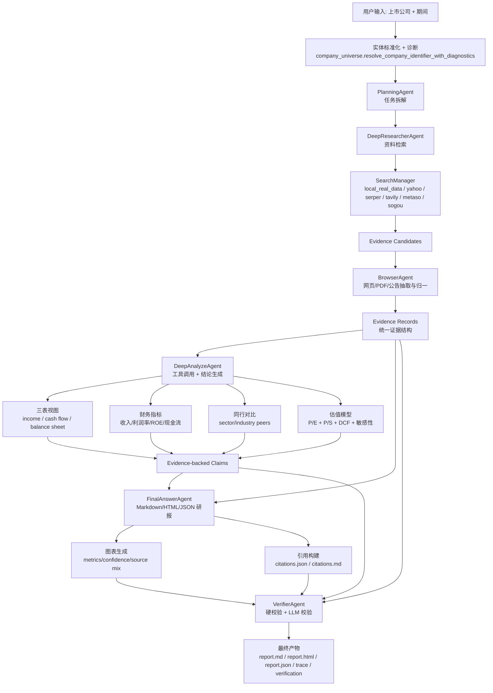
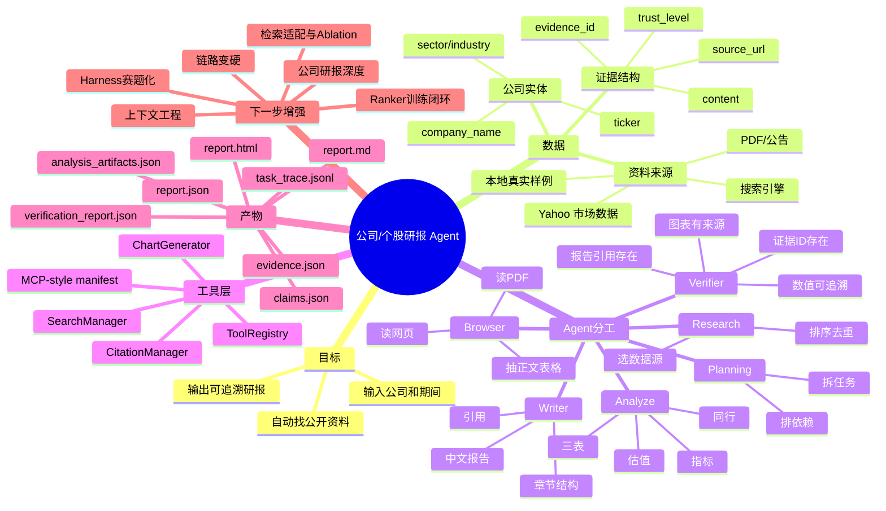

# 公司/个股研报 Agent 架构说明

## Agent 能力落点

这个项目体现 Agent 能力的核心不在于“调用了一次大模型”，而在于把研报任务拆成多个有状态、有边界、有产物的角色，并让每个角色围绕同一个任务链条协作：

- `PlanningAgent`：把公司研报需求拆成可执行任务图。
- `DeepResearcherAgent`：选择搜索/本地数据源，返回候选证据。
- `BrowserAgent`：把搜索结果、网页、PDF 公告归一成 citation-ready evidence。
- `DeepAnalyzeAgent`：调用财务工具，生成三表视图、指标、同行、估值和 evidence-backed claims。
- `FinalAnswerAgent`：把 claims 和 evidence 写成中文研报。
- `VerifierAgent`：检查章节、证据 ID、引用、数值支撑和图表来源，形成反馈闭环。

## Pipeline 流程图

## 从 0 开始的思维架构图

## 当前闭环边界

当前版本已经能跑通公司/个股研报主链路，并且主链新增了三层更接近真实 Agent 系统的控制能力：

- `entity resolution gate`：入口保留 `entity_resolution` 诊断信息，`VerifierAgent` 会检查 `expected_symbol` 与证据主体是否一致，避免标的跑偏后仍然通过。
- `context packer`：对 claims、evidence、旧稿、verifier 反馈做字符预算和优先级打包。
- `local hybrid retrieval`：`BM25 + vector recall + rerank`，优先走小模型本地 RAG，缺依赖时自动 fallback。
- `verifier rework loop`：首轮验证失败时，把错误/建议压缩成 revision brief，回送给 `FinalAnswerAgent` 自动返工一轮。

但三表仍主要来自本地财务摘要和规则推导；估值模型也还是第一版规则模型。下一步应优先把 PDF/公告表格抽取接到真实三表 schema，再补股本、市值、EV、同行选择规则和更细的图文一致性校验。

## 四条主线，两项补强优先级

1. `已有链路变硬`：先做入口实体解析、目标公司一致性校验、verifier 语义防线和失败样本回归。当前已完成第一步：`entity_resolution` 诊断进入 orchestrator 状态与 run summary，verifier 增加 `expected_symbol` 对齐检查。
2. `上下文工程化完善`：继续细化 claims、evidence、旧稿、revision brief、conversation memory 的预算和优先级，并补充被丢弃上下文的 trace。
3. `ranker 文档同步与训练闭环做实`：以代码和配置为准统一 ranker 模型描述，补正负样本、hard negative、训练/校准产物和 harness 对照。当前已完成最小闭环：默认模型统一为 `BAAI/bge-reranker-base`，dataset 记录正样本/硬负样本与来源字段，训练脚本写入可复用 `feature_weights`，推理 fallback 会读取校准权重。
4. `检索链路适配与 ablation`：面向中文财经、公告 PDF、财报表格、ticker/别名做召回适配，并固定 `bm25 / vector / hybrid / hybrid_rerank` 对照实验。当前已完成最小闭环：本地检索增加 `finance_query_expansion_v1`，会把中文财经词、ticker、公司名、行业/板块和期间扩展进 query；retrieval meta 输出 `record_count / hit_count / failure_reason`；multi-agent harness 输出 `retrieval_ablation`，按 ranking mode 汇总 coverage、alignment、fallback 和 verifier pass delta。
5. `公司研报内容深度补强`：补股权结构、治理、管理层、战略、业务拆分、同行地位、估值敏感性和风险提示。当前已完成最小闭环：报告 outline 增加 `股权结构与公司治理`、`战略与主营业务`、`估值敏感性`；`DeepAnalyzeAgent` 会从 company_profile、financials、market/valuation artifacts 生成对应 claims；`VerifierAgent` 会检查新增 claim section 是否有对应报告章节；harness 默认结构完整性也纳入新增章节。
6. `harness 赛题化`：把赛题必答项做成 checklist 指标，沉淀 ticker 混淆、证据不足、图文不一致等失败样本池。当前已完成最小闭环：`multi_agent_harness` 为每份报告输出 `contest_checklist`、`contest_checklist_score` 和 `failure_taxonomy`；summary 汇总 checklist 均分、失败类型、检索 ablation 和固定 regression topics；`summary.md` 变成可展示的评测摘要。

## 六项完成标准

1. `已有链路变硬` 完成标准：
   - 输入中的公司名、ticker、别名会生成 `entity_resolution` 诊断，并写入 run summary / verification report。
   - `VerifierAgent` 能拦截目标 symbol 与 evidence symbol 不一致的报告。
   - 至少覆盖一个历史失败样本，例如 `Nvda` 被误解析为 `NADA` 的回归测试。
   - 动态主链 smoke、verifier 单测、harness 相关测试全部通过。

2. `上下文工程化完善` 完成标准：
   - `claims`、`evidence`、`prior_markdown`、`revision_brief`、`conversation_brief` 都有明确字符预算入口。
   - context pack meta 至少包含 `input_count`、`packed_count`、`dropped_count`、`packed_ids`、`dropped_ids`。
   - cited evidence 优先进入上下文；如果被预算丢弃，必须出现在 `prioritized_dropped_ids`。
   - `FinalAnswerAgent` 和 `VerifierAgent` 都能输出可审计的 context pack meta，并有单测覆盖。

3. `ranker 文档同步与训练闭环做实` 完成标准：
   - 文档、配置、推理代码对默认 ranker 模型名保持一致。
   - 训练数据包含 query、positive evidence、hard negative evidence 和来源字段。
   - 训练脚本不只写元数据，至少能产出可复用的校准/训练产物。
   - harness 能输出 `bm25 / vector / hybrid / hybrid_rerank` 的对照指标。

4. `检索链路适配与 ablation` 完成标准：
   - 中文财经 query、A 股公告/PDF、财报表格、ticker/公司别名都有召回路径。
   - chunk 策略能区分段落、表格行、指标项，并保留 evidence lineage。
   - 固定样本集上能比较 evidence 命中率、claim 支撑率、引用正确率、数值可追溯率。
   - 搜索 fallback 和失败原因写入 search meta。

5. `公司研报内容深度补强` 完成标准：
   - 报告稳定覆盖股权结构、治理/管理层、战略、主营业务、行业地位、同行对比、估值敏感性、风险提示。
   - 三表数据从真实表格/PDF/公告抽取进入 schema，而不是只靠财务摘要推导。
   - 估值章节能说明关键假设、敏感性、股本/市值/EV 来源。
   - verifier/harness 能检查上述章节是否有证据支撑。

6. `harness 赛题化` 完成标准：
   - harness 有赛题 checklist 分数，而不仅是工程 smoke 指标。
   - 固定 regression topics 覆盖实体混淆、证据不足、图文不一致、数值错误、章节缺失。
   - 每轮输出 per-report 指标、总览摘要、失败原因分类和可展示评测报告。
   - 至少能证明一个链路改动带来的指标提升或风险下降。

## 代码实现映射

下面不是抽象角色名，而是当前代码里真实存在的落点：

| 架构角色 | 代码入口 | 主要输入 | 主要输出 | 当前关键控制点 |
| --- | --- | --- | --- | --- |
| `PlanningAgent` | `src/agents/planning_agent.py` | `research_topic`、`requirements`、`conversation_brief` | `task_plan.json` 风格的任务图 | 允许 LLM 出计划，也允许 fallback 到默认任务链；会强制把单个 verifier 放在 final_answer 之后 |
| `DeepResearcherAgent` | `src/agents/deep_researcher_agent.py` | query、symbol、period、ranking mode | `evidence_candidates`、`search_meta` | 支持普通 search path 和 ReAct tool loop；检索 meta 会保留 engines / fallback / tool_calls |
| `BrowserAgent` | `src/agents/browser_agent.py` | `evidence_candidates` | `evidence_records` | 负责把 snippet 归一成 citation-ready evidence；可选 reader / PDF 抽取 / Playwright / LLM key points |
| `DeepAnalyzeAgent` | `src/agents/deep_analyze_agent.py` | `evidence_records`、symbol、period | `claims`、`analysis_artifacts` | 先走 ratio / three-statement / peer / valuation 工具，再做 claim merge 和 evidence gate |
| `FinalAnswerAgent` | `src/agents/final_answer_agent.py` | claims、evidence、prior_markdown、revision_request、conversation_brief | `markdown`、`html`、`report_json` | 用 context packer 做预算控制；支持 verifier 返工；统一中文章节标题 |
| `VerifierAgent` | `src/agents/verifier_agent.py` | claims、markdown、evidence、charts、expected_symbol | `verification_report` | 规则校验 + LLM 校验双层结构；会产出 `revision_brief` 和 `rework_required` |
| `MultiAgentOrchestrator` | `src/agents/multi_agent_orchestrator.py` | topic、symbol、period、profile | 全套 report / trace / summary artifacts | 负责 dynamic task graph、state merge、chart/citation 构建、rework loop、run summary 持久化 |

如果要在答辩里解释“这不是单 prompt，而是多 Agent 系统”，最有说服力的就是指出：每个角色都有独立输入契约、输出契约、可审计 artifact、以及失败后如何把反馈送回上一环的机制。

## 一次动态运行的状态流

当前最重要的真实主链不是老的 `orchestrator.py`，而是 `multi_agent_orchestrator.py` 里的 `dynamic` 模式。它的运行状态大致如下：

1. 入口先做 `entity resolution`
   - 调 `resolve_company_identifier_with_diagnostics`，把 `research_topic` 和用户给的 `symbol` 归一成 `resolved_symbol`。
   - 这一步的诊断信息会进入 `state["entity_resolution"]`，最后也进入 `run_summary.json` 和 `verification_report.json`。

2. 建立 run 级记忆
   - `build_initial_conversation_state` 会把用户意图、symbol、period、hard constraints、pinned facts 压成 `conversation_context`。
   - `conversation_brief` 不是聊天记录原样拼接，而是面向 planning / writing / verifier 的压缩记忆。

3. 由 `PlanningAgent` 生成任务图
   - 计划里每个 task 带 `task_type`、`dependencies`、`priority`、`expected_output`。
   - 即便 LLM 计划不完整，`ensure_minimum_task_graph` 也会补齐 research -> browser -> analyze -> final -> verifier 的最低闭环。

4. orchestrator 逐步 enrich 并执行任务
   - `enrich_task_parameters` 会按 task_type 自动注入 symbol、period、evidence、claims、预算参数、ranking mode、conversation brief。
   - `merge_task_result` 会把每个 agent 的输出并回共享 `state`，而不是让后续 agent 直接吃前一步原始 prompt 文本。

5. `final_answer` 产出初稿后，系统追加派生能力
   - 根据 claims/evidence 自动生成 charts。
   - 生成 citations、`citations.md`、`citations.json`。
   - 输出 `report.md / report.html / report.json`，并追加合规披露。

6. `VerifierAgent` 做硬校验和语义校验
   - 检查章节是否齐全、claim 是否有 evidence、citation id 是否存在、图表是否一致、主体 symbol 是否跑偏。
   - 输出 `verification_report`，并压缩出 `revision_brief`。

7. 若验证失败，触发单轮 rework
   - orchestrator 读取 `revision_brief`，把 `prior_markdown + verification_report + conversation_brief` 回送给 `FinalAnswerAgent`。
   - 改写后重新验证，并把结果记入 `revision_history.json`。

## 产物视角下的 Agent 闭环

如果从“最后落盘了什么”来看，这个系统的 Agent 化已经比普通 workflow 更进一步，因为每层都在留下可审计中间件：

- `task_plan.json`：Planner 的任务图，不再是隐式链路。
- `search_meta.json`：Research 阶段使用了哪些 engine、是否 fallback、ranking mode 是什么。
- `evidence.json`：Browser 归一后的证据主表，是后续 claims / citations 的共享底座。
- `claims.json`：Analyze 阶段的结论层，而不是直接一把写整篇报告。
- `analysis_artifacts.json`：三表、比率、同行、估值的结构化中间产物。
- `citations.json`、`citations.md`、`charts.json`、`chart_consistency.json`：把“引用”和“图表”从 writer 文本里拆成独立对象。
- `verification_report.json`：Verifier 的可回放 verdict，而不是一句“看起来没问题”。
- `revision_history.json`、`conversation_context.json`、`task_trace.jsonl`、`run_summary.json`：让返工、记忆、时序和总览都能被审计。

这也是它适合继续往比赛/评测体系推进的原因，因为每一层都能单独打分、回归、统计失败类型。

## 哪些地方已经像 Agent，哪些地方还更像 Workflow

已经比较像 Agent 系统的部分：

- 有显式角色分工，而不是一个模型包办“搜、读、算、写、审”。
- 各角色都有自己的 prompt contract 和结构化输出。
- 任务图不是固定死顺序，planner 可以产出依赖关系，orchestrator 再补隐式依赖。
- verifier 的反馈会反向作用到 writer，形成最小闭环。
- conversation memory 不是 UI 层聊天功能，而是 run-level 控制状态。

仍然更像 workflow / 规则编排的部分：

- 动态执行器当前还是单线程串行调度，一次只执行一个 ready task。
- agent 之间共享的是 orchestrator state，而不是更强的黑板式协商或多轮协作。
- analyze 里的“智能”目前主要依赖工具和规则 claim builder，LLM 更像增强层，不是绝对主控。
- rework loop 目前只有一轮，而且只返工 writer，没有让 researcher/browser 主动补证据。
- retrieval 与 browser 虽已支持多源，但还没形成真正的“证据不足 -> 主动再检索 -> 再验证”闭环。

换句话说，当前系统已经跨过了“单 prompt 应用”的门槛，但还没有进入“强自治、多轮协商、自主补证据”的 fully-agentic 阶段。这个判断在答辩里反而是加分项，因为它说明我们知道系统真实边界，而不是把 workflow 包装成神秘智能体。

## 下一轮最值得继续补的三处

1. `Research -> Browser -> Verifier` 的证据补采闭环
   - 现在 verifier 发现证据不足后，主要是让 writer 改写；下一步应让 verifier 能把“缺什么证据”回传给 researcher/browser 补采。

2. `DeepAnalyzeAgent` 的真实表格化三表
   - 当前三表仍有较多规则推导和估算字段；应该把 PDF/公告表格抽取后直接落到标准 schema，再驱动 claims 与 valuation。

3. `dynamic scheduler` 的并行与失败恢复
   - 目前 ready task 只跑一个；后续可以把无依赖冲突的 research/browser 子任务并发化，并为失败 task 增加 retry / degrade 策略。
