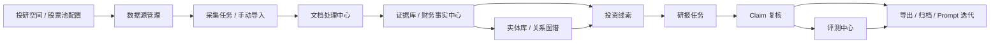
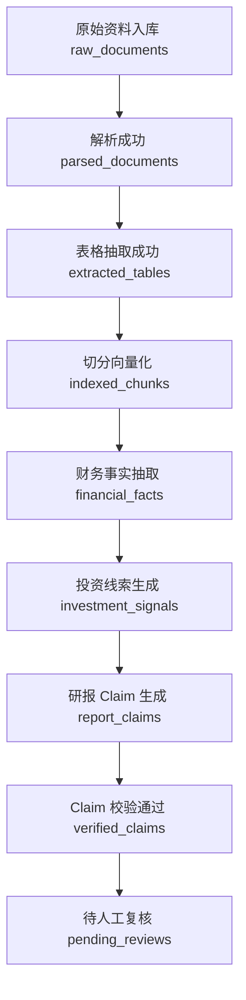

# FinSight / DeepReport++ 投研 Agent 工作台升级计划

> 给 Codex 的执行说明：本文件是 `wara886/DeepReport-` 的产品与工程重构任务书。请按 P0 → P1 → P2 → P3 顺序落地，每完成一个功能模块必须补充对应单元测试 / 集成测试。不要一次性大改所有链路；先把当前“生成一篇研报”的能力升级为“可追踪的投研任务系统 + 数据处理漏斗 + 证据复核工作台”。

---

## 0. 目标定位

当前项目已有多智能体研报生成、证据产物、质量门禁、正式 benchmark 和基础 Web UI，但产品形态仍偏“输入公司/期间 → 生成报告”。本轮升级目标是：

**FinSight Research Agent：面向投研场景的金融资料处理、事实抽取、研报生成与 Claim 级证据复核工作台。**

业务闭环：



核心原则：

1. 不是再堆一个 LLM 生成入口，而是把金融数据链路产品化。
2. 每个结论必须能追溯到 evidence、document、page、chunk、fact 或 source_url。
3. LLM API 能力必须通过 Harness 层发挥：Prompt 版本、Schema 约束、超时重试、成本时延统计、输出校验、回放评测。
4. 前端必须能展示“数据从哪里来、处理到哪一步、为什么可以/不可以写进研报”。
5. P0 先做可演示闭环，P1/P2 再做完整数据源和图谱增强。

---

## 1. 参考视频复核后的可借鉴模块

参考项目是一个黑灰产情报分析 Agent。它的强项不是单点生成，而是完整后台系统。确认可借鉴模块如下：

| 视频模块 | 观察到的功能 | 金融项目映射 |
|---|---|---|
| 首页 Dashboard | 累计采集量、有效线索数、高危线索数、待复核数、LLM 调用率、LLM 平均时延、风险类型分布、数据源分布、累计处理漏斗 | 投研首页：文档数、证据数、财务事实数、投资线索数、待复核 Claim、质量通过率、平均生成耗时、数据源分布、处理漏斗 |
| 业务配置 | 业务空间、产品、关键词、排除词、重点风险类型、BREAK 场景、阈值 | 投研空间：市场、股票池、行业、报告模板、关注指标、风险类型、证据阈值、质量门阈值 |
| 数据源管理 | 内置来源模板、启用/停用、凭证就绪、权限/额度受限、最近批次、手动触发、编辑配置 | 金融数据源管理：SEC、CNINFO、HKEX、EastMoney、Yahoo、Tavily、PDF 上传、手动导入 |
| 采集任务 | 数据源触发采集、批次状态、最近批次、失败提示 | 采集任务中心：batch_id、queued/running/success/failed、成功/失败数、重试 |
| 手动导入 | 文本导入、来源选择、预览、提交后自动进入清洗/分类流水线 | 手动导入财报文本、公告摘录、新闻、券商研报片段、PDF，导入后进入文档处理中心 |
| 清洗结果 | 状态页签：全部、已形成线索、待复核、已过滤、重复、未处理、处理中、失败；左列表 + 右详情；处理路径：入库、OCR、去重、归一化、分类、实体抽取 | 文档处理中心：入库、解析、OCR、表格抽取、去重、Chunk、Embedding、BM25、KG 入图、事实抽取、线索生成 |
| 风险线索 | 模型识别线索、证据、风险类型、置信度、来源、人工核验入口 | 投资线索：财务异常、经营事件、风险事件、估值异常、同行变化 |
| 人工复核 | 对风险线索进行有效性、分类、证据相关性确认 | Claim 复核：每条结论的证据覆盖、数字一致性、引用可用性、是否过度推断 |
| 黑话词典 | 黑灰产术语、别名、变体、标准词 | 金融词典：公司别名、指标别名、行业术语、财报科目、风险词 |
| PromptOps | Prompt 版本、输入/输出 JSON、返回字段、测试运行、失败状态 | 研报 PromptOps：财务分析、估值、风险、Verifier、GapResolver、事实抽取、事件抽取 |
| 实体库 | 实体、关系、来源、风险权重、实体详情 | 公司/行业/指标/事件实体库 |
| 剧本对抗 | 关系图谱、链路摘要、研判包、导出 | 投资逻辑链 / 风险传导链 / 供应链关系图谱 / 研报论证包 |
| 导出 | 导出线索、实体、研判包 | 导出 Markdown、HTML、PDF、DOCX、CSV、facts.json、claims.json |

特别注意：视频中“累计处理状态”的漏斗图是重点。它能把系统从 Demo 拉到业务系统层面。

金融版漏斗建议：



---

## 2. 升级后的产品架构图

```mermaid
flowchart TB
    subgraph FE[Frontend: React/Next.js or Vite + TS]
        FE1[投研首页 Dashboard]
        FE2[投研空间 / 股票池]
        FE3[数据源管理]
        FE4[采集任务]
        FE5[文档处理中心]
        FE6[证据库 / 财务事实]
        FE7[投资线索]
        FE8[研报任务]
        FE9[Claim 复核]
        FE10[PromptOps]
        FE11[实体库 / 关系图谱]
        FE12[评测中心]
        FE13[导出中心]
    end

    subgraph API[Backend API: FastAPI]
        A1[workspace_router]
        A2[datasource_router]
        A3[ingestion_router]
        A4[document_router]
        A5[evidence_router]
        A6[fact_router]
        A7[signal_router]
        A8[report_task_router]
        A9[claim_review_router]
        A10[promptops_router]
        A11[eval_router]
        A12[export_router]
    end

    subgraph JOB[Async Jobs]
        J1[采集 Worker]
        J2[PDF/HTML/OCR Parser]
        J3[Table Extractor]
        J4[Chunk + Embedding + BM25 Indexer]
        J5[KG Entity Extractor]
        J6[Fact Extractor]
        J7[Signal Builder]
        J8[Multi-Agent Report Runner]
        J9[Verifier / GapResolver]
        J10[Export Worker]
    end

    subgraph HARNESS[LLM Harness / Agent Harness]
        H1[Prompt Registry]
        H2[Model Router]
        H3[JSON Schema Validator]
        H4[ToolCall Trace]
        H5[Timeout / Retry / Fallback]
        H6[Cost / Latency / Token Metrics]
        H7[Replay Evaluation]
    end

    subgraph DATA[Data Layer]
        D1[(PostgreSQL)]
        D2[(Redis Queue/Cache)]
        D3[(Object Storage: local/MinIO)]
        D4[(Vector DB: Chroma P0 / Milvus P2)]
        D5[(Elasticsearch/OpenSearch)]
        D6[(Neo4j P2)]
    end

    FE --> API
    API --> JOB
    JOB --> HARNESS
    HARNESS --> JOB
    API --> DATA
    JOB --> DATA
```



---

## 3. 模块功能、实现方式、技术栈与注意点

### 3.1 投研首页 Dashboard

功能：
- 顶部指标卡：覆盖公司数、文档数、证据数、财务事实数、投资线索数、研报任务数、待复核 Claim、质量通过率、平均生成耗时。
- 中部图表：数据源分布、报告任务状态分布、Claim 校验状态分布、线索类型分布。
- 右侧/下方漏斗：原始资料入库 → 解析成功 → 表格抽取 → 向量化 → 事实抽取 → 线索生成 → Claim 生成 → Claim 通过 → 待复核。
- 每个漏斗层点击跳转到对应列表，并自动带筛选参数。

实现：
- API：`GET /api/dashboard/summary`、`GET /api/dashboard/funnel`。
- 后端从 PostgreSQL 聚合，不实时扫文件目录。
- 前端用 ECharts/Recharts 画漏斗、柱状、环图。

注意点：
- 漏斗每层必须有一致的统计口径，不能用页面假数据。
- dashboard 允许无 DB 时降级读取现有 run artifacts，但 P0 最终要落 PostgreSQL。

测试：
- `tests/test_dashboard_api.py`：构造内存/测试库记录，验证 summary 和 funnel 数字。
- `tests/test_dashboard_funnel_counts.py`：验证状态聚合和点击筛选参数。

### 3.2 投研空间 / 股票池

功能：
- 管理投研空间：市场范围、行业、股票池、报告模板、关注指标、风险类型、质量阈值。
- 示例：`A股新能源`、`美股科技`、`港股互联网`。
- 每个空间绑定默认数据源和默认报告模板。

实现：
- 表：`workspaces`、`companies`、`workspace_companies`。
- API：`POST/GET/PATCH /api/workspaces`，`POST/DELETE /api/workspaces/{id}/companies`。

注意点：
- `ticker` 必须市场归一：`AAPL`、`0700.HK`、`300750.SZ`。
- 公司别名独立存储，后续供 QueryUnderstanding 和 RAG 查询归一化使用。

测试：
- `tests/test_workspace_service.py`。
- `tests/test_company_alias_resolution.py`。

### 3.3 数据源管理

功能：
- 列出 SEC EDGAR、CNINFO、HKEX、EastMoney、Yahoo Finance、Tavily、本地 PDF、手动导入等来源。
- 展示状态：启用/停用、凭证就绪、最近批次、最近失败原因、权限/额度受限、官方/第三方 trust_level。
- 操作：编辑配置、手动触发采集、查看最近批次。

实现：
- 表：`data_sources`、`data_source_runs`。
- 封装现有 `SearchManager` 的数据源注册，但 UI 配置不要直接改 Python 代码。
- 数据源配置写 YAML/DB 均可，P0 推荐 DB 业务表 + `.env` 保存密钥。

注意点：
- 官方源和第三方源必须有 `trust_level`：official / exchange / third_party / web / user_import。
- 非美股年度报告必须优先官方源；缺官方源时报告降级为“第三方结构化数据观察报告”。

测试：
- `tests/test_datasource_registry_api.py`。
- `tests/test_datasource_run_trigger.py`。
- `tests/test_official_source_priority.py`。

### 3.4 采集任务中心

功能：
- 展示每个 batch：数据源、公司范围、期间、状态、成功数、失败数、开始/结束时间、错误原因。
- 操作：重试失败项、查看日志、跳转文档处理结果。

实现：
- 表：`ingestion_batches`、`ingestion_items`。
- P0 可先用 BackgroundTasks 或线程池，但接口和状态模型要按任务队列设计。
- P1 引入 Redis + RQ/Celery/Arq。

注意点：
- batch_id 是贯穿后续文档、证据、事实、线索的主键之一。
- 所有 Worker 要幂等：同一文档重复入库要能去重或复用。

测试：
- `tests/test_ingestion_batch_lifecycle.py`。
- `tests/test_ingestion_retry_failed_items.py`。

### 3.5 文档处理中心

功能：
- 状态页签：全部、已入库、解析成功、解析失败、OCR 成功、表格抽取成功、表格抽取失败、已切分、已向量化、已入图、已抽取事实、已形成线索、待复核。
- 左侧列表：文档标题、公司、来源、期间、batch_id、处理状态、时间。
- 右侧详情：处理路径卡片，类似视频清洗结果页：
  - 原文入库
  - PDF/HTML 解析
  - OCR
  - 去重
  - 归一化
  - 表格抽取
  - Chunk 切分
  - Embedding
  - BM25 索引
  - KG 入图
  - 财务事实抽取
  - 线索生成
- 操作：打开原文、打开来源、复制文本、重新解析、重新入库、查看错误。

实现：
- 表：`documents`、`document_processing_steps`、`document_tables`、`document_chunks`。
- P0 先对现有 artifacts 建索引记录，减少大改。
- P1 接入真实 PDF/HTML parser、table extractor。

注意点：
- 状态不是一个字符串，应记录每个 step 的 status、error、started_at、finished_at。
- 文档解析失败不能阻断整个 batch；失败项进入可重试列表。

测试：
- `tests/test_document_processing_steps.py`。
- `tests/test_document_reprocess_api.py`。
- `tests/test_pdf_table_extraction_contract.py`。

### 3.6 证据库 / 财务事实中心

功能：
- 证据库：展示 evidence_id、来源、文档、页码、chunk、snippet、trust_level、source_url、关联 claim。
- 财务事实中心：展示收入、净利润、毛利率、现金流、资产负债、估值指标等结构化事实。
- 支持按公司、期间、来源、指标、可信度筛选。

实现：
- 表：`evidence_items`、`financial_facts`、`event_facts`。
- 复用当前 `evidence.json`、`claims.json`、`financial_metrics.json`、`section_dossiers.json` 等 artifacts，新增 importer 写入 DB。
- 事实抽取使用 deterministic parser 优先，LLM 提取作为补充，输出必须过 JSON Schema。

注意点：
- 财务数字要带 currency、unit、scale、period、source_evidence_id。
- LLM 不能凭空生成 facts；只能从 evidence 原文提取。

测试：
- `tests/test_evidence_importer.py`。
- `tests/test_financial_fact_schema.py`。
- `tests/test_fact_extraction_no_evidence_no_fact.py`。
- `tests/test_money_currency_scale_required.py`。

### 3.7 投资线索中心

功能：
- 将财务事实和事件事实聚合成线索：收入增长、毛利率下滑、现金流背离、估值偏高、诉讼/监管风险、官方来源缺口等。
- 展示线索类型、严重度、置信度、证据数量、是否进入研报。
- 点击线索查看证据链和相关 Claim。

实现：
- 表：`investment_signals`、`signal_evidence`。
- P0 先实现规则型线索：margin_decline、cashflow_gap、official_source_missing、currency_mismatch、valuation_blocked。
- P1 再引入 LLM 生成线索摘要。

注意点：
- 线索不是投资建议，只是研究提示。
- 风险等级需要可解释规则。

测试：
- `tests/test_signal_rules.py`。
- `tests/test_signal_evidence_binding.py`。

### 3.8 研报任务中心

功能：
- 创建研报任务：公司、期间、报告类型、深度模式、数据源范围。
- 任务列表：queued/running/retrieving/analyzing/writing/verifying/completed/failed/timeout。
- 查看任务详情：阶段进度、性能 trace、模型调用、产物链接、错误原因、重试。
- 历史报告版本管理。

实现：
- 表：`report_tasks`、`report_task_events`、`report_artifacts`。
- 复用 `MultiAgentOrchestrator`，但任务状态必须落库，不只存在内存 dict。
- 当前 `/api/run` 可作为兼容层，新增 RESTful `/api/report-tasks`。

注意点：
- 不要让前端只轮询 `/api/latest` 的全局最新，必须按 job_id/task_id 查。
- 用户并发任务要隔离输出目录和 artifacts。

测试：
- `tests/test_report_task_api.py`。
- `tests/test_report_task_status_lifecycle.py`。
- `tests/test_report_task_artifact_links.py`。

### 3.9 Claim 复核工作台

功能：
- 展示每个 Claim：section、claim_text、claim_type、evidence_ids、numeric_check_status、citation_check_status、over_inference_status、confidence、review_status。
- 右侧展示证据原文、页码、数据表、相关财务事实。
- 操作：通过、驳回、修改、重新检索、重新生成、标记无证据、加入报告。

实现：
- 表：`report_claims`、`claim_evidence`、`review_records`。
- 从当前 `claims.json`、`verification_report.json` 导入。
- 新增 Claim Review API。

注意点：
- 复核记录必须保留 before/after，不能覆盖原始模型输出。
- 被驳回 Claim 不能出现在最终导出版中，除非有修复记录。

测试：
- `tests/test_claim_importer.py`。
- `tests/test_claim_review_api.py`。
- `tests/test_rejected_claim_excluded_from_export.py`。

### 3.10 PromptOps + LLM Harness

功能：
- Prompt 模板列表：财务事实抽取、事件抽取、财务分析、估值、风险、投资结论、Claim 抽取、Verifier、GapResolver。
- Prompt 版本详情：system_prompt、user_template、input_schema、output_schema、active_version、测试样例、运行结果、diff。
- Harness 运行记录：model、prompt_version、input_tokens、output_tokens、latency_ms、cost、status、schema_valid、retry_count、fallback_used、error。

实现：
- 表：`prompt_templates`、`prompt_versions`、`llm_runs`、`llm_run_artifacts`。
- 新增 `src/llm/harness.py`：统一调用模型 API，封装 schema 校验、重试、超时、fallback、trace。
- 所有 Agent 调用逐步改为通过 Harness，不直接散落调用 `model.generate`。

Harness 应用位置：
1. 事实抽取：要求 JSON Schema，失败自动重试或返回 empty facts。
2. 线索摘要：限制输出类型和置信度。
3. 研报章节生成：记录 prompt_version 与 evidence coverage。
4. Verifier：输出 structured verdict，不接受自然语言随意判断。
5. GapResolver：根据 verifier 失败项生成补检索任务。
6. 评测回放：同一输入可复现比较不同 prompt/model。

注意点：
- PromptOps 不是纯前端表单，必须真的驱动后端 Agent 的 prompt 版本。
- 所有 LLM JSON 输出必须经过 Pydantic / jsonschema 校验。

测试：
- `tests/test_llm_harness_schema_validation.py`。
- `tests/test_llm_harness_retry_fallback.py`。
- `tests/test_promptops_active_version_resolution.py`。
- `tests/test_promptops_run_logging.py`。

### 3.11 实体库 / 关系图谱

功能：
- 实体类型：Company、Ticker、Industry、Product、Customer、Supplier、Executive、FinancialMetric、Document、RiskEvent、NewsEvent、PeerCompany。
- 关系类型：BELONGS_TO、PUBLISHED、HAS_PRODUCT、HAS_METRIC、HAS_EVENT、PEER_OF、SUPPLIES_TO、MENTIONED_IN。
- 前端：实体列表、实体详情、局部关系图、证据来源、相关线索。

实现：
- P1 先用 PostgreSQL 存实体和关系表。
- P2 接入 Neo4j；参考 AGI-saber 的 KGStore 思路，但金融实体和关系要重新定义。

注意点：
- P0 不要过度投入复杂图谱可视化。先保证证据库和 Claim 复核。
- 图谱召回只作为 RAG 的一支，不应替代证据引用。

测试：
- `tests/test_entity_extraction_schema.py`。
- `tests/test_entity_relation_upsert.py`。
- `tests/test_graph_recall_returns_evidence_bound_chunks.py`。

### 3.12 评测中心

功能：
- 展示 Formal-18、Quick-9、自定义回归集结果。
- 指标：Delivery Pass Rate、Objective Quality Score、Traceable Claim Rate、evidence coverage、numeric consistency、citation support rate、schema_valid_rate、tool_call_success_rate、latency/cost。
- 支持选择报告任务运行局部评测。

实现：
- 复用 `src/evaluation/multi_agent_harness.py` 和 formal benchmark。
- 新增 eval API 和 UI 读取已生成 summary/artifacts。

注意点：
- 评测分为离线 frozen benchmark 和线上单任务质量诊断，不要混为一谈。
- 线上评测不能声称投资准确率，只能评估证据、结构、数字、引用、任务完成度。

测试：
- `tests/test_eval_summary_importer.py`。
- `tests/test_agent_eval_metrics_contract.py`。

---

## 4. 前端页面规划

推荐技术栈：

- P0：继续使用当前 FastAPI + HTML/JS 也可，但建议新建 `frontend/`，使用 Vite + React + TypeScript，开发快。
- P1：Ant Design Pro / Shadcn UI + TanStack Query + ECharts/Recharts。
- API BFF：FastAPI REST。

### 左侧菜单

```text
FinSight Research Agent
├── 投研首页
├── 投研空间
├── 股票池管理
├── 数据源管理
├── 采集任务
├── 手动导入
├── 文档处理中心
├── 证据库
├── 财务事实中心
├── 投资线索
├── 研报任务
├── Claim 复核
├── 金融词典
├── 实体库
├── 关系图谱
├── PromptOps
├── 评测中心
└── 导出中心
```

P0 只实现：投研首页、数据源管理只读、文档处理中心、证据库、研报任务、Claim 复核、导出中心。

### 页面细节

#### 投研首页

- 顶部四卡：文档数、证据数、待复核 Claim、质量通过率。
- 第二行：LLM 平均耗时、总 token、失败率、报告任务数。
- 左下：数据源分布条形图。
- 右下：处理漏斗。
- 点击“待复核 Claim” → `/claims?status=pending`。
- 点击漏斗“表格抽取失败” → `/documents?step=table_extract&status=failed`。

#### 数据源管理

- 表格列：名称、类型、市场、trust_level、启用状态、凭证状态、最近批次、最近失败、操作。
- 操作：手动同步、查看最近批次、编辑配置、启用/停用。
- 点击最近批次 → `/ingestion-batches/{batch_id}`。

#### 采集任务

- 顶部筛选：数据源、市场、公司、期间、状态。
- 表格列：batch_id、source、workspace、status、total/success/failed、started_at、finished_at。
- 详情抽屉：日志、失败项、重试按钮。

#### 手动导入

- 表单：导入模式 text/pdf/url、来源、公司、期间、文档类型、正文/上传文件。
- 预览：预计记录数、字符数、解析结果。
- 提交后进入文档处理中心。

#### 文档处理中心

- 顶部状态 tabs：全部、解析成功、解析失败、表格成功、表格失败、已向量化、已形成事实、待复核。
- 左侧列表：文档卡片。
- 右侧详情：处理路径网格，颜色区分成功/失败/跳过。
- 操作：打开原文、打开来源、复制文本、重新解析、重建索引。

#### 证据库

- 表格：evidence_id、company、period、source_type、trust_level、document、page、snippet、score。
- 点击 evidence_id：打开右侧详情，展示原文、关联 facts、关联 claims、来源链接。

#### 财务事实中心

- 指标表：metric_name、value、unit、currency、period、source_evidence_id、confidence、review_status。
- 可视化：收入/利润/现金流趋势折线图，毛利率/净利率条形图。
- 点击指标 → 展示来源证据和计算口径。

#### 投资线索

- 卡片：标题、类型、严重度、公司、期间、证据数、状态。
- 点击：展示证据链、关联 facts、是否进入研报。

#### 研报任务

- 列表：task_id、company、period、report_type、status、quality_score、created_at、duration、操作。
- 详情页：阶段进度、task_trace、performance_trace、artifacts、报告预览、重试。
- 点击 report.html → 新窗口预览。

#### Claim 复核

- 左侧 Claim 列表：按章节/状态筛选。
- 中间 Claim 内容与校验结果。
- 右侧证据原文和财务事实。
- 操作按钮：通过、驳回、修改、重新检索、重新生成。

#### PromptOps

- 模板列表 + 版本列表 + 测试运行面板。
- 输入 JSON、输出 JSON、Schema 校验结果、耗时、token、错误信息。

#### 评测中心

- 总览：各 benchmark 运行记录和指标。
- 明细：按 case、market、variant 查看失败类型。
- 单任务诊断：对某个 report_task 运行质量评估。

---

## 5. 后端技术栈与注意点

### 推荐栈

- API：FastAPI + Pydantic v2。
- ORM：SQLAlchemy 2.x + Alembic。
- 任务队列：P0 可 BackgroundTasks/线程池，P1 Redis + RQ/Celery/Arq。
- 数据库：PostgreSQL。
- 缓存/队列：Redis。
- 对象存储：P0 local filesystem，P1 MinIO/S3。
- 向量库：P0 Chroma 或本地向量索引，P2 Milvus。
- 关键词检索：P1 Elasticsearch/OpenSearch，P0 可先沿用本地 BM25。
- 图数据库：P2 Neo4j。
- 前端：React/Vite/TS + ECharts。
- 测试：pytest + FastAPI TestClient + temporary Postgres/sqlite fixture + fake model。

### 后端 API 分层

```text
src/app/api/
  routers/
    dashboard.py
    workspaces.py
    datasources.py
    ingestion.py
    documents.py
    evidence.py
    facts.py
    signals.py
    report_tasks.py
    claims.py
    promptops.py
    evaluation.py
    export.py
  deps.py
  schemas.py

src/services/
  dashboard_service.py
  datasource_service.py
  ingestion_service.py
  document_service.py
  evidence_service.py
  fact_service.py
  signal_service.py
  report_task_service.py
  claim_review_service.py
  promptops_service.py
  evaluation_service.py

src/db/
  models.py
  session.py
  migrations/

src/jobs/
  worker.py
  ingestion_jobs.py
  document_jobs.py
  report_jobs.py

src/llm/
  harness.py
  prompt_registry.py
```

### 关键注意点

1. 当前 `api_fastapi.py` 是把 legacy UI 包到 ASGI 中，P0 应新增真实 router，同时保留旧 `/api/run` 兼容。
2. 当前任务队列存在内存中，P0 要先把 `report_tasks` 状态落库，避免刷新/重启丢任务。
3. 所有文件产物必须和 `report_task_id`、`company_id`、`period` 绑定。
4. 所有 API 返回应有 `request_id`，方便追踪。
5. 所有 LLM 调用必须经过 Harness 记录。
6. 官方源缺失、币种不一致、数字不可复算要进入 quality gate，不只作为 warning 展示。

---

## 6. 数据库设计

### P0 必需表

```text
companies
- id
- name
- ticker
- market
- industry
- aliases JSONB
- created_at

workspaces
- id
- name
- market_scope
- industry_scope
- report_template
- quality_threshold JSONB
- created_at

workspace_companies
- workspace_id
- company_id

data_sources
- id
- name
- source_key
- source_type
- market_scope
- trust_level
- config_json JSONB
- enabled
- credential_status
- last_sync_at
- last_status
- last_error

ingestion_batches
- id
- batch_id
- datasource_id
- workspace_id
- status
- total_count
- success_count
- failed_count
- started_at
- finished_at
- error_message

documents
- id
- company_id
- datasource_id
- batch_id
- title
- doc_type
- report_period
- source_url
- file_path
- content_hash
- parse_status
- created_at

document_processing_steps
- id
- document_id
- step_name
- status
- started_at
- finished_at
- error_message
- metadata JSONB

evidence_items
- id
- evidence_id
- company_id
- document_id
- chunk_id
- source_type
- trust_level
- title
- content
- source_url
- page_no
- metadata JSONB
- created_at

financial_facts
- id
- company_id
- metric_name
- metric_value
- unit
- currency
- scale
- period
- source_evidence_id
- confidence
- review_status
- metadata JSONB

investment_signals
- id
- company_id
- signal_type
- title
- summary
- severity
- confidence
- status
- metadata JSONB

signal_evidence
- signal_id
- evidence_item_id

report_tasks
- id
- task_id
- workspace_id
- company_id
- symbol
- period
- report_type
- status
- current_phase
- quality_score
- created_at
- started_at
- finished_at
- error_message
- metadata JSONB

report_artifacts
- id
- task_id
- artifact_type
- path
- web_url
- created_at

report_claims
- id
- task_id
- section_name
- claim_text
- claim_type
- is_critical
- critical_claim_type
- verification_status
- numeric_check_status
- citation_check_status
- confidence
- review_status
- metadata JSONB

claim_evidence
- claim_id
- evidence_item_id
- support_type

review_records
- id
- target_type
- target_id
- decision
- comment
- before_value JSONB
- after_value JSONB
- reviewer
- created_at

prompt_templates
- id
- name
- module
- description

prompt_versions
- id
- template_id
- version
- system_prompt
- user_template
- input_schema JSONB
- output_schema JSONB
- is_active
- created_at

llm_runs
- id
- task_id
- prompt_version_id
- model_name
- input_tokens
- output_tokens
- latency_ms
- cost
- status
- schema_valid
- retry_count
- fallback_used
- error_message
- created_at
```

### 选型注意点

- PostgreSQL 是业务事实源，不要用 JSON 文件长期替代业务状态。
- Object Storage 存 PDF、HTML、报告、图表，不要把大正文全塞 DB。
- Vector DB 存 chunk embedding，但证据元数据仍以 PostgreSQL 为准。
- Elasticsearch/OpenSearch 用于财报科目、公司名、公告标题等关键词召回。
- Neo4j 是 P2 增强，不阻塞 P0/P1。

---

## 7. 测评体系

### 产品级指标

- 数据处理成功率：解析成功 / 入库总数。
- 表格抽取成功率。
- 索引成功率：embedding + BM25。
- 事实抽取覆盖率：有事实文档 / 可解析文档。
- 线索生成率。
- 待复核率。
- 平均处理耗时。

### RAG 指标

- Recall@K。
- MRR。
- NDCG@K。
- Evidence coverage。
- Citation support rate。
- Context precision / recall。

### Agent 指标

- Plan completion rate。
- Tool-call success rate。
- Tool-call schema valid rate。
- Unsupported fallback count。
- Retry success rate。
- Verifier pass rate。
- GapResolver repair success rate。
- LLM latency / cost / token。

### 研报质量指标

- Delivery Pass Rate。
- Objective Quality Score。
- Traceable Claim Rate。
- Numeric consistency。
- Citation coverage。
- Chart consistency。
- Currency consistency。
- Official-source coverage。

### 测试要求

每个 P0/P1 功能必须至少有：

1. service 单元测试。
2. API 测试。
3. importer/schema 测试。
4. fake model/fake data 的离线集成测试。
5. 不允许依赖真实网络 API 的测试进入默认 pytest。

---

## 8. 当前项目可复用与需要更新

### 可以复用

- `src/agents/multi_agent_orchestrator.py`：规划、研究、分析、写作、验证、GapResolver 的主流程。
- `src/tools/registry.py`：ToolSpec、ToolRegistry、财务工具 schema。
- `src/search/search_manager.py`：多数据源 SearchManager、SEC/Yahoo/CNINFO/HKEX/EastMoney/Tavily/local evidence 入口。
- `src/evaluation/multi_agent_harness.py`：多智能体评测 Harness，可扩展为产品评测中心。
- `docs/formal_benchmark_protocol.md`：Formal-18 基准协议和指标。
- `src/evaluation/report_quality.py`、delivery gate、currency audit、numeric audit 等质量门禁。
- 现有 artifacts：`evidence.json`、`claims.json`、`verification_report.json`、`report.md/html/json`。
- QueryUnderstanding、company alias、period parsing、official source priority 相关代码。

### 需要更新

- 当前 UI：从单页 chat/report workbench 升级为多页面投研控制台。
- 当前 FastAPI：从 legacy proxy 增加真实 REST routers。
- 当前任务状态：从内存 dict/文件目录升级为 PostgreSQL report_tasks。
- 当前数据源：从代码注册升级为可配置数据源管理。
- 当前证据库：从 artifacts 文件升级为 DB + index 的可查询 evidence center。
- 当前 RAG：P0 先复用本地 BM25/hybrid，P1/P2 接入 AGI-saber 的 Dense + BM25 + KG + RRF。
- 当前 Prompt：从代码散落升级为 PromptOps + Harness。
- 当前复核：从后端 gate 报告升级为 Claim 复核 UI 和 review_records。
- 当前评测：从脚本输出升级为可视化评测中心。

---

## 9. 优先级任务拆解

## P0：最小可演示投研工作台

目标：在不大规模破坏现有 MultiAgentOrchestrator 的前提下，让项目具备“任务中心 + 数据处理漏斗 + 证据库 + Claim 复核”的产品形态。

### P0.1 新增数据库基础层

任务：
- 新建 `src/db/`：session、models、init_db。
- 建 P0 必需表：companies、documents、evidence_items、report_tasks、report_artifacts、report_claims、claim_evidence、review_records。
- P0 可先 SQLite/PostgreSQL 双支持，生产配置 PostgreSQL。

测试：
- `tests/test_db_models.py`
- `tests/test_db_init.py`

验收：
- `pytest tests/test_db_models.py tests/test_db_init.py -q` 通过。

### P0.2 Report Task API

任务：
- 新增 `/api/report-tasks`：创建、列表、详情、重试、产物链接。
- 包装当前 `MultiAgentOrchestrator.run`，运行前写 task，阶段变化写 events/metadata，完成后导入 artifacts。
- 保留 `/api/run` 兼容。

测试：
- `tests/test_report_task_api.py`
- `tests/test_report_task_status_lifecycle.py`
- `tests/test_report_task_artifact_import.py`

### P0.3 Artifact Importer

任务：
- 新增 importer：从现有输出目录读取 `evidence.json`、`claims.json`、`verification_report.json`、`report.md/html/json`，写入 DB。
- 绑定 task_id、company、period。

测试：
- `tests/test_artifact_importer_evidence.py`
- `tests/test_artifact_importer_claims.py`

### P0.4 Dashboard + Funnel API

任务：
- `GET /api/dashboard/summary`
- `GET /api/dashboard/funnel`
- 基于 DB 聚合。

测试：
- `tests/test_dashboard_api.py`
- `tests/test_dashboard_funnel_counts.py`

### P0.5 前端投研首页 + 研报任务页

任务：
- 新建前端页面或增强现有 HTML：Dashboard、Report Tasks。
- Dashboard 必须有漏斗图。
- 研报任务页必须按 task_id 查看状态，不使用全局 latest 假象。

测试：
- `tests/test_web_dashboard_payload.py`
- `tests/test_web_report_task_links.py`

### P0.6 证据库页面/API

任务：
- `GET /api/evidence` 支持 company、period、source_type、trust_level 筛选。
- 详情返回关联 claims。

测试：
- `tests/test_evidence_api.py`
- `tests/test_evidence_claim_join.py`

### P0.7 Claim 复核页面/API

任务：
- `GET /api/claims?task_id=&status=`。
- `POST /api/claims/{id}/approve|reject|edit|regenerate`，P0 regenerate 可先标记状态，不必马上重跑 Agent。
- 写 review_records。

测试：
- `tests/test_claim_review_api.py`
- `tests/test_review_record_audit_trail.py`

### P0.8 文档处理中心简版

任务：
- 从 artifacts 和 evidence 建 documents/document_processing_steps 简版记录。
- 页面展示处理路径：入库、证据化、Claim 绑定、验证。

测试：
- `tests/test_document_processing_center_api.py`

---

## P1：数据源、采集、PromptOps 与 LLM Harness

### P1.1 数据源管理

任务：
- 新增 data_sources、ingestion_batches。
- 把 SearchManager 已注册来源映射到数据源表。
- UI 展示启用状态、最近批次、最近失败。

测试：
- `tests/test_datasource_registry_api.py`
- `tests/test_searchmanager_datasource_mapping.py`

### P1.2 采集任务中心

任务：
- 新增采集 batch 生命周期。
- 支持手动触发已有数据源的采集/搜索。
- 失败项可重试。

测试：
- `tests/test_ingestion_batch_lifecycle.py`
- `tests/test_ingestion_retry.py`

### P1.3 手动导入

任务：
- 支持文本导入和 PDF 导入。
- 导入后进入 documents + evidence pipeline。

测试：
- `tests/test_manual_import_text.py`
- `tests/test_manual_import_pdf_stub.py`

### P1.4 LLM Harness

任务：
- 新建 `src/llm/harness.py`。
- 提供统一接口：`run_prompt(prompt_key, input, schema, model_role, task_id)`。
- 记录 llm_runs。
- 支持 timeout、retry、fallback、schema validation。

测试：
- `tests/test_llm_harness_schema_validation.py`
- `tests/test_llm_harness_retry_fallback.py`
- `tests/test_llm_harness_run_logging.py`

### P1.5 PromptOps

任务：
- prompt_templates/prompt_versions CRUD。
- active version 解析。
- 前端 PromptOps 页面。
- 至少接入一个模块：Claim Verifier 或 Fact Extractor。

测试：
- `tests/test_promptops_api.py`
- `tests/test_promptops_active_version_resolution.py`

### P1.6 财务事实中心

任务：
- 从现有 financial metrics、three statement、valuation outputs 导入 financial_facts。
- 支持事实列表和来源证据详情。

测试：
- `tests/test_financial_fact_importer.py`
- `tests/test_financial_fact_source_binding.py`

---

## P2：Hybrid RAG、KG 与投资线索

### P2.1 AGI-saber Hybrid RAG 思路迁移

任务：
- 新建 `src/rag/`：dense_retriever、bm25_retriever、graph_retriever、rrf_fusion、reranker_adapter。
- P2 可接 Chroma/Milvus + Elasticsearch/OpenSearch。
- 保留现有 `retrieve_evidence_with_mode` 兼容。

测试：
- `tests/test_rrf_fusion.py`
- `tests/test_hybrid_retriever_contract.py`
- `tests/test_retrieval_fallback_when_vector_unavailable.py`

### P2.2 实体库和关系图谱

任务：
- 先用 PG entities/entity_relations。
- 再可选 Neo4j。
- 实体抽取必须输出 schema。

测试：
- `tests/test_entity_extraction_schema.py`
- `tests/test_entity_relation_upsert.py`

### P2.3 投资线索中心

任务：
- 规则线索 + LLM 摘要。
- 支持线索进入研报任务上下文。

测试：
- `tests/test_signal_rules.py`
- `tests/test_signal_to_report_context.py`

### P2.4 关系图谱前端

任务：
- 实体详情页 + 局部关系图。
- 不追求复杂大图，优先实体-证据-线索链路。

测试：
- `tests/test_entity_api.py`
- 前端 smoke test 可选。

---

## P3：评测中心、导出增强、生产化

### P3.1 评测中心

任务：
- 展示 Formal-18 和 multi_agent_harness 结果。
- 单任务质量诊断。

测试：
- `tests/test_eval_summary_importer.py`
- `tests/test_eval_api.py`

### P3.2 导出中心

任务：
- Markdown/HTML/PDF/DOCX/JSON/CSV。
- 导出时遵守复核状态：被 reject 的 Claim 不进入正式导出。

测试：
- `tests/test_export_center.py`
- `tests/test_rejected_claim_excluded_from_export.py`

### P3.3 生产化可观测性

任务：
- request_id/run_id 全链路。
- OpenTelemetry 或结构化日志。
- LLM cost dashboard。

测试：
- `tests/test_request_id_propagation.py`
- `tests/test_llm_cost_aggregation.py`

---

## 10. Codex 执行规则

1. 每次只实现一个 P0/P1 小模块。
2. 修改前先搜索相关文件，避免重复实现。
3. 所有新增 API 必须有测试。
4. 所有新增 DB 表必须有模型测试或迁移测试。
5. 不要让默认测试依赖真实网络和真实 LLM。
6. 对模型 API 使用 fake model / stub harness 测试。
7. 每个模块完成后更新本文件或补充 `docs/implementation_notes/*.md`。
8. 保留现有 `/api/run`、`/api/chat`、`/api/latest` 兼容，新增 RESTful API 不要破坏旧 UI。
9. 投资相关输出必须保留 research-only / not investment advice 边界。
10. 数据缺口必须显式暴露，不能用模型编造补齐。
