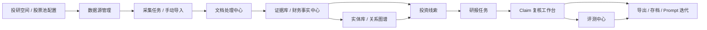

# DeepReport- / FinSight Research Agent 升级重构任务书（Codex 执行版 v2）

> 适用仓库：`https://github.com/wara886/DeepReport-`  
> 建议放置路径：`docs/fin_research_agent_upgrade_plan.md`  
> 建议执行分支：`feat/fin-research-agent-workbench-v2`  
> 执行原则：严格按 **P0 → P1 → P2 → P3** 推进；每完成一个小模块都必须补测试；每完成一个阶段必须提交并推送到 GitHub。

---

## 0. 先复述用户本次新增要求

本次不是重新写一个空泛规划，而是在已有 `docs/fin_research_agent_upgrade_plan.md` 的基础上继续完善，目标是让 Codex 可以直接按任务书执行 DeepReport- 的产品化重构。新增要求如下：

1. **文档开头先复述用户要求**，再进入正式任务书，避免 Codex 理解偏差。
2. **再次复核参考视频关键帧内容**，确认黑灰产情报分析 Agent 项目中值得借鉴的产品能力没有遗漏，并把这些能力映射到金融研报项目中。
3. **强调 GitHub 提交流程**：每完成一个 P0/P1/P2/P3 阶段，必须提交一次 GitHub；更细粒度地说，每完成一个 P0.x / P1.x 小模块，也应先跑测试、commit、push。
4. **明确仓库地址**：所有代码提交到 `https://github.com/wara886/DeepReport-`。
5. **另起功能分支开发**：不要继续只在 docs 分支上做功能开发；建议从 `main` 拉出 `feat/fin-research-agent-workbench-v2` 分支。
6. **主分支放新的版本**：功能分支完成并通过测试后，合并回 `main`，让 `main` 保持新的投研工作台版本。
7. **旧项目处理**：之前没用的老项目、旧 UI、旧代理层、废弃脚本，可以删除；如果存在复用风险，则集中放入类似 `archive/legacy_v0/` 或 `old/` 的目录，并建立说明文档，不要混在新主线里。
8. **文档要本地生成**，方便复制进仓库或直接给 Codex 使用。

---

## 1. 给 Codex 的总执行说明

你正在改造 `wara886/DeepReport-` 仓库。当前项目已经具备“输入公司/期间 → 生成研报”的基础能力，但产品形态仍偏单次生成工具。本轮升级目标是将其升级为：

> **FinSight Research Agent：可追踪的投研任务系统 + 金融数据处理漏斗 + 证据复核工作台 + PromptOps / Harness 可观测框架。**

不要推倒重来。需要复用当前仓库已有的多智能体研报生成、官方来源路由、证据产物、Claim-first writing、quality gates、Docker 和基础 Web App 能力。先用 P0 做出可演示闭环，再在 P1/P2/P3 做数据源、RAG、图谱、PromptOps 和生产化增强。

### 1.1 分支与提交规则

请按下面流程开始实现：

```bash
git clone https://github.com/wara886/DeepReport-.git
cd DeepReport-
git checkout main
git pull origin main
git checkout -b feat/fin-research-agent-workbench-v2
```

开发过程中遵守：

1. **每次只实现一个小模块**，例如只做 `P0.1`，不要顺手实现 `P0.2` 之后的内容。
2. 每个小模块完成后必须运行该模块指定测试；测试通过后提交并推送：

```bash
pytest <本模块指定测试> -q
git status
git add .
git commit -m "feat(p0.1): add database foundation"
git push origin feat/fin-research-agent-workbench-v2
```

3. 每完成一个大阶段，也就是 P0、P1、P2、P3 完整完成后，做阶段汇总提交：

```bash
pytest -q
git add .
git commit -m "chore(p0): finish minimal research workbench"
git push origin feat/fin-research-agent-workbench-v2
```

4. `main` 分支最终必须放新版本。建议 P0 验收后先合并一次，P1/P2/P3 每阶段验收后继续合并：

```bash
git checkout main
git pull origin main
git merge --no-ff feat/fin-research-agent-workbench-v2
git push origin main
```

5. 不要直接 force push 到 `main`。如果自动化环境无法创建 PR，则在功能分支 push 后等待用户确认；如果用户明确要求直接合并，才执行 merge。

### 1.2 旧代码处理规则

本次目标是让 `main` 变成新的投研工作台版本，因此旧项目不能继续散落在主线目录里。

处理原则：

1. **必须保留并继续复用的核心代码，不要移动**：
   - `src/agents/multi_agent_orchestrator.py`
   - `src/tools/registry.py`
   - `src/search/search_manager.py`
   - `src/evaluation/multi_agent_harness.py`
   - 当前 quality gates、official-source routing、evidence/claims/report artifacts 相关代码。
2. **确认无用的旧代码可以删除**，但删除前必须全仓搜索引用，确保测试通过。

3. **不确定是否仍有复用价值的旧代码，集中归档**：

```text
archive/legacy_v0/
├── README.md                  # 说明为什么归档、从哪里迁移、是否仍可恢复
├── legacy_ui/                 # 旧单页 UI 或旧 HTML 工作台
├── legacy_api_proxy/          # 旧 legacy proxy / wrapper
├── old_scripts/               # 旧一次性脚本
├── old_docs/                  # 旧文档或过时说明
└── old_artifacts_examples/    # 老样例产物，禁止被新系统默认读取
```

4. 每次归档或删除旧代码，都要补一条说明：

```text
docs/implementation_notes/legacy_cleanup.md
```

说明内容：移动了什么、为什么移动、新路径是什么、有没有影响测试、如何恢复。

---

### 1.3 当前执行状态（2026-07-09 更新）

当前仓库实际推进状态如下，后续 Codex 继续执行时必须以本节为准，避免重复实现已经完成的 P0/P1 功能。

| 阶段 | 当前状态 | 说明 |
| --- | --- | --- |
| P0 最小可演示投研工作台 | 已完成并提交 | 已具备工作台外壳、投研首页、任务创建/取消、文档处理、证据库、Claim 复核、导出入口、严格漏斗和基础用户流。 |
| P1 投研空间、数据源、采集、手动导入、词典、PromptOps、Harness、财务事实 | 已完成核心闭环，已做收尾提交 | 已补齐数据源健康、补采集闭环、PromptOps 版本管理、Harness 观测、质量证明解释、任务分析链路总览、文档空状态引导。 |
| P2 Hybrid RAG、实体库、关系图谱、投资线索 | 可进入，但必须先做 RAG 质量闭环 | 目前已有实体、关系、线索、逻辑链雏形；进入 P2 后优先补检索质量、证据召回和评测闭环，不要先做炫酷图谱。 |
| P3 评测中心、导出中心与生产化 | 暂不进入 | 等 P2 的 RAG/证据链稳定后，再做正式导出包、回归评测矩阵和生产部署增强。 |

最近关键提交：

- `fc93229 fix(p0): stabilize workbench task and import feedback`
- `ce2b39e fix(p1): tighten workbench quality and remediation flows`
- `09abf38 fix(p1): polish workbench closure experience`

P1 收尾验收已运行：

```bash
pytest -q tests/test_workbench_frontend_script.py tests/test_web_evaluation_center.py tests/test_task_analysis_api.py
pytest -q tests/test_report_task_status_lifecycle.py tests/test_evaluation_api.py tests/test_promptops_api.py tests/test_ingestion_batch_lifecycle.py tests/test_web_promptops.py
python tmp/current_workbench_user_walkthrough.py
```

验收结果：

- 单元 / 前端静态 / API 回归：通过。
- 浏览器模拟用户走查：`ok: True`，无控制台错误，无评测页后端变量名裸露。
- 运行产物 `tmp/`、`data/vector_db/` 不进入提交。

进入 P2 前的产品边界：

1. 继续沿用参考视频的叙事：数据源采集 → 结构化处理 → 记忆沉淀 → 关系分析 → 风险/线索发现 → 人工复核 → 报告输出。
2. 前端必须保持产品化中文表达，不能把后端字段名、调试 token、内部 key 直接展示给用户。
3. P2 首要目标是证明“生成研报为什么可信”：证据召回质量、引用覆盖、检索失败降级、质量评测闭环。
4. P2 不优先做复杂 Neo4j/Milvus 迁移；可以保留 PostgreSQL + Chroma 的渐进方案，先把接口契约和测试打稳。
5. 每完成一个 P2.x 小模块，必须先做单元测试和一次真实用户浏览器走查，再提交。

## 2. 参考视频二次复核结果：不能遗漏的产品能力

参考视频是一个“黑灰产情报分析 Agent MVP 控制台”。它最值得借鉴的不是某个单独 Agent，而是完整后台系统的产品化能力。根据关键帧复核，页面侧边栏和主流程至少覆盖：

```text
首页
业务配置
数据源管理
采集任务
手动导入
清洗结果
风险线索
人工复核
黑话词典
PromptOps
实体库
剧本对抗
导出
```

这些模块对 DeepReport- 的金融版映射如下。

| 视频模块 | 复核到的关键能力 | DeepReport- 金融映射 |
|---|---|---|
| 首页 Dashboard | 顶部统计卡片、风险分布、来源分布、累计处理漏斗、LLM 调用/时延指标 | 投研首页：公司数、文档数、证据数、财务事实数、投资线索数、待复核 Claim、质量通过率、平均生成时间、数据源分布、处理漏斗、LLM 成本/时延 |
| 业务配置 | 业务空间、产品、公司/产品别名、关键词、排除词、重点风险类型、BREAK 场景、阈值、绑定数据源 | 投研空间：市场、股票池、行业、公司别名、关注指标、风险类型、证据阈值、质量门阈值、默认数据源、报告模板 |
| 数据源管理 | 数据源模板、启用/停用、凭证校验、最近批次、最近失败、手动触发、编辑配置 | SEC、CNINFO、HKEX、EastMoney、Yahoo、Tavily、本地 PDF、手动导入等可配置数据源 |
| 采集任务 | 批次状态、成功/失败数、失败原因、重试、跳转结果 | 采集任务中心：`batch_id`、`queued/running/success/failed`、日志、失败项重试、跳转文档处理中心 |
| 手动导入 | 文本/来源/业务空间录入，进入后续清洗链路 | 手动导入财报摘录、公告、新闻、券商研报片段、PDF/URL，进入文档处理中心 |
| 清洗结果 | 多状态页签、左侧列表、右侧详情、处理路径、文本高亮、抽取结果、风险标签 | 文档处理中心：入库、PDF/HTML 解析、OCR、表格抽取、去重、Chunk、Embedding、BM25、KG 入图、事实抽取、线索生成 |
| 风险线索 | 线索类型、置信度、风险等级、证据、人工核验入口 | 投资线索：经营变化、财务异常、估值异常、现金流风险、诉讼/监管风险、官方来源缺口 |
| 人工复核 | 对线索进行通过/驳回/编辑/补充，保留审核状态 | Claim 复核工作台：approve、reject、edit、regenerate、review_records 审计轨迹 |
| 黑话词典 | 术语、别名、变体、标准词维护 | 金融词典：公司别名、指标别名、行业术语、财报字段口径、风险词库、查询归一化词典 |
| PromptOps | Prompt 版本、输入/输出 JSON、测试运行、失败状态、结构化返回 | 研报 PromptOps：事实抽取、线索摘要、财务分析、估值、风险、Verifier、GapResolver 的模板版本和测试面板 |
| 实体库 | 实体详情、关系、来源、风险权重 | 公司、行业、指标、产品、客户、供应商、高管、事件、文档实体库 |
| 剧本对抗 | 关系链、剧本链路、研判过程图、风险传播路径 | 投资逻辑链、风险传导链、供应链关系图谱、研报论证包 |
| 导出 | 导出线索、实体、研判包 | 导出 Markdown、HTML、PDF、DOCX、JSON、CSV、facts.json、claims.json、reviewed_report |

### 2.1 对原文档的补漏要求

原文档已经覆盖 Dashboard、处理漏斗、PromptOps、实体库、主张复核等核心内容，但本次二次复核后，需要特别补强以下点：

1. **业务配置不是简单配置页**：必须包括业务空间、关键词、排除词、风险类型、阈值、绑定数据源。金融版要做成“投研空间/股票池配置”。
2. **黑话词典不能漏掉**：金融版应设计为“金融词典/别名库”，服务于公司名归一、财务指标归一、行业术语归一、查询理解。
3. **数据源管理要有凭证/可用性/最近批次状态**，不是只列出数据源名称。
4. **采集任务要以 batch 为主线**，后续文档、证据、事实、线索、报告都要能追溯到 `batch_id`。
5. **清洗结果页的右侧处理路径是重点**：金融版必须显示每个文档的处理步骤，而不是只展示最终 evidence。
6. **人工复核必须写审计记录**：不能只改状态；要保存修改前后内容、审核人、理由、时间。
7. **PromptOps 必须驱动真实 Harness**：不能只是前端文本框。
8. **剧本对抗在金融版不要照搬命名**：改为“投资逻辑链 / 风险传导链 / 供应链关系图谱 / 研报论证包”。
9. **导出中心要尊重复核状态**：被 reject 的 Claim 不能进入正式导出版本。
10. **Dashboard 的 LLM 调用率、平均时延、失败率、成本统计** 需要来自 `llm_runs`，不能写死。
11. **P0.5 不能只做两个 tab 的测试页**：必须先搭建接近参考视频的控制台外壳，包括左侧导航、顶部业务空间/刷新区、主内容区、右侧详情抽屉或详情面板、统一表格和筛选样式。P0.5 可以只接入 Dashboard 和 Report Tasks 的真实 API，但导航上要为后续模块预留稳定入口。

---

## 3. 产品目标与业务闭环

当前 DeepReport- 的目标从：

```text
输入公司/期间 → 调用多智能体 → 生成一篇研报
```

升级为：

```text
投研空间 / 股票池
→ 数据源配置
→ 采集任务 / 手动导入
→ 文档处理中心
→ 证据库 / 财务事实中心
→ 投资线索
→ 研报任务
→ Claim 复核
→ 导出 / 存档 / Prompt 迭代
```

Mermaid 架构：



核心原则：

1. 不是再堆一个 LLM 生成入口，而是把金融数据仓库、任务链路、证据链路产品化。
2. 每个研报结论必须能追溯到 `evidence`、`document`、`page`、`chunk`、`fact` 或 `source_url`。
3. 所有 LLM 调用最终必须经过 Harness：Prompt 版本、Model Router、JSON Schema 校验、ToolCall Trace、超时重试、fallback、token/成本/时延、回放评测。
4. 前端必须展示“数据从哪里来、处理到哪一步、为什么能/不能写进报告”。
5. P0 做可演示闭环，P1/P2/P3 再做完整数据源、PromptOps、Hybrid RAG、KG、评测和生产化。

---

## 4. 升级后的整体系统架构

```mermaid
flowchart TB
    subgraph FE[前端：React / Vite / TypeScript]
        FE1[投研首页 Dashboard]
        FE2[投研空间 / 股票池]
        FE3[数据源管理]
        FE4[采集任务]
        FE5[手动导入]
        FE6[文档处理中心]
        FE7[证据库 / 财务事实]
        FE8[投资线索]
        FE9[研报任务]
        FE10[Claim 复核]
        FE11[金融词典]
        FE12[PromptOps]
        FE13[实体库 / 关系图谱]
        FE14[评测中心]
        FE15[导出中心]
    end

    subgraph API[后端 API：FastAPI]
        A1[workspace_router]
        A2[datasource_router]
        A3[ingestion_router]
        A4[document_router]
        A5[evidence_router]
        A6[fact_router]
        A7[signal_router]
        A8[report_task_router]
        A9[claim_review_router]
        A10[dictionary_router]
        A11[promptops_router]
        A12[entity_router]
        A13[evaluation_router]
        A14[export_router]
    end

    subgraph JOB[异步任务 / Worker]
        J1[采集 Worker]
        J2[PDF / HTML / OCR 解析]
        J3[表格抽取]
        J4[Chunk + Embedding + BM25 索引]
        J5[实体抽取 / KG 入图]
        J6[财务事实抽取]
        J7[投资线索生成]
        J8[MultiAgent Report Runner]
        J9[Verifier / GapResolver]
        J10[Export Worker]
    end

    subgraph HARNESS[LLM Harness / Agent Harness]
        H1[Prompt Registry]
        H2[Model Router]
        H3[JSON Schema Validator]
        H4[ToolCall Trace]
        H5[Timeout / Retry / Fallback]
        H6[Cost / Latency / Token Metrics]
        H7[Replay Evaluation]
    end

    subgraph DATA[数据层]
        D1[(PostgreSQL)]
        D2[(Redis Queue / Cache)]
        D3[(Object Storage: Local / MinIO)]
        D4[(Vector DB: Chroma P0 / Milvus P2)]
        D5[(Elasticsearch / OpenSearch)]
        D6[(Neo4j P2)]
    end

    FE --> API
    API --> JOB
    JOB --> HARNESS
    HARNESS --> JOB
    API --> DATA
    JOB --> DATA
```



---

## 5. 当前仓库可复用与需要更新的部分

### 5.1 可以复用

- `src/agents/multi_agent_orchestrator.py`：继续作为规划、研究、分析、写作、验证、GapResolver 的主流程。
- `src/tools/registry.py`：继续复用 ToolSpec、ToolRegistry 和财务工具 schema。
- `src/search/search_manager.py`：继续复用 SEC、Yahoo、CNINFO、HKEX、EastMoney、Tavily、local evidence 等入口。
- `src/evaluation/multi_agent_harness.py`：扩展为产品评测中心。
- 当前 `evidence.json`、`claims.json`、`verification_report.json`、`report.md/html/json`：通过 Artifact Importer 导入数据库。
- Claim-first writing、official-source routing、10-K 解析、quality gates、currency/number/citation checks、Docker 和基础 Web App。

### 5.2 必须更新

- UI 从单页 chat/report workbench 升级为多页面投研控制台。
- FastAPI 从 legacy proxy 增加真实 REST routers。
- 任务状态从内存 dict / 文件目录升级为 PostgreSQL `report_tasks`。
- 数据源从代码注册升级为可配置数据源管理。
- 证据库从 artifacts 文件升级为 DB + index 的可查询 evidence center。
- Prompt 从代码散落升级为 PromptOps + Harness。
- 复核从后端 gate 报告升级为 Claim 复核 UI 和 `review_records`。
- 旧 UI / 旧代理层 / 废弃脚本清理到 `archive/legacy_v0/` 或删除。

---

## 6. 前端页面与菜单规划

P0 先实现：控制台外壳、投研首页、研报任务、证据库、Claim 复核、文档处理中心简版、导出中心入口。P1 后补投研空间/股票池、数据源、采集任务、手动导入、金融词典、LLM Harness、PromptOps、财务事实中心。P2 后补实体库、关系图谱、投资线索中心。

```text
FinSight Research Agent
├── 投研首页
├── 投研空间
├── 股票池管理
├── 数据源管理
├── 采集任务
├── 手动导入
├── 文档处理中心
├── 证据库
├── 财务事实中心
├── 投资线索
├── 研报任务
├── Claim 复核
├── 金融词典
├── PromptOps
├── 实体库
├── 关系图谱
├── 评测中心
└── 导出中心
```

页面跳转要求：

- 点击 Dashboard 的“待复核 Claim” → `/claims?status=pending`
- 点击 Dashboard 漏斗的“表格抽取失败” → `/documents?step=table_extract&status=failed`
- 点击数据源最近批次 → `/ingestion-batches/{batch_id}`
- 点击文档处理中心某文档 → 打开右侧处理路径和关联 evidence / claims
- 点击 evidence → 打开证据原文、页码、关联 facts、关联 claims
- 点击 Claim → 打开 Claim 复核工作台，展示证据、数字校验、引用校验、人工操作

P0 前端形态要求：

1. `/workbench` 不应继续是只含 Dashboard / Report Tasks 两个 tab 的临时页面，而应是多模块控制台壳。
2. 左侧导航先完整展示 P0/P1/P2/P3 规划中的核心入口；未实现模块可以显示空状态或“待接入”，但不能写死假业务数据。
3. Dashboard、Report Tasks、Evidence、Claim Review、Documents 等 P0 页面必须复用同一套筛选栏、状态标签、表格、详情面板样式。
4. 详情页优先采用“列表 + 右侧详情面板”的视频式操作形态，减少跳转后丢上下文。
5. 所有可点击入口必须最终落到任务、文档、证据、Claim 或 artifact 的稳定 ID，不允许继续依赖全局 latest。
- 点击报告任务 → `/report-tasks/{task_id}`，禁止继续依赖全局 latest

---

## 7. P0 数据库表设计

P0 需要先把业务状态落库。可以支持 SQLite + PostgreSQL 双模式，但生产默认 PostgreSQL。建议 `src/db/` 使用 SQLAlchemy 2.x + Alembic。

### 7.1 P0 必需表

```text
companies
- id
- name
- symbol
- market
- industry
- aliases JSONB
- created_at

workspaces
- id
- name
- market_scope
- industry_scope
- report_template
- quality_threshold JSONB
- created_at

workspace_companies
- workspace_id
- company_id

data_sources
- id
- name
- source_key
- source_type
- market_scope
- trust_level
- config_json JSONB
- enabled
- credential_status
- last_sync_at
- last_status
- last_error

ingestion_batches
- id
- batch_id
- workspace_id
- data_source_id
- source_key
- name
- target_type
- symbol
- period
- query
- status
- retry_count
- item_count
- success_count
- failed_count
- started_at
- finished_at
- error_message
- metadata JSONB
- created_at

ingestion_batch_events
- id
- batch_id
- stage
- status
- message
- metadata JSONB
- created_at

documents
- id
- company_id
- datasource_id
- batch_id
- title
- doc_type
- report_period
- source_url
- file_path
- content_hash
- parse_status
- created_at

document_processing_steps
- id
- document_id
- step_name
- status
- started_at
- finished_at
- error_message
- metadata JSONB

evidence_items
- id
- evidence_id
- company_id
- document_id
- chunk_id
- source_type
- trust_level
- title
- content
- source_url
- page_no
- metadata JSONB
- created_at

financial_facts
- id
- company_id
- metric_name
- metric_value
- unit
- currency
- scale
- period
- source_evidence_id
- confidence
- review_status
- metadata JSONB

report_tasks
- id
- task_id
- workspace_id
- company_id
- symbol
- period
- report_type
- status
- current_stage
- quality_score
- created_at
- started_at
- finished_at
- error_message
- metadata JSONB

report_task_events
- id
- task_id
- stage
- status
- message
- metadata JSONB
- created_at

report_artifacts
- id
- task_id
- artifact_type
- path
- url
- created_at

report_claims
- id
- task_id
- section_name
- claim_text
- claim_type
- is_critical
- critical_claim_type
- verification_status
- numeric_check_status
- citation_check_status
- confidence
- review_status
- metadata JSONB

claim_evidence
- claim_id
- evidence_item_id
- support_type

review_records
- id
- target_type
- target_id
- decision
- comment
- before_value JSONB
- after_value JSONB
- reviewer
- created_at

prompt_templates
- id
- name
- module
- description

prompt_versions
- id
- template_id
- version
- system_prompt
- user_template
- input_schema JSONB
- output_schema JSONB
- is_active
- created_at

llm_runs
- id
- task_id
- prompt_version_id
- model_name
- input_tokens
- output_tokens
- latency_ms
- cost
- status
- schema_valid
- retry_count
- fallback_used
- error_message
- created_at
```

### 7.2 数据原则

- PostgreSQL 是业务事实源，不能长期依赖 JSON 文件保存业务状态。
- PDF、HTML、报告文件、图表等大文件放对象存储或本地文件系统，DB 只存路径和元数据。
- Vector DB 负责 chunk embedding；证据元数据仍以 PostgreSQL 为准。
- Elasticsearch/OpenSearch 用于公告标题、财报正文、公司名称、关键词检索。
- Neo4j 是 P2 增强，不阻塞 P0/P1。

### 7.3 工作台记忆系统

参考视频中的“记忆系统”不是单独的聊天记忆页，而是分布在配置、清洗结果、风险线索、人工复核、PromptOps、实体库和导出中心里的结构化业务记忆。DeepReport- 金融版需要按以下层次沉淀：

- **工作空间记忆**：投研空间、股票池、公司别名、关注指标、风险类型、证据阈值、默认数据源。
- **数据源/批次记忆**：数据源配置、启用状态、凭证状态、采集批次、运行日志、失败原因、重试次数。
- **文档处理记忆**：原始文档、解析状态、表格抽取、切分向量化、证据化、Claim 绑定、处理步骤详情。
- **证据/事实/Claim 记忆**：证据片段、财务事实、Claim、Claim-Evidence 绑定、校验结果、质量门禁结果。
- **人工复核记忆**：`review_records` 保存通过、驳回、编辑、重生成请求的修改前后内容、理由、审核人和时间。
- **Prompt/LLM 运行记忆**：`prompt_versions` 和 `llm_runs` 保存 Prompt 版本、输入输出 JSON、Schema 校验、模型、成本、时延、失败和 fallback。
- **词典/实体图谱记忆**：金融词典、别名库、实体、实体关系、事件链和投资逻辑链。
- **评测/回放记忆**：评测样例、运行结果、失败样例、回归对比、导出包版本。

关键原则：记忆可以用于路由、召回、检索扩展、失败规避和复核提示，但**不能直接替代证据**。进入正式研报的事实必须来自可追溯来源、财务事实表或人工确认记录。

---

## 8. P0 → P1 → P2 → P3 任务拆解

## P0：最小可演示投研工作台

目标：在不破坏现有 `MultiAgentOrchestrator` 的前提下，把项目升级为具备“任务中心 + 数据处理漏斗 + 证据库 + Claim 复核”的产品形态。

### P0.1 新增数据库基础层

任务：

- 新建 `src/db/`：`session.py`、`models.py`、`init_db.py`。
- 建 P0 核心表：`companies`、`documents`、`document_processing_steps`、`evidence_items`、`report_tasks`、`report_task_events`、`report_artifacts`、`report_claims`、`claim_evidence`、`review_records`。
- P0 支持 SQLite / PostgreSQL 双模式；生产配置 PostgreSQL。
- 提供测试用临时数据库 fixture。

测试：

```bash
pytest tests/test_db_models.py tests/test_db_init.py -q
```

完成后提交：

```bash
git add .
git commit -m "feat(p0.1): add database foundation"
git push origin feat/fin-research-agent-workbench-v2
```

### P0.2 Report Task API

任务：

- 新增 `/api/report-tasks`：创建、列表、详情、重试、产物链接。
- 包装当前 `MultiAgentOrchestrator.run`。
- 运行前写 `report_tasks`，阶段变化写 `report_task_events`，完成后导入 artifacts。
- 保留旧 `/api/run` 兼容。
- 前端轮询必须按 `task_id`，禁止继续只用全局 latest。

测试：

```bash
pytest tests/test_report_task_api.py tests/test_report_task_status_lifecycle.py tests/test_report_task_artifact_import.py -q
```

提交：

```bash
git add .
git commit -m "feat(p0.2): add report task api"
git push origin feat/fin-research-agent-workbench-v2
```

### P0.3 Artifact Importer

任务：

- 新增导入器，从现有输出目录读取：
  - `evidence.json`
  - `claims.json`
  - `verification_report.json`
  - `report.md`
  - `report.html`
  - `report.json`
- 写入 `evidence_items`、`report_claims`、`claim_evidence`、`report_artifacts`。
- 绑定 `task_id`、`company_id`、`period`。
- 对旧 artifacts 做容错：字段缺失时写入 metadata，但不能导致任务失败。

测试：

```bash
pytest tests/test_artifact_importer_evidence.py tests/test_artifact_importer_claims.py -q
```

提交：

```bash
git add .
git commit -m "feat(p0.3): import report artifacts into database"
git push origin feat/fin-research-agent-workbench-v2
```

### P0.4 Dashboard + Funnel API

任务：

- 新增 `GET /api/dashboard/summary`。
- 新增 `GET /api/dashboard/funnel`。
- 基于 DB 聚合，不允许写死假数据。
- 漏斗层级至少包括：

```text
原始资料入库
解析成功
表格抽取成功
切分向量化
财务事实提取
投资线索生成
研报 Claim 生成
Claim 校验通过
待人工复核
```

测试：

```bash
pytest tests/test_dashboard_api.py tests/test_dashboard_funnel_counts.py -q
```

提交：

```bash
git add .
git commit -m "feat(p0.4): add dashboard and funnel api"
git push origin feat/fin-research-agent-workbench-v2
```

### P0.5 控制台前端壳 + 投研首页 + 研报任务页

任务：

- 新建或增强 `/workbench` 为投研控制台外壳，而不是只含两个 tab 的测试页。
- 控制台外壳必须包含：
  - 左侧导航：投研首页、投研空间、股票池管理、数据源管理、采集任务、手动导入、文档处理中心、证据库、财务事实中心、投资线索、研报任务、Claim 复核、金融词典、PromptOps、实体库、关系图谱、评测中心、导出中心。
  - 顶部栏：当前投研空间/市场选择、刷新按钮、关键状态提示。
  - 主内容区：支持 Dashboard 和 Report Tasks 的真实数据展示。
  - 右侧详情面板或详情抽屉：用于任务、文档、证据、Claim 后续下钻复用。
- P0.5 阶段只要求 Dashboard、Report Tasks 接真实 API；其他导航入口可以显示“待接入”空状态，但不能写死假业务数据。
- Dashboard 必须展示漏斗图、指标卡、任务状态分布、数据源分布。
- Dashboard 需要预留 LLM 成本/时延、最近批次、待复核 Claim、文档处理异常、导出入口等模块位；P0 缺数据时显示空状态。
- 研报任务页必须按 `task_id` 查询状态和 artifacts。
- 研报任务页需要展示任务详情入口、阶段状态、事件时间线、失败原因、重试按钮、产物链接。
- 旧单页 UI 如仍需保留，移动到 `archive/legacy_v0/legacy_ui/` 或仅保留兼容入口。

测试：

```bash
pytest tests/test_web_dashboard_payload.py tests/test_web_report_task_links.py -q
```

提交：

```bash
git add .
git commit -m "feat(p0.5): add workbench shell and report task pages"
git push origin feat/fin-research-agent-workbench-v2
```

### P0.6 证据库页面/API

任务：

- 新增 `GET /api/evidence`。
- 支持 `company`、`period`、`source_type`、`trust_level`、`task_id` 筛选。
- Evidence 详情返回关联 claims、facts、document。
- 前端 Evidence Center 可查看 snippet、来源、页码、可信度、关联 Claim。

测试：

```bash
pytest tests/test_evidence_api.py tests/test_evidence_claim_join.py -q
```

提交：

```bash
git add .
git commit -m "feat(p0.6): add evidence center api and page"
git push origin feat/fin-research-agent-workbench-v2
```

### P0.7 Claim 复核页面/API

任务：

- 新增 `GET /api/claims?task_id=&status=`。
- 新增：
  - `POST /api/claims/{id}/approve`
  - `POST /api/claims/{id}/reject`
  - `POST /api/claims/{id}/edit`
  - `POST /api/claims/{id}/regenerate`
- P0 的 regenerate 可先标记状态和生成事件，不要求立即重跑全代理。
- 每个操作必须写 `review_records`。
- 被 reject 的 Claim 不能进入最终导出。

测试：

```bash
pytest tests/test_claim_review_api.py tests/test_review_record_audit_trail.py -q
```

提交：

```bash
git add .
git commit -m "feat(p0.7): add claim review workflow"
git push origin feat/fin-research-agent-workbench-v2
```

### P0.8 文档处理中心简版

任务：

- 从 artifacts 和 evidence 建立 `documents` 与 `document_processing_steps` 简版记录。
- 页面采用参考视频的“列表 + 右侧处理路径详情”形态。
- 页面展示处理路径：入库、解析、表格抽取、切分、证据化、Claim 绑定、验证。
- 右侧详情必须展示每个步骤的 `status`、`started_at`、`finished_at`、`error_message`、`metadata`。
- 右侧详情必须展示关联 evidence、claims、report_task、batch_id/source_url/file_path。

测试：

```bash
pytest tests/test_document_processing_center_api.py tests/test_document_processing_steps.py -q
```

提交：

```bash
git add .
git commit -m "feat(p0.8): add simplified document processing center"
git push origin feat/fin-research-agent-workbench-v2
```

### P0.9 导出中心入口 / Artifact Review 入口

任务：

- 在 `/workbench` 增加导出中心入口。
- P0.9 只做入口和 artifact review，不实现正式 PDF/DOCX/CSV 导出流水线。
- 展示每个 `report_task` 的 `report.md`、`report.html`、`report.json`、`claims.json`、`evidence.json`、`verification_report.json`。
- 明确显示 Claim 复核状态统计：approved、pending、rejected。
- 对存在 rejected Claim 的任务，正式导出按钮必须禁用或显示“需复核后导出”的状态。
- 正式导出包、PDF/DOCX/CSV 生成、reject Claim 排除逻辑放到 P3.2 实现。

测试：

```bash
pytest tests/test_export_entry_api.py tests/test_web_export_entry.py -q
```

提交：

```bash
git add .
git commit -m "feat(p0.9): add export center entry"
git push origin feat/fin-research-agent-workbench-v2
```

### P0 阶段验收

P0 全部完成后运行：

```bash
pytest tests/test_db_models.py tests/test_db_init.py \
       tests/test_report_task_api.py tests/test_report_task_status_lifecycle.py \
       tests/test_artifact_importer_evidence.py tests/test_artifact_importer_claims.py \
       tests/test_dashboard_api.py tests/test_dashboard_funnel_counts.py \
       tests/test_evidence_api.py tests/test_evidence_claim_join.py \
       tests/test_claim_review_api.py tests/test_review_record_audit_trail.py \
       tests/test_document_processing_center_api.py tests/test_document_processing_steps.py \
       tests/test_export_entry_api.py tests/test_web_export_entry.py -q
```

阶段提交：

```bash
git add .
git commit -m "chore(p0): finish minimal research workbench"
git push origin feat/fin-research-agent-workbench-v2
```

用户验收后合并主分支：

```bash
git checkout main
git pull origin main
git merge --no-ff feat/fin-research-agent-workbench-v2
git push origin main
```

---

## P1：投研空间、数据源、采集、手动导入、词典、PromptOps 与 LLM Harness

### P1.0 投研空间 / 股票池配置

- 新增 `workspaces`、`workspace_companies`，或在 P1 初期用配置表承载。
- 支持市场、股票池、行业、公司别名、关注指标、风险类型、证据阈值、质量门阈值、默认数据源、报告模板。
- UI 对应参考视频“业务配置”，但金融版命名为“投研空间 / 股票池配置”。
- 后续数据源、采集批次、文档、证据、研报任务都要能绑定 `workspace_id`。
- 测试：`tests/test_workspace_api.py`、`tests/test_workspace_company_aliases.py`。
- 提交：`feat(p1.0): add workspace and stock pool config`。

### P1.1 数据源管理

- 新增 `data_sources`、`data_source_runs` 或复用 `ingestion_batches`。
- 把 `SearchManager` 已注册源映射到数据源表。
- 数据源配置必须支持绑定投研空间/股票池。
- UI 展示启用状态、凭证状态、最近批次、最近失败、手动同步、编辑配置。
- 测试：`tests/test_datasource_registry_api.py`、`tests/test_searchmanager_datasource_mapping.py`、`tests/test_official_source_priority.py`。
- 提交：`feat(p1.1): add datasource management`。

### P1.2 采集任务中心

- 支持批次创建、运行、失败重试、日志查看。
- P1 引入 Redis + RQ / Celery / Arq 之一。
- 测试：`tests/test_ingestion_batch_lifecycle.py`、`tests/test_ingestion_retry.py`。
- 提交：`feat(p1.2): add ingestion batch center`。

### P1.3 手动导入

- 支持文本、PDF、URL 导入。
- 导入后进入文档处理中心。
- 测试：`tests/test_manual_import_text.py`、`tests/test_manual_import_pdf_stub.py`。
- 提交：`feat(p1.3): add manual import workflow`。

### P1.4 金融词典 / 别名库

- 对应视频中的“黑话词典”。
- 支持公司别名、产品别名、财务指标别名、行业术语、风险词、排除词。
- 服务于 Query Understanding、公司归一、指标归一、RAG 检索扩展。
- 表建议：`dictionary_terms`、`dictionary_aliases`。
- 测试：`tests/test_financial_dictionary_api.py`、`tests/test_company_alias_resolution.py`、`tests/test_metric_alias_resolution.py`。
- 提交：`feat(p1.4): add financial dictionary`。

### P1.5 LLM Harness

- 新建 `src/llm/harness.py`。
- 提供统一接口：`run_prompt(prompt_key, input, schema, model_role, task_id)`。
- 记录 `llm_runs`。
- 支持超时、重试、fallback、schema validation、token/cost/latency 统计。
- 测试：`tests/test_llm_harness_schema_validation.py`、`tests/test_llm_harness_retry_fallback.py`、`tests/test_llm_harness_run_logging.py`。
- 提交：`feat(p1.5): add llm harness`。

### P1.6 PromptOps

- `prompt_templates` / `prompt_versions` CRUD。
- 活动版本解析。
- 前端 PromptOps 页面。
- 至少接入一个真实模块：Claim Verifier 或 Fact Extractor。
- 测试：`tests/test_promptops_api.py`、`tests/test_promptops_active_version_resolution.py`。
- 提交：`feat(p1.6): add promptops management`。

### P1.7 财务事实中心

- 从现有财务指标、三报表、估值输出导入 `financial_facts`。
- 展示指标、单位、币种、期间、证据来源、置信度、审核状态。
- 测试：`tests/test_financial_fact_importer.py`、`tests/test_financial_fact_source_binding.py`、`tests/test_money_currency_scale_required.py`。
- 提交：`feat(p1.7): add financial facts center`。

### P1 阶段提交

P1 完成后：

```bash
pytest -q
git add .
git commit -m "chore(p1): finish datasource promptops and harness layer"
git push origin feat/fin-research-agent-workbench-v2
```

### P1 收尾验收记录（已完成）

P1 当前不是“再补更多功能”，而是已经完成核心闭环后的收尾状态。实际完成内容包括：

- 投研空间 / 股票池 / 公司别名：已具备页面入口、配置能力和任务创建时的公司名称 / 股票代码解析。
- 数据源管理：已具备启用状态、凭证/健康状态、最近批次、失败诊断、补采集入口。
- 采集任务中心：已具备批次创建、状态展示、失败诊断和补采集回流入口。
- 手动导入：已支持文本、URL、PDF 路径导入，导入后进入文档处理链路。
- 金融词典：已覆盖公司别名、财务指标、行业术语、风险词等结构化记忆入口。
- LLM Harness：已具备调用记录、超时、重试、fallback、schema 校验、token/成本/时延观测基础。
- PromptOps：已具备 Prompt 版本管理、活动版本解析、运行记录查看，且不是纯前端文本框。
- 财务事实中心：已支持事实导入、证据绑定、期间/币种/单位展示。
- P1 收尾体验：任务详情新增分析链路总览，研报质量证明新增“为什么是这个质量分 / 还差什么”，文档详情空状态新增业务解释和下一步按钮。

P1 已验证命令：

```bash
pytest -q tests/test_workbench_frontend_script.py tests/test_web_evaluation_center.py tests/test_task_analysis_api.py
pytest -q tests/test_report_task_status_lifecycle.py tests/test_evaluation_api.py tests/test_promptops_api.py tests/test_ingestion_batch_lifecycle.py tests/test_web_promptops.py
python tmp/current_workbench_user_walkthrough.py
```

当前 P1 剩余风险不应阻塞进入 P2，但要在 P2 中持续观察：

1. 部分数据源仍是“配置 / 诊断 / 补采集”闭环，真实外部采集稳定性还需要更多真实样本验证。
2. Harness 已有观测能力，但复杂多模型路由和大规模回放还属于 P3 生产化增强。
3. 研报质量证明已能解释质量分，但质量本身仍依赖 P2 的证据召回和引用覆盖率提升。

---

## P2：Hybrid RAG、实体库、关系图谱与投资线索

### P2 进入原则（2026-07-09 更新）

P2 的第一目标不是“看起来更复杂”，而是让研报质量可验证、证据召回可评测、分析链路可追溯。参考视频里的关系链和记忆系统要映射为金融场景的证据链、事实链、投资逻辑链和风险传导链。

进入 P2 后的优先级：

1. **P2.1 Hybrid RAG / 证据召回质量闭环**
   - 先做 dense + BM25 + RRF 融合的统一检索接口。
   - 保留现有 `retrieve_evidence_with_mode` 兼容，避免破坏已完成前端和任务分析包。
   - 必须增加检索回退测试、RRF 融合测试、引用覆盖率测试。
   - 判断标准：同一个研报任务能展示“召回了哪些证据、为什么选这些、缺哪些来源、召回失败如何降级”。

2. **P2.2 生成前证据门禁**
   - 把 P2.1 的证据召回覆盖率接入研报任务运行前置检查。
   - 证据不足时必须给出来源缺口、推荐动作和可审计事件；强制门禁开启时不应继续生成看似完整的研报。
   - 判断标准：用户创建任务后，系统能解释“是否有足够证据进入生成、缺哪些权威来源、下一步该补采集还是去证据库复核”。

3. **P2.3 实体库 / 关系存储收口**
   - 不急于接 Neo4j，先把 PostgreSQL 的实体和关系抽取、去重、upsert、证据绑定做稳定。
   - 判断标准：用户点进公司、证据或线索时，能看到实体记忆如何由文档/证据沉淀而来。

4. **P2.4 投资线索中心增强**
   - 在线索页补“为什么出现这个线索”：关联事实、证据、阈值、影响方向。
   - 判断标准：线索能进入研报任务上下文，并在质量证明或任务分析链路里被追踪。

5. **P2.5 投资逻辑链 / 风险传导链**
   - 在已有链路雏形上补证据绑定和节点详情，不做纯视觉大图优先。
   - 判断标准：用户能从风险线索追溯到财务事实、来源证据、Claim 和报告章节。

P2 暂不做：

- 不优先迁移到 Neo4j。
- 不优先迁移到 Milvus / OpenSearch，除非 Chroma / 当前检索层无法满足接口测试。
- 不新增脱离研报质量目标的大屏、动画图谱或无业务闭环的可视化。

### P2.1 Hybrid RAG 迁移

- 新建 `src/rag/`：`dense_retriever.py`、`bm25_retriever.py`、`graph_retriever.py`、`rrf_fusion.py`、`reranker_adapter.py`。
- P2 可连接 Chroma/Milvus + Elasticsearch/OpenSearch。
- 保留现有 `retrieve_evidence_with_mode` 兼容。
- 测试：`tests/test_rrf_fusion.py`、`tests/test_hybrid_retriever_contract.py`、`tests/test_retrieval_fallback_when_vector_unavailable.py`。
- 提交：`feat(p2.1): add hybrid rag retrieval layer`。

### P2.2 生成前证据门禁

- 在 `ReportTaskService.run_task()` 中先执行生成前证据门禁，再进入多智能体生成。
- 门禁复用 P2.1 的 `build_retrieval_coverage` 合同，输出候选证据数、命中证据数、必需来源、缺口和推荐动作。
- 支持 `enforce_evidence_gate` 强制拦截、`allow_weak_evidence` 弱证据放行、`skip_evidence_gate` 明确跳过。
- 测试：`tests/test_report_task_evidence_gate.py`、`tests/test_report_task_status_lifecycle.py`。
- 提交：`feat(p2.2): add pre-generation evidence gate`。

#### P2.1/P2.2 补强进度（2026-07-09）

- 已完成 P2.2 前端承接：创建研报任务弹窗新增“生成前证据门禁”策略；任务表和任务详情不再显示 `evidence_gate_failed` 这类后端阶段名，改为产品化中文阶段。
- 任务详情已新增“生成前证据门禁”卡片，展示门禁结论、候选证据、命中来源、缺失来源、建议来源、阻塞原因和推荐动作。
- 已完成证据召回诊断补强：`/api/report-tasks/{task_id}/analysis` 新增 `retrieval_diagnostics`，区分“暂无候选资料”“有资料但期间/查询未命中”“缺少必要权威来源”“证据可用”。
- 任务详情已新增“证据召回诊断”卡片，展示查询口径、候选资料池、命中证据、来源缺口、候选/命中样例和处理入口。
- 已完成 P2.1 引用覆盖率闭环：`/api/report-tasks/{task_id}/analysis` 新增 `citation_usage`，从 `citations.json` 和 `report.md` 校验“Claim 绑定证据”是否真正进入报告正文。
- 任务详情已新增“引用覆盖闭环”卡片，展示正文已使用引用、可追溯主张、缺引用主张、未进入正文的引用和处理入口；质量证明新增“报告引用使用”检查项。
- 最新小块验收命令：`pytest -q tests/test_task_analysis_api.py tests/test_workbench_frontend_script.py tests/test_web_report_task_evidence_gate.py`。
- 阶段回归命令：`pytest -q tests/test_report_task_evidence_gate.py tests/test_report_task_status_lifecycle.py tests/test_report_task_api.py tests/test_report_task_quality_gate.py tests/test_task_analysis_api.py tests/test_evidence_api.py tests/test_hybrid_retriever_contract.py tests/test_web_evaluation_center.py tests/test_web_report_task_links.py tests/test_web_report_task_evidence_gate.py`；`python tmp/deep_p2_workbench_walkthrough.py`。

### P2.3 实体库和关系图谱

- 先用 PostgreSQL 存 `entities`、`entity_relations`。
- Neo4j 暂不作为 P2.3 阻塞项；先把 PostgreSQL 实体关系、证据绑定、任务级记忆沉淀和前端可解释链路做稳定。
- 实体类型：公司、股票代码、行业、产品、客户、供应商、高管、财务指标、文档、风险事件、新闻事件、同行公司。
- 关系类型：`BELONGS_TO`、`PUBLISHED`、`HAS_PRODUCT`、`HAS_METRIC`、`HAS_EVENT`、`PEER_OF`、`SUPPLIES_TO`、`MENTIONED_IN`。
- 测试：`tests/test_entity_extraction_schema.py`、`tests/test_entity_relation_upsert.py`。
- 提交：`feat(p2.3): add entity and relation store`。

#### P2.3 补强进度（2026-07-09）

- 已完成任务级结构化记忆沉淀：新增 `POST /api/entities/extract-from-task`，从任务证据池、Claim 证据绑定和文档批次中收集证据，复用现有实体/关系 upsert 规则，保证重复执行幂等。
- 已完成任务分析包记忆摘要：`/api/report-tasks/{task_id}/analysis` 新增 `entity_memory`，展示来源证据数、实体数、关系数、实体类型分布、关系类型分布和样例。
- 任务详情新增“结构化记忆”卡片，支持一键“沉淀当前任务证据”，并提供实体库、关系图谱跳转；分析链路从五步升级为“数据进入 → 记忆沉淀 → 结构化处理 → 线索发现 → 主张复核 → 报告输出”。
- 已补测试：`tests/test_entity_relation_upsert.py` 覆盖任务级沉淀 API 幂等性，`tests/test_task_analysis_api.py` 覆盖 `entity_memory`，`tests/test_web_report_task_evidence_gate.py` 覆盖前端卡片和接口路径。
- 最新验收命令：`pytest -q tests/test_entity_relation_upsert.py tests/test_task_analysis_api.py tests/test_workbench_frontend_script.py tests/test_web_report_task_evidence_gate.py tests/test_web_evaluation_center.py`；P2 回归命令见 P2.1/P2.2 补强进度。

### P2.4 投资线索中心

- 规则线索 + LLM 摘要。
- 规则线索先实现：`margin_decline`、`cashflow_gap`、`official_source_missing`、`currency_mismatch`、`valuation_blocked`、`revenue_growth_acceleration`。
- 线索可以进入研报任务上下文。
- 测试：`tests/test_signal_rules.py`、`tests/test_signal_evidence_binding.py`、`tests/test_signal_to_report_context.py`。
- 提交：`feat(p2.4): add investment signal center`。

P2.4 收尾进度：

- 已复用现有规则线索中心，不重建新模块；`/api/investment-signals/generate`、`/api/investment-signals`、`/api/investment-signals/{id}/add-to-task` 已形成基础闭环。
- 线索序列化新增产品化字段：`priority_label`、`recommended_action`、`decision_use`、`research_brief`，前端不直接暴露后端规则变量名作为主要解释。
- `/api/report-tasks/{task_id}/analysis` 新增 `signal_summary`，展示线索总数、高优先级、已进入上下文、风险/机会分布、证据绑定、重点线索和推荐动作。
- 任务详情新增“投资线索闭环”卡片，可一键“生成当前任务线索”，并跳转到投资线索、财务事实和主张复核。
- 投资线索详情页新增“线索研判摘要”“建议动作”“研报用途”，统一保留“仅供研究，不构成投资建议”边界。
- 这里的“LLM 摘要”先落为可测试的规则研判摘要；真实 LLM 生成应等 PromptOps / Harness 质量追踪稳定后再接入。
- 最新验收命令：`pytest -q tests/test_signal_rules.py tests/test_signal_evidence_binding.py tests/test_signal_to_report_context.py tests/test_task_analysis_api.py tests/test_workbench_frontend_script.py tests/test_web_report_task_evidence_gate.py tests/test_web_evidence_center.py`。

### P2.5 投资逻辑链 / 风险传导链

- 对应视频中的“剧本对抗”，但金融项目不要使用黑灰产命名。
- 页面展示：实体 → 事件 → 财务事实 → 投资线索 → Claim → 报告章节。
- 重点是证据链与论证链，不是炫酷大图。
- 测试：`tests/test_argument_chain_api.py`、`tests/test_risk_chain_evidence_binding.py`。
- 提交：`feat(p2.5): add investment argument chain`。

### P2 阶段提交

```bash
pytest -q
git add .
git commit -m "chore(p2): finish rag graph and investment signal layer"
git push origin feat/fin-research-agent-workbench-v2
```

---

## P3：评测中心、导出中心与生产化

### P3.1 评测中心

- 展示 Formal-18、Quick-9、回归集结果。
- 指标：交付通过率、客观质量评分、可追溯 Claim 率、证据覆盖率、数值一致性、引用支持率、schema 有效率、工具调用成功率、延迟/成本。
- 支持选择某个 `report_task` 运行局部诊断。
- 测试：`tests/test_eval_summary_importer.py`、`tests/test_eval_api.py`、`tests/test_agent_eval_metrics_contract.py`。
- 提交：`feat(p3.1): add evaluation center`。

### P3.2 导出中心

- 支持 Markdown、HTML、PDF、DOCX、JSON、CSV。
- 导出时遵守复核状态：reject 的 Claim 不进入正式导出。
- 导出包包括：报告正文、证据表、Claim 表、facts、review_records、quality report。
- 测试：`tests/test_export_center.py`、`tests/test_rejected_claim_excluded_from_export.py`。
- 提交：`feat(p3.2): add export center`。

### P3.3 生产化可观测

- `request_id` / `run_id` 贯穿 API、任务、LLM、工具调用、日志。
- OpenTelemetry 或结构化日志。
- LLM 成本仪表盘。
- 失败重试和降级策略统一记录。
- 测试：`tests/test_request_id_propagation.py`、`tests/test_llm_cost_aggregation.py`。
- 提交：`feat(p3.3): add observability and production hardening`。

### P3 阶段提交

```bash
pytest -q
git add .
git commit -m "chore(p3): finish evaluation export and production hardening"
git push origin feat/fin-research-agent-workbench-v2
```

---

## 9. 后端目录建议

```text
src/
├── app/
│   ├── api/
│   │   ├── routers/
│   │   │   ├── dashboard.py
│   │   │   ├── workspaces.py
│   │   │   ├── datasources.py
│   │   │   ├── ingestion.py
│   │   │   ├── documents.py
│   │   │   ├── evidence.py
│   │   │   ├── facts.py
│   │   │   ├── signals.py
│   │   │   ├── report_tasks.py
│   │   │   ├── claims.py
│   │   │   ├── dictionary.py
│   │   │   ├── promptops.py
│   │   │   ├── entities.py
│   │   │   ├── evaluation.py
│   │   │   └── export.py
│   │   ├── dependencies.py
│   │   └── schemas.py
│   └── main.py
├── db/
│   ├── models.py
│   ├── session.py
│   ├── init_db.py
│   └── migrations/
├── services/
│   ├── dashboard_service.py
│   ├── datasource_service.py
│   ├── ingestion_service.py
│   ├── document_service.py
│   ├── evidence_service.py
│   ├── fact_service.py
│   ├── signal_service.py
│   ├── report_task_service.py
│   ├── claim_review_service.py
│   ├── dictionary_service.py
│   ├── promptops_service.py
│   ├── entity_service.py
│   ├── evaluation_service.py
│   └── export_service.py
├── jobs/
│   ├── worker.py
│   ├── ingestion_jobs.py
│   ├── document_jobs.py
│   └── report_jobs.py
├── llm/
│   ├── harness.py
│   └── prompt_registry.py
├── rag/
│   ├── dense_retriever.py
│   ├── bm25_retriever.py
│   ├── graph_retriever.py
│   ├── rrf_fusion.py
│   └── reranker_adapter.py
└── agents/
    └── multi_agent_orchestrator.py
```

---

## 10. 测评体系

### 10.1 产品链路指标

- 数据处理成功率：解析成功 / 入库总数。
- 表格抽取成功率。
- 索引成功率：embedding + BM25。
- 事实抽取覆盖率：有事实文档 / 可解析文档。
- 线索生成率。
- 待复核率。
- 平均处理时长。

### 10.2 RAG 指标

- Recall@K。
- MRR。
- NDCG@K。
- 证据覆盖率。
- 引用支持率。
- Context Precision / Context Recall。

### 10.3 Agent 指标

- 计划完成率。
- 工具调用成功率。
- 工具调用参数有效率。
- fallback 次数。
- 重试成功率。
- Verifier 通过率。
- GapResolver 修复成功率。
- LLM 延迟 / 成本 / token。

### 10.4 研报质量指标

- 交付通过率。
- 客观质量评分。
- 可追溯 Claim 率。
- 数值一致性。
- 引用覆盖率。
- 图表一致性。
- 货币一致性。
- 官方来源覆盖率。

---

## 11. Codex 禁止事项

1. 禁止一次性实现多个阶段，尤其禁止在 P0 未完成时引入复杂 Neo4j / Milvus 大改。
2. 禁止让默认测试依赖真实网络 API 或真实 LLM。
3. 禁止把 Dashboard 写成假数据页面。
4. 禁止让任务状态只存在内存 dict。
5. 禁止让前端只读 `/api/latest` 全局最新任务。
6. 禁止把 PromptOps 做成纯前端文本框；必须与 Harness、`prompt_versions`、`llm_runs` 打通。
7. 禁止把 P0 前端继续做成只有 Dashboard / Report Tasks 两个 tab 的临时测试页；必须使用控制台外壳承载后续模块入口。
8. 禁止在未实现的前端模块里写死演示业务数据；未接入模块只能显示空状态、待接入状态或真实 API 返回的数据。
9. 禁止删除当前可复用核心能力：orchestrator、tools registry、search manager、evaluation harness。
10. 禁止生成无证据支持的投资结论。
11. 禁止把“投资线索”写成“投资建议”。所有结果必须保留“仅供研究，不构成投资建议”的边界。
12. 禁止把老项目散落在新主线里；要么删除，要么归档到 `archive/legacy_v0/` 并写说明。

---
